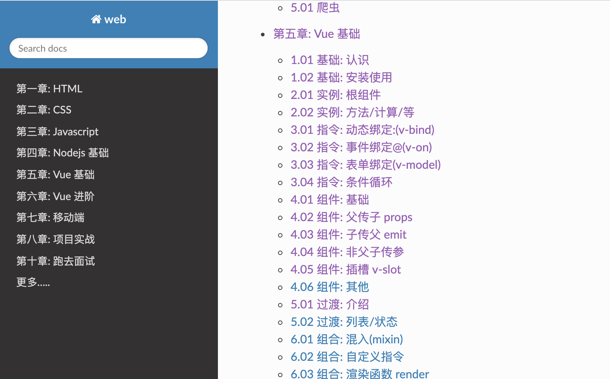

### 一：项目介绍

#### 1. 项目说明

```
python + venv + read the docs 
```


### 二：项目启动

```

1. 创建python虚拟环境

$ python3 -m venv ~/data/venv
$ source ~/data/venv/bin/activate

2. 创建read the docs

$ pip install sphinx

3. 下载代码

$ git clone https://github.com/Ohimma/doc_web.git
$ cd doc_web

$ sphinx-quickstart
$ make clean  // 清理代码
$ make html   // 构建代码


4. 访问build下的index.html
```
