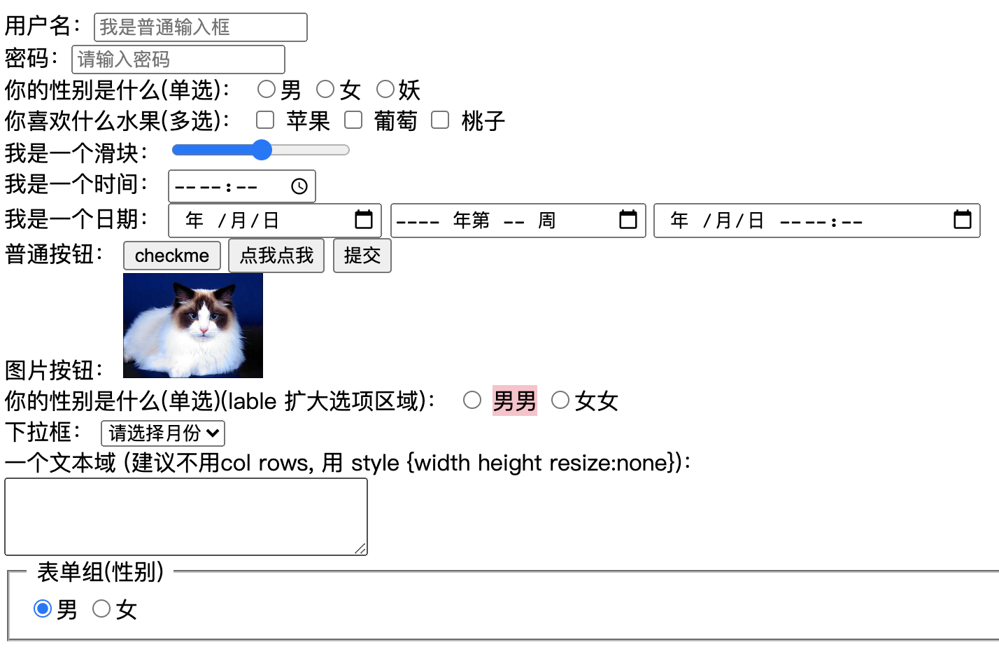

## 2.07 HTML 表单(含5)


##### 1. 表单标签(元素)
```
<form>	    定义供用户输入的表单
<input>	    定义输入域
<textarea>	定义文本域 (一个多行的输入控件)
<label>	    定义了 <input> 元素的标签，一般为输入标题
<fieldset>	定义了一组相关的表单元素，并使用外框包含起来
<legend>	定义了 <fieldset> 元素的标题
<select>	定义了下拉选项列表
<optgroup>	定义选项组
<option>	定义下拉列表中的选项
<button>	定义一个点击按钮

<datalist>	h5 指定一个预先定义的输入控件选项列表
<keygen>	h5 定义了表单的密钥对生成器字段
<output>	h5 定义一个计算结果
```

##### 2. form 表单属性
表单的数据用来提交给后端。           

get方式： 默认，显示在地址栏，存储量较小，不太安全          
post方式：比较安全 (具体方式看后端需求)             

outline: none;   // 表单聚焦 (选中后边框变色)
```
accept	         规定服务器接收到的文件的类型。（文件是通过文件上传提交的）
accept-charset   规定服务器可处理的表单数据字符集。
action	         规定当提交表单时向何处发送表单数据。
enctype	         规定在向服务器发送表单数据之前如何对其进行编码。（适用于 method="post" 的情况）
method 	         规定用于发送表单数据的 HTTP 方法。
name	         规定表单的名称。

autocompleteNew	 h5 规定是否启用表单的自动完成功能。on/off
novalidate       h5 如果使用该属性，则提交表单时不进行验证。
target	         规定在何处打开页面 _blank新窗口 _self当前页面 _parent父页面 _top整个窗口 _framename指定iframe
```

##### 3. input 表单属性
```
1. type
type 传统类型(10)：
text      定义单行的输入字段，用户可在其中输入文本
password  定义密码字段。该字段中的字符被掩码
file      定义输入字段和 "浏览"按钮，供文件上传
radio     定义单选按钮
checkbox  定义复选框
hidden    定义隐藏的输入字段
button    定义可点击按钮（多数情况下，用于通过JavaScript启动脚
image     定义图像形式的提交按钮
reset     定义重置按钮。重置按钮会清除表单中的所有数据
submit    定义提交按钮。提交按钮会把表单数据发送到服务

type h5新增类型(13)：
color     定义调色板
tel       定义包含电话号码的输入域
email     定义包含email地址的输入域
url       定义包含URL地址的输入域 
search    定义搜索域
number    定义包含数值的输入域
range     定义包含一定范围内数字值的输入域
date      定义选取日、月、年的输入域 
month     定义选取月、年的输入域
week      定义选取周、年的输入域
time      定义选取月、年的输入域
datetime  定义选取时间、日 月、年的输入域(UTC时间)
datatime-local    定义选取时间、日 月、年的输入域(本地时间)

2. 其他属性
<https://www.runoob.com/tags/tag-input.html>
```

##### 3. 示例



```
<html lang="en">
<head>
    <meta charset="UTF-8">
    <meta name="viewport" content="width=device-width, initial-scale=1.0">
    <title>Document</title>
    <style>
        .label_sex {
            width: 100px;
            height: 100px;
            background-color:pink;   
        }
    </style>
</head>
<body>
    <form action="" method="">
        用户名：<input type="text" maxlength="10" placeholder="我是普通输入框">
        <br>
        密码：<input type="password" maxlength="5" placeholder="请输入密码">
        
        <br>
        你的性别是什么(单选)：
        <input type="radio" name="sex">男
        <input type="radio" name="sex">女
        <input type="radio" name="sex">妖
        
        <br>
        你喜欢什么水果(多选)：
        <input type="checkbox" name="apple" id="" value="on"> 苹果
        <input type="checkbox" name="grapes" id="" value="on"> 葡萄
        <input type="checkbox" name="peach" id="" value="on"> 桃子
        
        <br>
        我是一个滑块：
        <input type="range" name="" id="" max="99" min="0">
        <!-- <input type="button" value=""> -->

        <br>
        我是一个时间：
        <input type="time" name="" id="">

        <br>
        我是一个日期：
        <!-- <input type="datetime" name="" id=""> -->
        <input type="date" name="" id="">
        <input type="week">
        <input type="datetime-local">

        <br>
        普通按钮：
        <input type="button" value="checkme">
        <button>点我点我</button>
        <input type="submit" >

        <br>
        图片按钮：
        <input style="width: 100px " type="image" src="https://ss1.bdstatic.com/70cFvXSh_Q1YnxGkpoWK1HF6hhy/it/u=3363295869,2467511306&fm=26&gp=0.jpg" alt="">

        <br>
        你的性别是什么(单选)(lable 扩大选项区域)：
        <input type="radio" name="sex" id="sexid">
        <label for="sexid" class="label_sex">男男</label>
        <input type="radio" name="sex">女女

        <br>
        下拉框：
        <select name="" id="">
            <option value="" selected>请选择月份</option>
            <optgroup label="一季度">
                <option value="1">1月</option>
                <option value="2">2月</option>
                <option value="3">3月</option>
            </optgroup>
            <option value="4">4月</option>
            <option value="5">5月</option>
            <option value="6">6月</option>
            <option value="7">7月</option>
        </select>

        <br>
        一个文本域 (建议不用col rows, 用 style {width height resize:none})：<br>
        <textarea name="" id="" cols="30" rows="10"></textarea>
        
        <br>
        <fieldset>
            <legend>&nbsp;表单组(性别)&nbsp;</legend>
            <input type="radio" name="sex" id="" checked>男    
            <input type="radio" name="sex" id="">女    
        </fieldset>

    </form>
    
    
</body>
</html>

```
