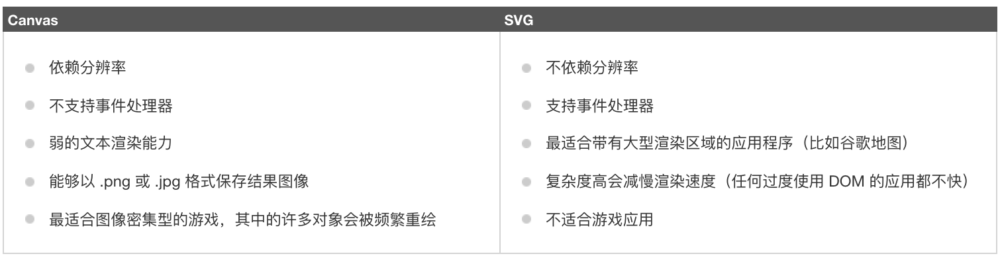

## 3.03 HTML5 内联(svg)


##### 1. svg 是什么
```
SVG 指可伸缩矢量图形 (Scalable Vector Graphics)
SVG 用于定义用于网络的基于矢量的图形
SVG 使用 XML 格式定义图形
SVG 图像在放大或改变尺寸的情况下其图形质量不会有损失
SVG 是万维网联盟的标准

```

##### 2. svg 特点

```
与其他图像格式相比（比如 JPEG 和 GIF），使用 SVG 的优势在于：

SVG 图像可通过文本编辑器来创建和修改
SVG 图像可被搜索、索引、脚本化或压缩
SVG 是可伸缩的
SVG 图像可在任何的分辨率下被高质量地打印
SVG 可在图像质量不下降的情况下被放大
```

##### 3. svg canvas
