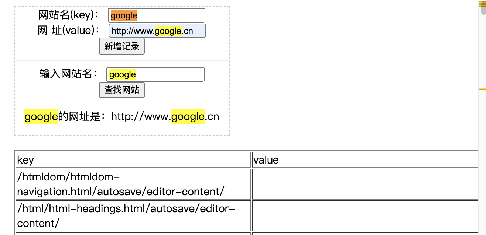

## 3.12 HTML5 WEB 存储缓存


##### 1. 存储
HTML5 WEB 存储，一个比cookie更好的本地存储方式。        

```
客户端存储：
1、存储过多会卡顿
2、最多存储5M

客户端存储数据的两个对象：     
1、localStorage    长久保存网站数据，没有过期时间，需手动清除，页面共享      
2、sessionStorage  临时保存网站数据，关闭窗口或标签页数据将被删除，页面共享，其他域名不共享      

localstorage 和 sessionStorage 都有相同五个函数，举例：
localStorage.setItem(key,value);  // 保存数据
localStorage.getItem(key);        // 读取数据
localStorage.removeItem(key);     // 删除单个数据
localStorage.clear();             // 删除所有数据
localStorage.key(index);          // 得到某个索引的key
```

##### 2. 缓存

使用 HTML5，通过创建 cache manifest 文件，可以轻松地创建 web 应用的离线版本。

   
```
1、缓存的优势：
a、离线浏览 - 用户可在应用离线时使用它们
b、速度 - 已缓存资源加载得更快
c、减少服务器负载 - 浏览器将只从服务器下载更新过或更改过的资源。


2、缓存的两种方式：
a、在需要缓存的页面指定mamifest属性
<!DOCTYPE HTML>
<html manifest="demo.appcache">
...
</html>


b、写到文件里 .apacache
CACHE MANIFEST    # 必需的，此标题下文件首次访问就会下载缓存
/theme.css  
/logo.gif
/main.js

NETWORK:         # 规定此标题下文件永远不会被缓存，离线时不可用
login.php

FALLBACK:        # 无法访问时，则用offine.html 代替 /html/ 下所有文件
/html/ /offline.html


3、一旦应用被缓存，直到发生下列情况才会缓存
a. 用户清空浏览器缓存
b. manifest 文件被修改（参阅下面的提示）
c. 由程序来更新应用缓存

注意: 浏览器对缓存数据的容量限制可能不太一样（某些浏览器设置的限制是每个站点 5MB）
```


##### 3. 存储案例



```
<!DOCTYPE html>
<html>  
<head>  
    <meta charset="utf-8">  
    <title>HTML5本地存储之Web Storage篇</title>  
</head>  
<body>  
    <div style="border: 2px dashed #ccc;width:820px;text-align:center;">     
        <label for="sitename">网站名(key)：</label>  
        <input type="text" id="sitename" name="sitename" class="text"/>  
        <label for="siteurl">网 址(value)：</label>  
        <input type="text" id="siteurl" name="siteurl"/>  
        <input type="button" onclick="save()" value="新增记录"/>  
        
        <hr/>  
        <label for="search_phone">输入网站名：</label>  
        <input type="text" id="search_site" name="search_site"/>  
        <input type="button" onclick="find()" value="查找网站"/>  
        <p id="find_result"></p>  
    </div>  

    <div id="list"> </div>  
    <script>
	// 载入所有存储在localStorage的数据
	loadAll(); 	
		
    //保存数据  
    function save(){  
        var siteurl = document.getElementById("siteurl").value;  
        var sitename = document.getElementById("sitename").value;  
        localStorage.setItem(sitename, siteurl);
        alert("添加成功");
    }
    //查找数据  
    function find(){  
        var search_site = document.getElementById("search_site").value;  
        var siteurl = localStorage.getItem(search_site);  
        var find_result = document.getElementById("find_result");  
        find_result.innerHTML = search_site + "的网址是：" + siteurl;  
    }
    //将所有存储在localStorage中的对象提取出来，并展现到界面上
    function loadAll(){  
        var list = document.getElementById("list");  
        if(localStorage.length>0){  
            var result = "<table border='1'>";  
            result += "<tr><td>key</td><td>value</td></tr>";  
            for(var i=0;i<localStorage.length;i++){  
                var sitename = localStorage.key(i);  
                var siteurl = localStorage.getItem(sitename);  
                result += "<tr><td>"+sitename+"</td><td>"+siteurl+"</td></tr>";  
            }  
            result += "</table>";  
            list.innerHTML = result;  
        }else{  
            list.innerHTML = "数据为空……";  
        }  
    }      
    </script>
</body>  
</html>
```