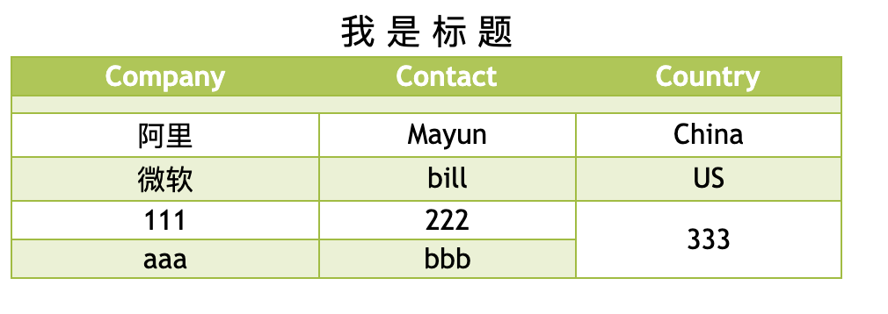

## 2.06 HTML 表格(含5)

##### 1. 语法

表格 同样使用的是字体、背景等属性

```
border-collapse 属性设置表格的边框是否被折叠成一个单一的边框或隔开：
```

```
1. 表格标题: <caption>我是表格标题</caption>

2. 架子
头部：<thead></thead>
身体：<tbody></tbody>
尾部：<tfoot></tfoot>

3. 行、列、表头
<tr>...</tr>   行
<td>...</td>   列
<th>...</th>   表头单元格,表格中的文字将以粗体显示

<td>和<th> 都需要嵌套在<tr></tr>中间

4. 表格内边框
border-collapse: separate;    默认，每个单元格边框会被分开
border-collapse: collapse;    边框被合并为单一边框
border-collapse: inherit;     继承


5. 合并单元格
<td colspan="3">....</td>   左右列合并
<td rowspan="2">....</td>   上下行合并


5. 其他
border-spacing: 10px 10px;   表格边框间的距离


```


##### 2. 示例



```
<html lang="en">
<head>
    <meta charset="UTF-8">
    <meta name="viewport" content="width=device-width, initial-scale=1.0">
    <title>Document</title>
    <style>
        .main {
            width: 70%;
            border-collapse: collapse;
            border: 1px solid #98bf21;
            text-align: center;
            font-family:"Trebuchet MS", Arial, Helvetica, sans-serif;
        }
        .main>caption {
            font-size: 20px;
        }

        .main td, main th {
            font-size: 1em;
            border: 1px solid #98bf21;
        }
        .main th {
            background-color:#A7C942;
	        color:#ffffff;
        } 
        .alt {
            color:#000000;
        	background-color:#EAF2D3;
        }
        .line {
            height: 10px;
            background-color:#EAF2D3;
        }
    </style>
</head>
<body>
    <table class="main" >
        <caption>我 是 标 题</caption>
        <thead>
            <tr>
                <th>Company</th>
                <th>Contact</th>
                <th>Country</th>
            </tr>
        </thead>
        <tbody>
            <tr>
                <td class="line" colspan="3"></td>
            </tr>
            <tr>
                <td>阿里</td>
                <td>Mayun</td>
                <td>China</td>
            </tr>
            <tr class="alt">
                <td>微软</td>
                <td>bill</td>
                <td>US</td>
            </tr>
            <tr>
                <td>111</td>
                <td>222</td>
                <td rowspan="2">333</td>
            </tr>
            <tr class="alt">
                <td>aaa</td>
                <td>bbb</td>
                <!-- <td>ccc</td> -->
            </tr>
        </tbody>
        <!-- <tfoot>
            <tr>
                <td>001</td>
                <td>002</td>
                <td>003</td>
            </tr>
        </tfoot> -->
    </table>
    
</body>
</html>
```