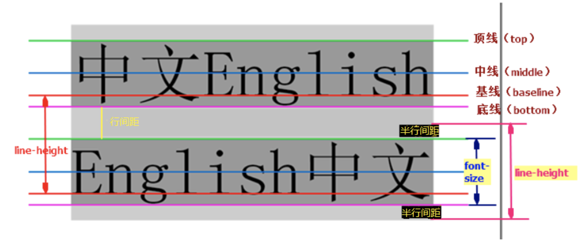
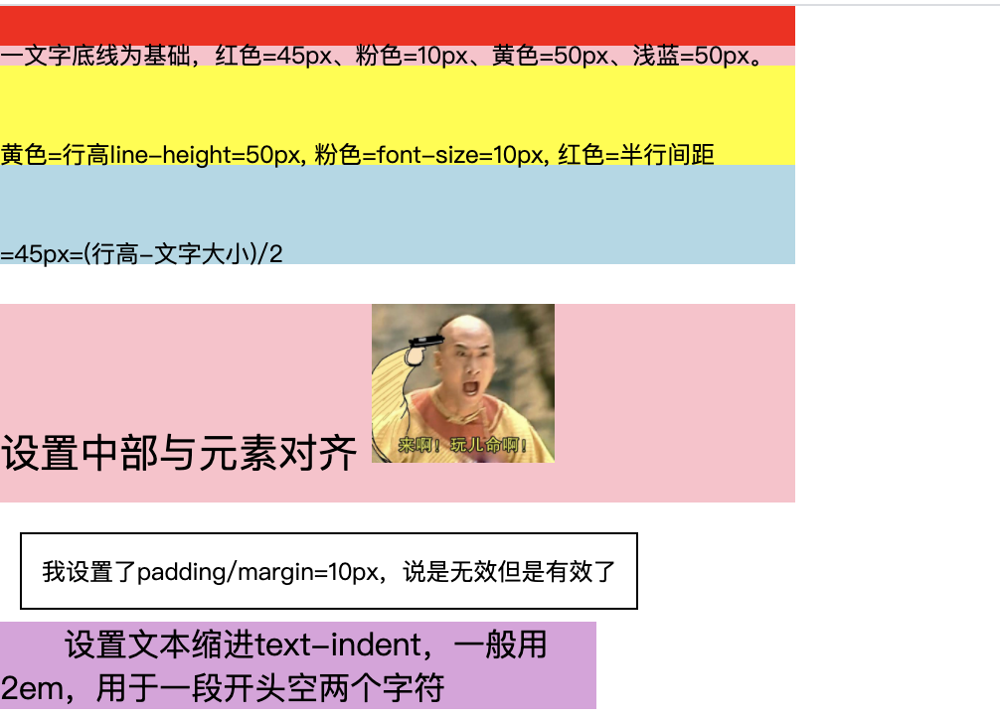

## 2.07 css 行内盒模型(span)

##### 1. 语法



```
1. 行高(line-height) 是指文本行基线间的垂直距离（也叫行距）
2. 行间距 是上行的底线和下一行顶线之间的距离，即 line-height - font-size
3. 字体大小(font-size) 是字体从上到下的整体大小
```

```
行内盒模型是 W3C 规定的一个浏览器如何渲染、显示、排版文字的一整套规则
行内盒模型：上下padding、上下margin 不生效

1. 文本基线 (由字母所在位置决定)
vertical-align: top;      元素及其后代元素的顶部 与整行的顶部对齐
vertical-align: middle;   元素中部与父元素中线对齐
vertical-align: baseline; 元素的基线与父元素对齐 
vertical-align: bottom;   元素及其后代的底部 与整行的底部对齐

2. 行高 line-height
3. 文字大小 font-size
4. 文本缩进 text-indent
5. 文字对齐 text-align
6. 文本装饰 text-decoration

```


##### 2. 示例



```
<!DOCTYPE html>
<html>
    <head>
        <meta charset="utf-8">
        <title>sdds</title>
        <style>
            html,body,div{
                margin: 0;
                padding: 0;
                border: 0;
            }
            div {
                width: 400px;
            }
            .bg0{  
                height: 20px;
                line-height: 50px;
                background-color: red;
                font-size: 10px;
            }
            .bg1{
                height: 10px;
                background-color: pink;
            }
            .bg2{
                height: 50px;
                background-color: yellow;
            }
            .bg3{
                height: 50px;
                background-color: lightblue;
            }
            
            .box2 {
                height: 100px;
                font-size: 20px;
                margin-top: 20px;
                background-color: pink;
            }
            .box2>span {
                line-height: 50px;  /* 没效果 */
                vertical-align: middle;
            }
            .s1 {
                border: 1px solid black;
                font-size: 10px;
                margin: 10px;
                padding: 10px;
            }

            p {
                width: 300px;
                background-color: plum;
                text-indent: 2em;
            }
        </style>
    </head>

<body>
    <div class="bg0">以文字底线为基础, 黄色背景就是行高line-height=100px, 文字大小=10px。 而文字与盒子上下各距离半行间距(红色区域)45px，即 (line-height - font-size)/2 = 45px</div>
    <div class="bg1"></div>
    <div class="bg2"></div>
    <div class="bg3"></div>
    
    <div class="box2">
        <span class="line-pad">设置中部与元素对齐</span>
            
    </div>
    <br>
    <span class="s1">我设置了padding/margin=10px，说是无效但是有效了</span>
    <br>
    <p >设置文本缩进text-indent，一般用2em，用于一段开头空两个字符</p>
</body>
</html>
```
 