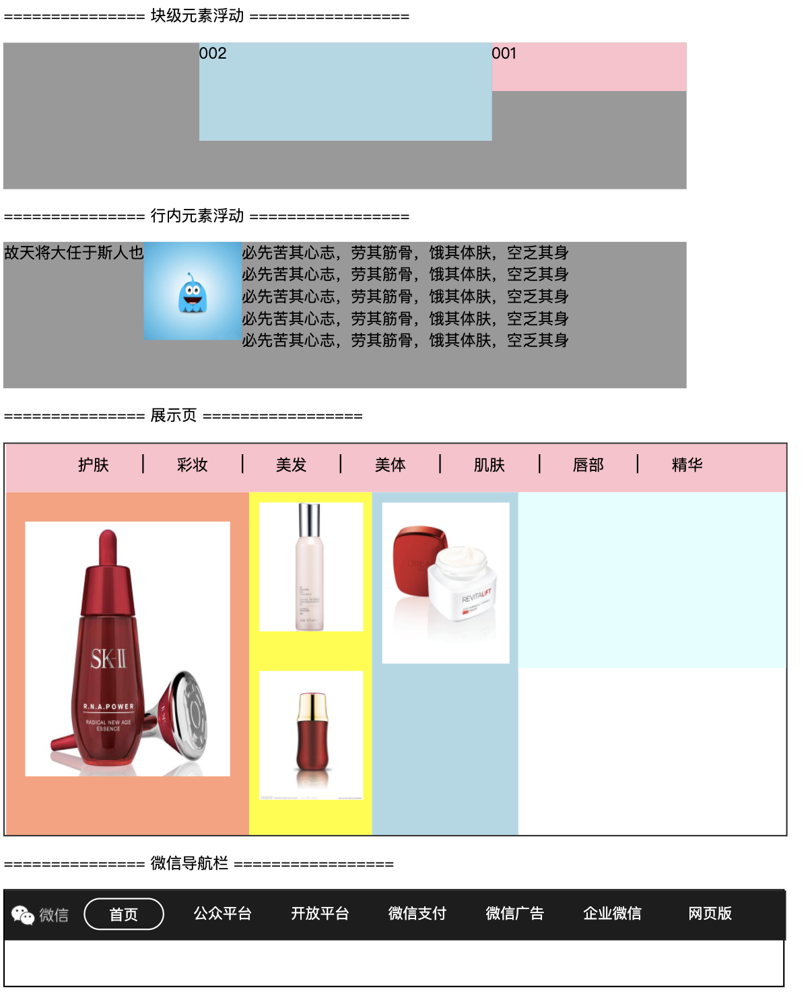

## 2.09 css 浮动(float)

目的：想让文字环绕图片等     
意外收获：可以代替 块级元素横向排列，取代 display: inline-black;

浮动，是指元素将浮动到底层body的上面，底层元素重新排列。
相邻几个浮动放在一起，会自动相邻。
##### 1. 语法
```
1. 不允许元素周围浮动元素
clear: none;
clear: left;
clear: both;
clear: right;
clear: inherit;

2. 允许浮动
float: none;
float: left;
float: right;
float: inherit;

```


##### 2. 块级元素浮动

##### 3. 行内元素浮动
```
行内元素浮动用的较少。
行内元素顶部 不会超过 所在行行框顶部
```

##### 4. 父元素高度塌陷(未懂)
当父元素没有固定高度并且所有元素都浮起来的时候。

解决方案：
```
1. 父元素 BFC 化
overflow: hidden;
display: inline-block;
float: left;
position: absolute;

2. 利用幽灵元素清除浮动，手动撑开父元素高度
新建空的块元素。利用clear: both;

```

##### 5. 示例


```
<html lang="en">
<head>
    <meta charset="UTF-8">
    <meta name="viewport" content="width=device-width, initial-scale=1.0">
    <title>Document</title>
    <style>
        .basic1 {
            width: 700px;
            height: 150px;
            background-color: #999;
        }
        .box01 {
            width: 200px;
            height: 50px;
            background-color: pink;
            float: right;
        }
        .box02 {
            width: 300px;
            height: 100px;
            background-color: lightblue;
            float: right;
        }

        .span1_01 {
            float: left;   
        }
        .img1_01 {
            float: left;
        }

        .basic2 {
            width: 800px;
            height: 400px;
            border: 2px solid #333;
        }
        .ul2 {
            box-sizing: border-box;
            margin: 0px;
            width: 100%;
            height: 50px;
            background-color: pink;
        }
        .li2 {
            list-style: none;
            float: left;
            width: 100px;
            height: 20px;
            /* line-height: 20px; */
            margin: 10px auto;
            text-align: center;
        }
        .li2+.li2 {
            border-left: 1px solid #000;
        }
        
        .basic2_01 {
            box-sizing: border-box;
            width: 250px;
            height: 350px;
            float: left;
            padding: 30px 20px 30px;
            background-color: lightsalmon;
        }     
        .basic2_02 {
            box-sizing: border-box;
            width: 126px;
            height: 350px;
            float: left;
            padding: 10px;
            background-color: yellow;
        }
        .basic2_03 {
            box-sizing: border-box;
            width: 150px;
            height: 350px;
            float: left;
            padding: 10px;
            background-color: lightblue;
        }
        .basic2_04 {
            box-sizing: border-box;
            width: 274px;
            height: 180px;
            float: left;
            padding-top: 20px;
            background-color: lightcyan;
        }

        .img2_01 {
            width: 100%;
            height: 90%;
            /* padding: 25px 0px 25px; */
            float: left;
        }
        .img2_02_01 {
            width: 100%;
            height: 40%;
            margin-bottom: 20px; 
            float: left;
        }
        .img2_02_02 {
            width: 100%;
            height: 40%;
            margin-top: 20px;
            float: left;
        }
        
        .img2_03_01 {
            width: 100%;
            height: 50%;
            float: left;
        }

        .basic3 {
            box-sizing: border-box;
            width: 800px;
            height: 100px;
            border: 1px solid black;
        }
        .logo {
            width: 60px;
            height: 20px;
            float: left;
            padding: 15px 5px;
        }
        .ul3 {
            width: 800px;
            height: 50px;

            list-style: none;
            background-color: #1d1d1d;
            margin: 0;
            box-sizing: border-box;
        }
        
        .li3 {
            width: 70px;
            height: 20px;
            float: left;

            text-align: center;
            color: white;
            font-size: 15px;
            margin: 7px 10px 5px 10px;
            padding: 5px 5px 5px 5px;  
        }
        .li3:hover {
            color: #999;
            cursor: pointer;
            border: 1px solid white;
            border-radius: 20px/20px;
        }
        .li3_01 {
            width: 70px;
            height: 20px;
            float: left;

            text-align: center;
            color: white;
            font-size: 15px;
            margin: 7px 10px 10px 10px;
            padding: 5px 5px 5px 5px;

            border: 1px solid white;
            border-radius: 20px/20px;
        }
        .a3 {
            text-decoration: none;
            color: white;
        }
        
        .a3:hover {
            color: #999;
        }
        
        

    </style>
</head>
<body>

    <p>=============== 块级元素浮动 ================= </p>
    <div class="basic1">
        <div class="box01">001</div>
        <div class="box02">002</div>
    </div>
    <p>=============== 行内元素浮动 ================= </p>
    <div class="basic1">
        <span class="span1_01">故天将大任于斯人也</span>
        
        <span class="span1_01">必先苦其心志，劳其筋骨，饿其体肤，空乏其身</span>
        <span class="span1_01">必先苦其心志，劳其筋骨，饿其体肤，空乏其身</span>
        <span class="span1_01">必先苦其心志，劳其筋骨，饿其体肤，空乏其身</span>
        <span class="span1_01">必先苦其心志，劳其筋骨，饿其体肤，空乏其身</span>
        <span class="span1_01">必先苦其心志，劳其筋骨，饿其体肤，空乏其身</span>
    </div>
    <p>=============== 展示页 ================= </p>
    <div class="basic2">
        <ul class="ul2">
            <li class="li2">护肤</li>
            <li class="li2">彩妆</li>
            <li class="li2">美发</li>
            <li class="li2">美体</li>
            <li class="li2">肌肤</li>
            <li class="li2">唇部</li>
            <li class="li2">精华</li>
        </ul>
        <div class="basic2_01">
            
        </div>
        <div class="basic2_02">
            
            
        </div>
        <div class="basic2_03">
            
        </div>
        <div class="basic2_04"></div>
    </div>
    <p>=============== 微信导航栏 ================= </p>
    <div class="basic3">
        
        <ul class="ul3">
            <li class="li3_01"> <a class="a3" href="#">首页</a></li>
            <li class="li3">公众平台</li>
            <li class="li3">开放平台</li>
            <li class="li3">微信支付</li>
            <li class="li3">微信广告</li>
            <li class="li3">企业微信</li>
            <li class="li3">网页版</li>
        </ul>
    </div>

</body>
</html>
```
