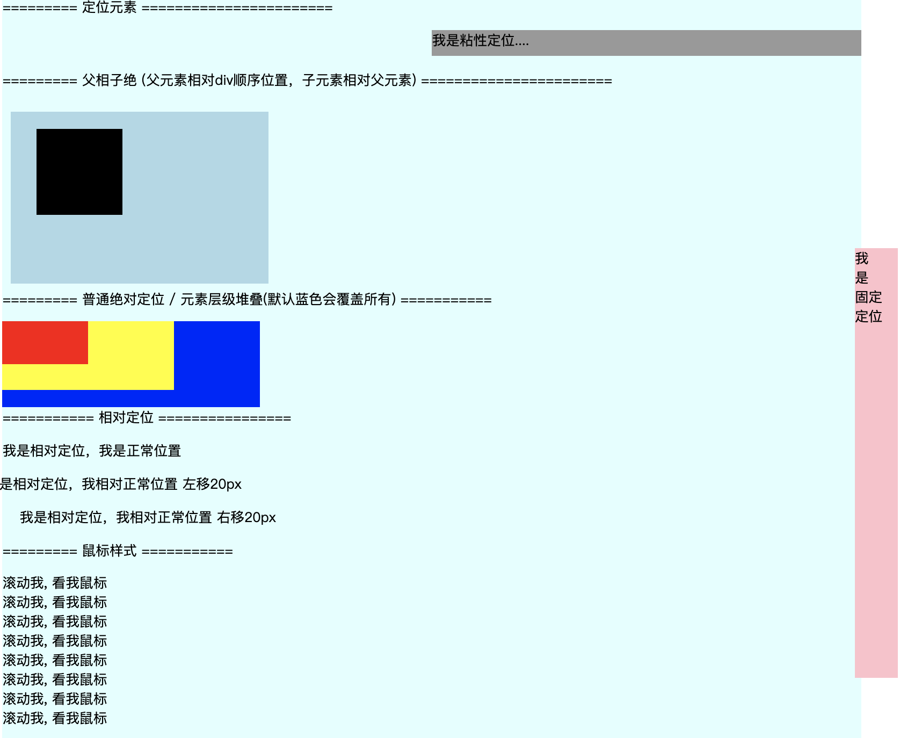

## 2.10 css 定位(position)

和 浮动(float) 相同点：会脱离标准文档流，飘起来
和 浮动(float) 不同点：相同的定位会覆盖，浮动不会，会往旁边顺序排列

##### 1. 语法
然而，这些属性无法工作，除非是先设定position属性。     
默认的 静态定位的元素不会受到 top, bottom, left, right影响，而其他定位要结合 top, bottom, left, right 使用。

```
1. 5 种定位类型
position: static;   默认，即没有定位
position: fixed;    元素的位置固定，与文档流无关，不占据位置
position: sticky;   粘性定位，固定在窗口，滚动不受影响
position: relative; 相对定位，相对于其正常位置进行定位。移动相对位置，原本所占空间不改变
psoition: absolute; 绝对定位，相对于static以外的第一个父元素，无定位元素则相对于html


2. 裁剪元素 (如果先有"overflow：visible"，clip属性不起作用)
clip: auto ;  默认值，不裁剪
clip: rect(0px, 10px, 10px, 0px);   上右下左顺序

3. 光标鼠标类型
cursor: url	      需使用的自定义光标的 URL。
cursor: default	     默认光标（通常是一个箭头）
cursor: auto	     默认。浏览器设置的光标。
cursor: crosshair	光标呈现为十字线。
cursor: pointer	      光标呈现为指示链接的指针（一只手）
cursor: move	      此光标指示某对象可被移动。
cursor: e-resize	此光标指示矩形框的边缘可被向右（东）移动。
cursor: ne-resize	此光标指示矩形框的边缘可被向上及向右移动（北/东）。
cursor: nw-resize	此光标指示矩形框的边缘可被向上及向左移动（北/西）。
cursor: n-resize	此光标指示矩形框的边缘可被向上（北）移动。
cursor: se-resize	此光标指示矩形框的边缘可被向下及向右移动（南/东）。
cursor: sw-resize	此光标指示矩形框的边缘可被向下及向左移动（南/西）。
cursor: s-resize	此光标指示矩形框的边缘可被向下移动（南）。
cursor: w-resize	此光标指示矩形框的边缘可被向左移动（西）。
cursor: text	      此光标指示文本。
cursor: wait	      此光标指示程序正忙（通常是一只表或沙漏）。
cursor: help	      此光标指示可用的帮助（通常是一个问号或一个气球）。

4. 设置元素堆叠顺序
z-index: auto;   默认，顺序与父元素相等
z-index: -1 ;    number 堆叠顺序
z-index: inherit; 继承


5. 偏移量设置
top、right、left、bottom
auto
leght
%
inherit

```

##### 2. 父相子绝
父元素相对定位(relative)，子元素绝对定位(absolute)。
父元素相对浏览器，子元素相对父元素，这样用起来会顺畅

tip:
子元素会在 父元素的内容区开始计算定位。(不是padding等)

##### 3. 示例


```
<html lang="en">
<head>
    <meta charset="UTF-8">
    <meta name="viewport" content="width=device-width, initial-scale=1.0">
    <title>Document</title>
    <style>
        .box {
            width: 1000px;
            height: 1500px;
            background-color: lightcyan;
        }
        .pos_sticky { 
            width: 50%;
            height: 30px;
            background-color: #999;
            margin: 0;
            position: sticky;
            left: 50%;
            top: 0; 
        }
        .pos_fixed {
            width: 50px;
            height: 500px;
            background-color: pink;
            position: fixed;
            left: 1000px;
            top: 300px;
        }
        .fa1 {
            width: 300px;
            height: 200px;
            background-color: lightblue;
            position: relative;
            top: 10px;
            left: 10px;
        }
        .son1 {
            width: 100px;
            height: 100px;
            background-color: black;
            position: absolute;
            top: 20px;
            left: 30px;
        }
        .box01 {
            width: 100px;
            height: 50px;
            background-color: red;
            position: absolute;
            z-index: 2;
        }
        .box02 {
            width: 200px;
            height: 80px;
            background-color: yellow;
            position: absolute;
            z-index: 1;
        }
        .box03 {
            width: 300px;
            height: 100px;
            background-color: blue;
            position: absolute;
            z-index: 0;
        }

        .pos_left {
            position: relative;
            left: -20px;
        }
        .pos_right {
            position: relative;
            left: 20px;
        } 
        
    </style>
</head>
<body>

    <div class="box">
        <p>========= 定位元素 =======================</p>
        <div class="pos_sticky">我是粘性定位....</div>
        <div class="pos_fixed">我 <br> 是 <br> 固定 <br> 定位</div>

        <p>========= 父相子绝 (父元素相对div顺序位置，子元素相对父元素) =======================</p>
        <div class="fa1">
            <div class="son1"></div>
        </div>
        <p>========= 普通绝对定位 / 元素层级堆叠(默认蓝色会覆盖所有) ===========</p>
        <div class="box01"></div>
        <div class="box02"></div>
        <div class="box03"></div>
        <p style="padding-top: 100px"> =========== 相对定位 ================ </p>
        <p>我是相对定位，我是正常位置</p>
        <p class="pos_left">我是相对定位，我相对正常位置 左移20px</p>
        <p class="pos_right">我是相对定位，我相对正常位置 右移20px</p>
    
        <p >========= 鼠标样式 ===========</p>
        <div>
            <span style="cursor:auto"> 滚动我, 看我鼠标 </span><br>
            <span style="cursor:default"> 滚动我, 看我鼠标 </span><br>
            <span style="cursor:crosshair"> 滚动我, 看我鼠标 </span><br>
            <span style="cursor:move"> 滚动我, 看我鼠标 </span><br>
            <span style="cursor:help"> 滚动我, 看我鼠标 </span><br>
            <span style="cursor:pointer"> 滚动我, 看我鼠标 </span><br>
            <span style="cursor:text"> 滚动我, 看我鼠标 </span><br>
            <span style="cursor:wait"> 滚动我, 看我鼠标 </span><br>
        </div> 
    </div>
    
</body>
</html>

```

