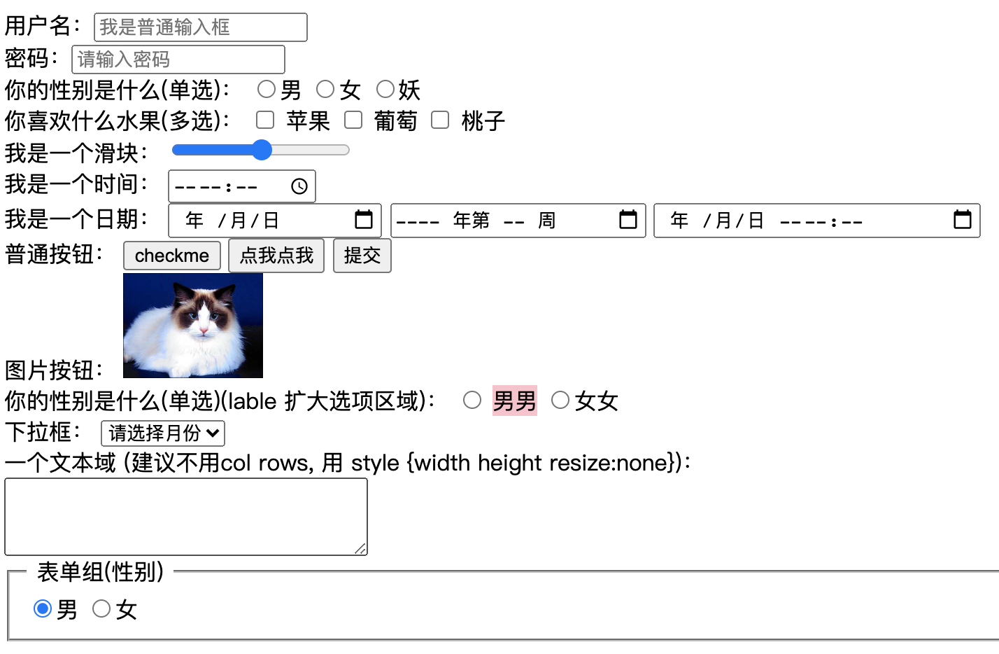

## 2.12 css 表单(form)


表单的数据用来提交给后端。

get方式： 默认，除西安阿紫地址栏，存储量较小，不太安全
post方式：比较安全 (具体方式看后端需求)

##### 1. 语法
```
<form action="">
    <input type="xxxxxx" value="">
</form>

1. type
传统类型(10)：
text      定义单行的输入字段，用户可在其中输入文本
password  定义密码字段。该字段中的字符被掩码
file      定义输入字段和 "浏览"按钮，供文件上传
radio     定义单选按钮
checkbox  定义复选框
hidden    定义隐藏的输入字段
button    定义可点击按钮（多数情况下，用于通过JavaScript启动脚
image     定义图像形式的提交按钮
reset     定义重置按钮。重置按钮会清除表单中的所有数据
submit    定义提交按钮。提交按钮会把表单数据发送到服务

h5新增类型(13)：
color     定义调色板
tel       定义包含电话号码的输入域
email     定义包含email地址的输入域
url       定义包含URL地址的输入域 
search    定义搜索域
number    定义包含数值的输入域
range     定义包含一定范围内数字值的输入域
date      定义选取日、月、年的输入域 
month     定义选取月、年的输入域
week      定义选取周、年的输入域
time      定义选取月、年的输入域
datetime  定义选取时间、日 月、年的输入域(UTC时间)
datatime-local    定义选取时间、日 月、年的输入域(本地时间)


2. label 扩大按钮选中区域 (见下面例子)
label 的 for 绑定 input 的 id 值，来扩大点击for区域选中该input

3. 按钮 button
<input type="button" value="checkme">
<button>点我点我</button>

4. 文本域 textarea
建议不使用 内置的 col rows，使用 style 样式 width、height
默认可以拖动右下角改变大小，可用 resize: none; 取消

5. 表单组 fieldset
可以将表单内元素分组，在周围绘制边框
<fieldset>
  <legend>分组名</legend>
  <input type="xxxxx"></input>
</fieldset>


6. 表单聚焦 (选中后边框变色)
outline: none;  


7. 
```
按钮见 03_07 <https://www.runoob.com/css3/css3-buttons.html>


#### 2. 示例



```
<html lang="en">
<head>
    <meta charset="UTF-8">
    <meta name="viewport" content="width=device-width, initial-scale=1.0">
    <title>Document</title>
    <style>
        .label_sex {
            width: 100px;
            height: 100px;
            background-color:pink;   
        }
    </style>
</head>
<body>
    <form action="" method="">
        用户名：<input type="text" maxlength="10" placeholder="我是普通输入框">
        <br>
        密码：<input type="password" maxlength="5" placeholder="请输入密码">
        
        <br>
        你的性别是什么(单选)：
        <input type="radio" name="sex">男
        <input type="radio" name="sex">女
        <input type="radio" name="sex">妖
        
        <br>
        你喜欢什么水果(多选)：
        <input type="checkbox" name="apple" id="" value="on"> 苹果
        <input type="checkbox" name="grapes" id="" value="on"> 葡萄
        <input type="checkbox" name="peach" id="" value="on"> 桃子
        
        <br>
        我是一个滑块：
        <input type="range" name="" id="" max="99" min="0">
        <!-- <input type="button" value=""> -->

        <br>
        我是一个时间：
        <input type="time" name="" id="">

        <br>
        我是一个日期：
        <!-- <input type="datetime" name="" id=""> -->
        <input type="date" name="" id="">
        <input type="week">
        <input type="datetime-local">

        <br>
        普通按钮：
        <input type="button" value="checkme">
        <button>点我点我</button>
        <input type="submit" >

        <br>
        图片按钮：
        <input style="width: 100px " type="image" src="https://ss1.bdstatic.com/70cFvXSh_Q1YnxGkpoWK1HF6hhy/it/u=3363295869,2467511306&fm=26&gp=0.jpg" alt="">

        <br>
        你的性别是什么(单选)(lable 扩大选项区域)：
        <input type="radio" name="sex" id="sexid">
        <label for="sexid" class="label_sex">男男</label>
        <input type="radio" name="sex">女女

        <br>
        下拉框：
        <select name="" id="">
            <option value="" selected>请选择月份</option>
            <optgroup label="一季度">
                <option value="1">1月</option>
                <option value="2">2月</option>
                <option value="3">3月</option>
            </optgroup>
            <option value="4">4月</option>
            <option value="5">5月</option>
            <option value="6">6月</option>
            <option value="7">7月</option>
        </select>

        <br>
        一个文本域 (建议不用col rows, 用 style {width height resize:none})：<br>
        <textarea name="" id="" cols="30" rows="10"></textarea>
        
        <br>
        <fieldset>
            <legend>&nbsp;表单组(性别)&nbsp;</legend>
            <input type="radio" name="sex" id="" checked>男    
            <input type="radio" name="sex" id="">女    
        </fieldset>

    </form>
    
    
</body>
</html>

```

