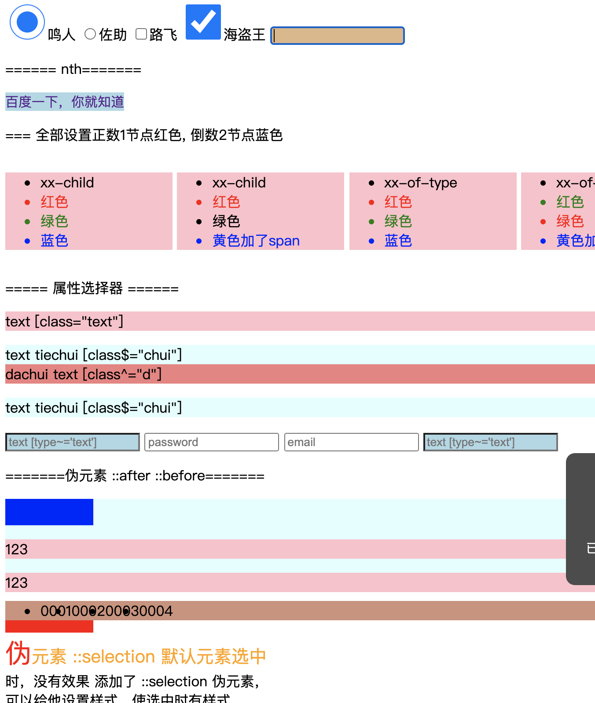

## 2.14 css 伪类/伪元素

##### 1. 伪类 语法(一个冒号)

```
1. 状态 伪类 (爱恨准则 love->hate)
a:link {}    未访问时显示的样式
a:hover {}   鼠标移动上显示的样式
a:active {}  鼠标点击时显示的样式
a:visited {} 访问过后显示的样式

tips：
一般多见于a标签
伪类不区分大小写
:hover  必须跟在 :link 和 :visited后面
:active 必须跟在 :hover后面

2. :checked 伪类   用于 只有checked属性的元素 选中后显示的样式
3. :focus   伪类   用于 能聚焦的元素 选中聚焦后显示的样式

4. 结构类 伪类
x:nth-child(2)	      x元素同层级的第二个元素
x:nth-last-child(2)	  x元素同层级的倒数第二个元素
x:nth-last-of-type(2) x元素同层级同类型的倒数第二个元素
x:nth-of-type(2)	  x元素同层级同类型的第二个元素

5. first/last  
p:first-letter	选择每个<p> 元素的第一个字母
p:first-line	选择每个<p> 元素的第一行
p:first-child	选择器匹配属于任意元素的第一个子元素的 <p> 元素
p:first-of-type	选择的每个 p 元素是其父元素的第一个 p 元素

p:last-child	选择所有p元素的最后一个子元素
p:last-of-type	选择每个p元素是其母元素的最后一个p元素

6. 属性 选择器
[class="text"] {}   class等于text的标签

[class~="text"] {}   class匹配text的标签
[type~="text"]  {}   type 匹配text的标签

[class^="t"]  {}   class以 t 开头的标签
[type$="t"]   {}   type 以 t 结尾的标签 
[class*="t"]  {}   class以 t 模糊匹配的所有标签 


```

##### 2. 伪元素 语法(两个冒号)

伪元素：创建一个假的，不存在于实体结构中的，不会影响seo。

用到最多的地方就是清除浮动 (比如浮动后background-color消失了，但还需

原因：因为 子元素的浮动撑不起父元素的高度 ，浮动后background-color消失了，但还需要他。
解决1：添加一个div，并把div清除下浮动
解决2：利用::after, 把父元素浮动清除


```
1. ::after/::before
ul::after {
    content: "";     必须, 不想要的话置为空
    display: block;  伪元素是行内的，需要改为块
}

2. 其他
::selection     鼠标选中时显示的样式
::first-letter  首字符的样式
::first-line  首行字符的样式
```

##### 3. 其他伪类


##### 3. 示例


```
<html lang="en">
<head>
    <meta charset="UTF-8">
    <meta name="viewport" content="width=device-width, initial-scale=1.0">
    <title>Document</title>
    <style>
        
        .main {
            width: 100%;
            /* margin-bottom: 20px; */
        }
        /* :checked  input:checked  */
        input:checked {
            width: 40px;
            height: 40px;
        }
        input:focus {
            border: 2px solid pink;
            background-color: burlywood;
        }

        /* 状态类伪元素 */
        a:link {
            background-color: lightblue;
            text-decoration: none;
            font-size: 15px;
        }
        a:hover {
            background-color: lightcoral;
            font-size: 20px;
        }
        a:active {
            background-color: lightgray;
        }
        a:visited {
            font-size: 25px;
        }

        /* nth伪类 */
        .nth_ul0,
        .nth_ul1,
        .nth_ul2,
        .nth_ul3,
        .nth_ul4 {
            display: inline-block;
            width: 150px;
            background-color: pink;
        }
        .nth_ul0>li:nth-child(2),
        .nth_ul1>li:nth-child(2) {
            color: red;
        }
        .nth_ul0>li:nth-child(3),
        .nth_ul1>li:nth-child(3) {
            color: green;
        }
        .nth_ul0>li:nth-last-child(1),
        .nth_ul1>li:nth-last-child(1) {
            color: blue;
        }

        .nth_ul2>li:nth-of-type(2),
        .nth_ul3>li:nth-last-of-type(2) {
            color: red;
        }
        .nth_ul2>li:nth-of-type(3),
        .nth_ul3>li:nth-last-of-type(3) {
            color: green;;
        }
        .nth_ul2>li:nth-last-of-type(1),
        .nth_ul3>li:nth-last-of-type(1) {
            color: blue;
        }
       
        p>.text {
            margin:0;
            padding:0;
        }
        [class="text"] {
            background-color: pink;
        }
        [type~="text"] {
            background-color: lightblue;
        }
        [class^="d"] {
         background-color: lightcoral;
        }
        [class$="chui"] {
         background-color: lightcyan;
        }

        .yuansu {
            background-color: lightcyan;
            height: 100px;
        }
        
        .yuansu::before {
            content: "";
            display: block;
            width: 100px;
            height: 30px;
            background-color: blue;
        }
        .yuansu>p {
            background-color: pink;
        }
        .yuansu::after {
            content: "";
            display: block;
            width: 100px;
            height: 30px;
            background-color: red;
        }
        .yuansu~ul {
            background-color: rgb(207, 145, 123);
        }
        .yuansu~ul>li {
            float: left;
        }
        /*  */
        /* .yuansu~ul>div {
            clear: both;
        } */
        .yuansu~ul::after {
            content: "";
            display: block;
            clear: both;
        }
        
        .selection {
            width: 300px;
            /* height: 300px; */
        }
        .selection::selection {
            background-color: pink;
        }
        .selection::first-letter {
            color: red;
            font-size: 30px;
        }
        .selection::first-line{
            color: orange;
            font-size: 20px;
        }

    </style>
</head>
<body>
    
    <!-- :checked  :focus  -->
    <div class="main">
        <input type="radio" name="ch" id="" checked>鸣人
        <input type="radio" name="ch" id="">佐助
    
        <input type="checkbox" name="" id="ch2">路飞
        <input type="checkbox" name="" id="ch2">海盗王
    
        <input type="text" name="">
    </div>
    <p>====== nth=======</p>
    <div class="main">
        <!-- 状态类伪元素 -->
        <a href="#">百度一下，你就知道</a>
    </div>

    <div class="main">
        <!-- nth 伪类 -->
        <p>=== 全部设置正数1节点红色, 倒数2节点蓝色</p>
        <ul class="nth_ul0">
            <li>xx-child</li>
            <li>红色</li>
            <li>绿色</li>
            <li>蓝色</li>
        </ul>
        <ul class="nth_ul1">
            <li>xx-child</li>
            <li>红色</li>
            <span></span>
            <li>绿色</li>
            <li>黄色加了span</li>
        </ul>
        <ul class="nth_ul2">
            <li>xx-of-type</li>
            <li>红色</li>
            <li>绿色</li>
            <li>蓝色</li>
        </ul>
        <ul class="nth_ul3">
            <li>xx-of-type</li>
            <li>红色</li>
            <li>绿色</li>
            <li>黄色加了span</li>
        </ul>
        <!-- <ul class="nth_ul4">
            <li>001</li>
            <li>002</li>
            <span></span>
            <li>003</li>
            <li>004</li>
        </ul> -->
    </div>

    <div class="main">
        <!-- 属性选择器 -->
        <p>===== 属性选择器 ======</p>
        <p class="text">text  [class="text"]</p>
        <div class="text tiechui">text tiechui  [class$="chui"]</div>
        <div class="dachui text">dachui text [class^="d"]</div>
        <p class="text tiechui">text tiechui  [class$="chui"]</p>
        <input type="text" name="" id="" placeholder="text [type~='text']">
        <input type="password" name="" id="" placeholder="password">
        <input type="email" name="" id="" placeholder="email">
        <input type="text" name="" id="" placeholder="text [type~='text']">
    </div>
    <div class="main">
        <!-- 伪元素 -->
        <p>=======伪元素  ::after ::before=======</p>
        <div class="yuansu">
            <p>123</p>
            <p>123</p>
        </div>
        <ul>
            <li>0001</li>
            <li>0002</li>
            <li>0003</li>
            <li>0004</li>
            <!-- <div></div> -->
        </ul>

        <p class="selection">伪元素 ::selection   
            默认元素选中时，没有效果
            添加了 ::selection 伪元素，可以给他设置样式，使选中时有样式。

            ::first-letter 表示对于首字母设置样式
        </p>
    </div>
</body>
</html>
```