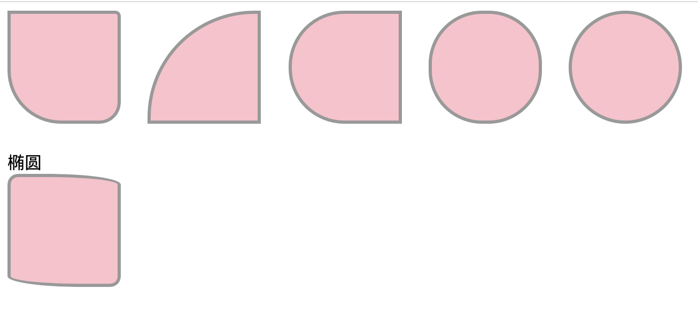

## 3.01 css3 边框圆角(border)

border-radius 可以给任何元素制作圆角

##### 1. 边框
见 盒模型 章节

##### 2. 圆角
```
border-radius:  10px;  	   值为一个圆的半径
四个值：左上、右上、右下、左下
三个值：左上、右上左下、左下
两个值：左上右下、右上左下
一个值：全部

border-top-left-radius	    定义了左上角的弧度
border-top-right-radius	    定义了右上角的弧度
border-bottom-right-radius	定义了右下角的弧度
border-bottom-left-radius	定义了左下角的弧度
```


##### 3. 椭圆角
```
border-radius: 10px/5px;   长半轴x/短半轴y
四个值：左上、右上、右下、左下
三个值：左上、右上左下、左下
两个值：左上右下、右上左下
一个值：全部

```

##### 4. 示例

```
<html lang="en">
<head>
    <meta charset="UTF-8">
    <meta name="viewport" content="width=device-width, initial-scale=1.0">
    <title>Document</title>
    <style>
        .one_basic {
            display: inline-block;
            width: 100px;
            height: 100px;
            background-color: pink;
            margin: 0px 20px 20px 0px;
        }
        .one1 {
            border: 3px solid #999;
            border-radius: 0px 5px 20px 50px;
        }
        .one2 {
            border: 3px solid #999;
            border-radius: 100px 0px 0px 0px;
        }
        .one3 {
            border: 3px solid #999;
            border-radius: 100px 0px 0px 100px;
        }
        .one4 {
            border: 3px solid #999;
            border-radius: 50px;
        }
        .one5 {
            border: 3px solid #999;
            border-radius: 50%;
        }

        .two_basic {
            display: inline-block;
            width: 100px;
            height: 100px;
            background-color: pink;
            margin: 0px 20px 20px 0px;
        }
        .two {
            border: 3px solid #999;
            border-radius: 10px 70px/10px;
        }

    </style>
</head>
<body>
    <div class="one_basic one1"></div>
    <div class="one_basic one2"></div>
    <div class="one_basic one3"></div>
    <div class="one_basic one4"></div>
    <div class="one_basic one5"></div>
    <div>椭圆</div>
    <div class="two_basic two"></div>
</body>
</html>
```
