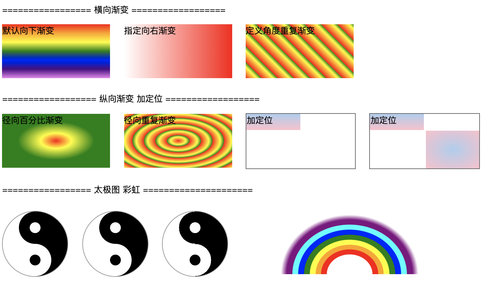

## 3.02 css3 渐变(Gradients)

IE8 及更早版本的 IE 浏览器不支持该属性。

基于 background image 的升级
<file:///Users/ohimma/me/git/doc_web/build/html/c02/02_03.html>

##### 1. 属性 
```
1. 线性渐变
backgroud-image: linear-gradient(red, blue);       默认从上到下，红色到蓝色渐变

backgroud-image: linear-gradient(to right, red, blue);   从左到右，红色到蓝色渐变
backgroud-image: linear-gradient(to bottom right, red, blue);  从左上到右下，红色到蓝色渐变
backgroud-image: linear-gradient(0deg, red, blue);  自定义角度，0deg从下到上，90deg从左到右
background-image: linear-gradient(red,orange,yellow,green,blue,indigo,violet);  多个颜色

background-image: linear-gradient(to right, rgba(255,0,0,0), rgba(255,0,0,1));  透明性的渐变
background-image: linear-gradient(to right, rgb(255,0,0), rgb(255,0,0), transparent 60%);  透明性的渐变

background-image: repeating-linear-gradient(red, yellow 10%, gree 20%);  重复型渐变


2. 径向渐变
background-image: radial-gradient(red, yellow, green);  默认，均匀分布
background-image: radial-gradient(red 5%, yellow 15%, green 60%);  按百分比分布
background-image: radial-gradient(circle, red, yellow, green);     circle圆形默认 ellipse椭圆 

background-image: repeating-radial-gradient(red, yellow 10%, green 15%);  重复型渐变
```


##### 2. 示例

```
<html lang="en">
<head>
    <meta charset="UTF-8">
    <meta name="viewport" content="width=device-width, initial-scale=1.0">
    <title>Document</title>
    <style>
        .one_basic {
            display: inline-block;
            width: 200px;
            height: 100px;  
            margin: 0px 20px 10px 0px; 
        }
        .two_basic {
            display: inline-block;
            width: 200px;
            height: 100px;  
            margin: 0px 20px 10px 0px;  
        }

        .grad1 {
            background-image: linear-gradient(red,orange,yellow,green,blue,indigo,violet);
        }
        .grad2 {
            /* background-color: red;   浏览器不支持时显示 */
            background-image: linear-gradient(to right, rgba(255, 255, 255, 0), rgba(255,0,0,1));
        }
        .grad3 {
            height: 100px;
            /* background-color: red;   浏览器不支持时显示 */
            background-image: repeating-linear-gradient(45deg, red,yellow 7%,green 10%);
        }
        .grad4 {
            background-image: repeating-radial-gradient(red, yellow 10%, green 15%);
        }
        .grad5 {
            background-image: radial-gradient(red, yellow 20%, green 50%);
        }

        .grad6 {
            border: 2px solid #666;
            background: linear-gradient( #abcdef 0%, pink 100%) 
            top left/100px 30px no-repeat;
        }
        .grad7 {
            border: 2px solid #666;
            background: linear-gradient( #abcdef 0%, pink 100%) 
            top left/100px 30px no-repeat,
            radial-gradient(#abcdef 0%, pink 100%)
            bottom right/100px 70px no-repeat;
        }
        .three_basic {
            display: inline-block;
            width: 200px;
            height: 100px;  
            margin: 0px 20px 10px 0px;  
        }
        .basic01 {
            display: inline-block;
            width: 120px;
            height: 120px;
            margin: 0px 20px 20px 0px;

            border-radius: 50%; 
            border: 1px solid #999;
            background-image: linear-gradient(90deg, white 50%, black 50%);
        }
        .t01 {
            box-sizing: border-box;
            width: 60px;
            height: 60px;
            background-color: black;
            border-radius: 50%; 
            margin: 0px auto; 
            padding-top: 20px;
        }
        .t02 {
            box-sizing: border-box;
            width: 60px;
            height: 60px;
            background-color: white;
            border-radius: 50%; 
            margin: 0px auto; 
            padding-top: 20px;
        }
        .t01son {
            width: 20px;
            height: 20px;
            background-color: white;
            border-radius: 50%; 
            margin: 0px auto; 
        }
        .t02son {
            width: 20px;
            height: 20px;
            background-color: black;
            border-radius: 50%; 
            margin: 0px auto; 
        }

        .basic02 {
            display: inline-block;
            width: 120px;
            height: 120px;
            margin: 0px 20px 20px 0px;

            border-radius: 50%; 
            border: 1px solid #999;
            background-image: linear-gradient(90deg, white 50%, black 50%);
        }
        .son01 {
            box-sizing: border-box;
            width: 60px;
            height: 60px;

            background-color: white;
            border: 20px solid black;
            border-radius: 50%;
            margin: 0px auto;
        }
        .son02 {
            box-sizing: border-box;
            width: 60px;
            height: 60px;

            background-color: black;
            border: 20px solid white;
            border-radius: 50%;
            margin: 0px auto;
        }

        .basic03 {
            display: inline-block;
            width: 120px;
            height: 120px;
            margin: 0px 20px 20px 0px;

            border-radius: 50%; 
            border: 1px solid #999;
            background: 
            radial-gradient(white 10px, black 10px, black 70%, transparent 70%)
            30px 0px/60px 60px no-repeat,
            radial-gradient(black 10px, white 10px, white 70%, transparent 70%)
            30px 60px/60px 60px no-repeat,
            linear-gradient(90deg, white 50%, black 50%) 
            no-repeat;
        }

        .rainbow {
            /* box-sizing: border-box; */
            display: inline-block;
            width: 300px;
            height: 130px;
            margin: 0px 0px 25px 50px;
 
            background: radial-gradient(at bottom, transparent 20% , red 20%, red 25%, orange 25%, orange 30%, yellow 30%, yellow 35%, green 35%, green 40%, blue 40%, blue 45%, cyan 45%, cyan 50%, purple 50% , purple 55%, transparent 60%);
            border-radius:  120px 120px 0 0;
        }

    </style>
</head>
<body>
    <p>================= 横向渐变 ==================</p>
    <div class="one_basic grad1">  默认向下渐变</div>
    <div class="one_basic grad2">  指定向右渐变</div>
    <div class="one_basic grad3">  定义角度重复渐变</div>
    <p>================== 纵向渐变  加定位 ==================</p>
    <div class="two_basic grad5">  径向百分比渐变</div>
    <div class="two_basic grad4">  径向重复渐变</div>
    <div class="two_basic grad6">  加定位</div>
    <div class="two_basic grad7">  加定位</div>

    <p>=================  太极图 彩虹 =====================</p>
    <div class="basic01">
        <div class="t01">
            <div class="t01son"></div>
        </div>
        <div class="t02">
            <div class="t02son"></div>
        </div>
    </div>
    <div class="basic02">
        <div class="son01"></div>
        <div class="son02"></div>
    </div>
    <div class="basic03"></div>
    <div class="rainbow"></div>
</body>
</html>
```

