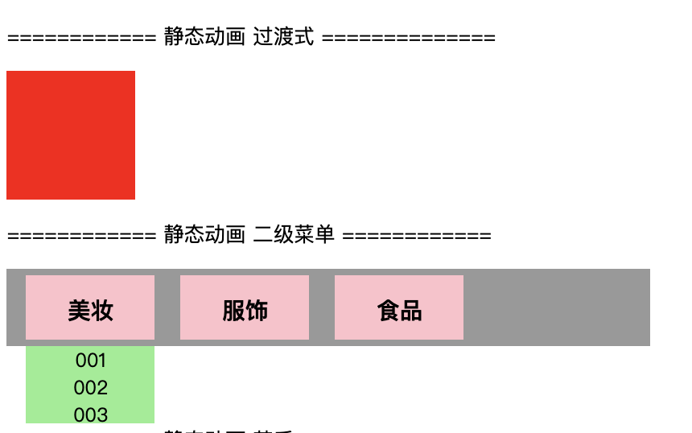

## 3.03 css3 静态动画-过渡(transition)

CSS3 过渡是元素从一种样式逐渐改变为另一种的效果。

要实现这一点，必须规定两项内容：
1. 指定要添加效果的CSS属性
2. 指定效果的持续时间。


##### 1. 语法
```
1. 简写
transition: property duration timing-function delay;

2. 指定使用css过渡属性的名称
transtion-property: none;  没有属性会获得过渡效果
transtion-property: all ;  所有属性会获得过渡效果
transtion-property: property;  定义过渡效果的css名称，逗号分割

3. 切换效果速度
transition-timing-function: linear;   相同速度过渡
transition-timing-function: ease;     慢速开始，然后变快，然后变慢
transition-timing-function: ease-in;      慢速开始的过渡效果
transition-timing-function: ease-out;     慢速结束的过渡效果
transition-timing-function: ease-in-out;  慢速开始和结束的过渡效果
transition-timing-function: cubic-bezier(n,n,n,n);  自定义


4. 定义过渡效果持续时间
transition-duration: 5s;  默认为0，不会有过渡效果

5. 定义效果开始时刻
transtion-delay: 2ms;  以秒为单位（S）或毫秒（ms）

```
cubic 曲线 <https://cubic-bezier.com/>

##### 2. 示例

```
<!DOCTYPE html>
<html>
<head>
<meta charset="utf-8"> 
<title>txt</title>
<style> 
    div, ul, li, h4 {
        margin: 0;
        padding: 0;
    }
    div {
        box-sizing: border-box;
    }
    li {
        list-style: none;
    }
    /* 静态动画 基础过渡 */
    .one {
      width: 100px;
      height: 100px;
      background-color: #f00;
      transition: all 2s;
      transition-timing-function: ease;
    }
    
    .one:hover{
        width: 800px;
        background-color: #00f; 
    }

     /* 静态动画 二级菜单 */
    .two {
        width: 500px;
        height: 60px;
        background: #999;
        padding: 5px 5px;
    }
    .two>ul>li {
        width: 100px;
        height: 50px;
        background-color: pink;

        margin: 0px 10px; 
        
        text-align: center;
        float: left;
    }
    .two>ul>li>h4 {
        font-size: 18px;
        padding: 15px 0px;
    }
  
    .two>ul>li>ul {
        width: 100px;
        background-color: lightgreen;
        font-size: 15px;

        /* display: none; */
        transition-duration: 1s;
        height: 0;
        overflow: hidden;
        
    }
    .two>ul>li>h4:hover~ul {
        /* display: block; */
        height: 60px;
    }

    
    </style>
</head>
<body>
    <p>============ 静态动画 过渡式 ==============</p>
    <div class="one"></div>
    

    <p>============ 静态动画 二级菜单 ============</p>
    <div class="two">
        <ul>
            <li>
                <h4>美妆</h4>
                <ul>
                    <li>001</li>
                    <li>002</li>
                    <li>003</li>
                </ul>
            </li>
            <li>
                <h4>服饰</h4>
                <ul>
                    <li>001</li>
                    <li>002</li>
                    <li>003</li>
                </ul>
            </li>
            <li>
                <h4>食品</h4>
                <ul>
                    <li>001</li>
                    <li>002</li>
                    <li>003</li>
                </ul>
            </li>
        </ul>
    </div>

</body>
</html>

```