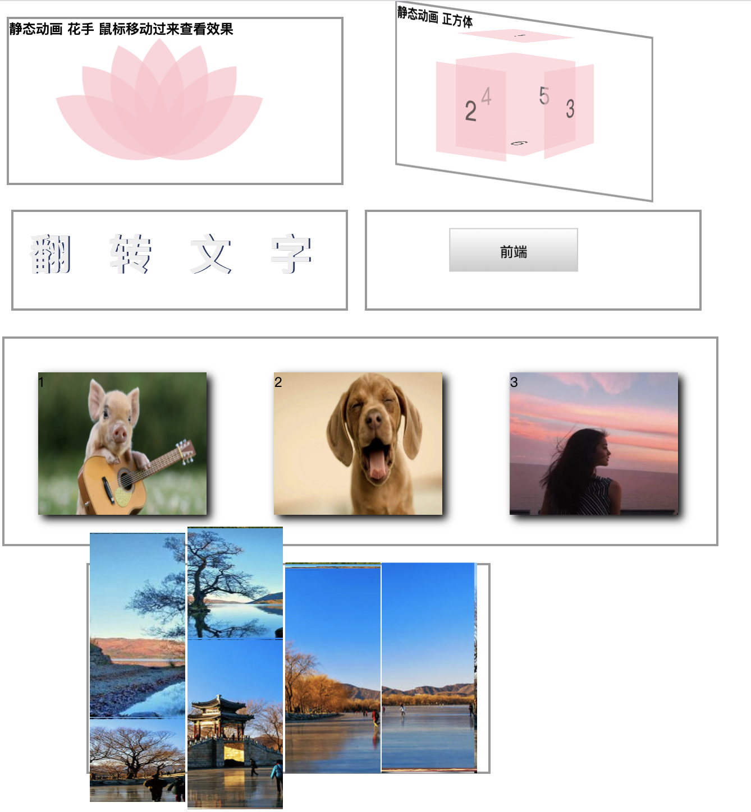

## 3.05 css3 2D3D(transform)


##### 1. 2D
目的： 让某个元素改变形状、大小、位置。

**transform 属性的方法**
```
1. 2D 移动
transform: translate(x,y);	    移动，沿着 X 和 Y 轴移动元素。
transform: translateX(n);	    移动，沿着 X 轴移动元素。
transform: translateY(n);	    移动，沿着 Y 轴移动元素。
 
2. 2D 缩放
transform: scale(x,y);	    缩放，改变元素的宽度和高度。倍数缩放
transform: scaleX(n);	    缩放，改变元素的宽度。
transform: scaleY(n);	    缩放，改变元素的高度。

3. 2D 倾斜
transform: skew(x-angle,y-angle)	倾斜，沿着 X 和 Y 轴。
transform: skewX(angle)	            倾斜，沿着 X 轴。
transform: skewY(angle)	            倾斜，沿着 Y 轴。

4. 2D 旋转
transform: rotate(angle)	        旋转，在参数中规定角度。30deg 顺时针旋转30度
 
5. 简写
transform: matrix(n,n,n,n,n,n);	    简写，使用六个值的矩阵。 旋转，缩放，移动（平移）和倾斜功能
```

**其他属性的方法**
```
1. 更改转换元素的位置
transform-origin: x-axis y-axis;   left/right/center/length/%

```


##### 2. 3D 

**必须属性**
```
1. 元素在三维空间中的展现 
transform-style: flat;          元素在2d平面内呈现  
transform-style: preserver-3d;  元素在3d平面内呈现 

2. 3d元素怎么查看透视图
perspective: none;  默认值，不设置透视
perspective: 10px;  元素距离视图的距离
```

**transform 属性的方法**
```
1. 3D 移动
transform: translate3d(x,y,z)	定义 3D 转化。
transform: translateX(x)	    定义 3D 转化，仅使用用于 X 轴的值。
transform: translateY(y)	    定义 3D 转化，仅使用用于 Y 轴的值。
transform: translateZ(z)	    定义 3D 转化，仅使用用于 Z 轴的值。
 
2. 3D 缩放
transform: scale3d(x,y,z)	定义 3D 缩放转换。
transform: scaleX(x)	    定义 3D 缩放转换，通过给定一个 X 轴的值。
transform: scaleY(y)	    定义 3D 缩放转换，通过给定一个 Y 轴的值。
transform: scaleZ(z)	    定义 3D 缩放转换，通过给定一个 Z 轴的值。
 
3. 3D 旋转
transform: rotate3d(x,y,z,angle)	定义 3D 旋转。
transform: rotateX(angle)	        定义沿 X 轴的 3D 旋转。
transform: rotateY(angle)	        定义沿 Y 轴的 3D 旋转。
transform: rotateZ(angle)	        定义沿 Z 轴的 3D 旋转。
 
4. 简写所有
transform: matrix3d(n,n,n,n,n,n,n,n,n,n,n,n,n,n,n,n)	定义 3D 转换，使用 16 个值的 4x4 矩阵。

5. 定义透视试图
transfrom: perspective(n)	定义 3D 转换元素的透视视图。
```

**其他属性的方法**
```
1. 更改转换元素的位置
transform-origin: x-axis  y-axis  z-axis;  值类型 left/right/center/length/%

2. 3d元素底部位置的改变
perspective-origin: x-axis y-axis;   值类型 left/right/center/length/%

3. 元素背向屏幕时是否可见
backface-visibility: visible;   背面可见
backface-visibility: hidden ;   背面不可见
```

##### 3. 示例



```
<!DOCTYPE html>
<html>
<head>
<meta charset="utf-8"> 
<title>txt</title>
<style> 
    div, ul, li, h4, span {
        margin: 0;
        padding: 0;
    }
    div {
        box-sizing: border-box;
    }
    ul {
        list-style: none;
    }

    #one,
    #two {
        width: 400px;
        height: 200px;
        border: 3px solid #999; 
        position: relative;
        margin: 10px 5px;
        display: inline-block;
    }
    #one>div {
        width: 100px;
        height: 100px;
        background-color: pink;
        border-radius: 0% 100% 0% 100%;
        opacity: 0.7;
        position: absolute;
        top: 33%;
        left: 20%;
        transform: rotate(45deg);
        transform-origin: 100% 100%;
        transition: all 2s; 
    }
    #one:hover>.one_1 {
        transform: rotate(15deg);
    }
    #one:hover>.one_2 {
        transform: rotate(-15deg);
    }
    #one:hover>.one_3 {
        transform: rotate(-45deg);
    }
    #one:hover>.one_5 {
        transform: rotate(75deg);
    }
    #one:hover>.one_6 {
        transform: rotate(105deg);
    }
    #one:hover>.one_7 {
        transform: rotate(135deg);
    }

    /* 正方体 */
    #two {
        transform-style: preserve-3d;
        perspective: 1000px;
        transform: rotateX(-10deg) rotateY(-40deg);
    }
    #two>div {
        height: 100px;
        width: 100px;
        background-color: pink;
        opacity: 0.6;
        position: absolute;
        top: 25%;
        left: 35%;

        line-height: 100px;
        font-size: 30px;
        text-align: center;
        transition: all 2s; 
    }
    .two_1 {
        transform: translateY(-80px) rotateX(90deg) ;
    }
    .two_2 {
        transform: translateZ(80px);
    }
    .two_3 {
        transform: translateX(80px) rotateY(90deg) ;
    }
    .two_4 {
        transform: translateX(-50px) rotateY(90deg) ;
    }
    .two_5 {
        transform: translateZ(-50px);
    }
    .two_6 {
        transform: translateY(50px) rotateX(90deg) ;
    }
    #two:hover>.two_1 {
        transform: translateY(-50px) rotateX(90deg) ;
    }
    #two:hover>.two_2 {
        transform: translateZ(50px);
    }
    #two:hover>.two_3 {
        transform: translateX(50px) rotateY(90deg) ;
    }

    /* 翻转文字 */
    #three,
    #four {
        width: 400px;
        height: 120px;
        float: left;
        border: 3px solid #999;
        margin: 20px 10px;
    }
    
    #three>span {
        font-size: 50px;
        font-weight: bolder;
        color: #2c3763;
        line-height: 100px;
        margin: 0px 20px;
        position: relative;
    }
    #three>span::before,
    #three>span::after {
        content: attr(data-txt);
        position: absolute;
        top: -15px;
        left: -2px;
        transform-origin: top left;
        transition: all 1s;
    }
    #three>span::before {
        color: #eee;
        z-index: 3;
        /* transform: rotateY(-10deg); */
    }
    #three>span::after {
        color: #ccc;
        /* transform: scale(1.2, 1); */
        z-index: -2;
    }
    #three>span:hover::before {
        transform: rotateY(-45deg) skew(0deg, 5deg);
    }
    #three>span:hover::after {
        transform: rotateY(45deg) skew(0deg, 15deg);
    }
    
    #four {
        position: relative;
        transform-style: preserve-3d;
        perspective: 1000px;
        transition: transform 2s;
    }
    #four>div {
        width: 150px;
        height: 50px;
        line-height: 50px;
        text-align: center;
        background: linear-gradient(#fff 0%, #ccc 100%);
        
        border: 2px solid #ccc;  
        position: absolute;
        top: 20px;
        left: 100px;      
    }
    .four_1 {
        transform: translateZ(25px);
    }
    .four_2 {
        transform: rotateX(-90deg) translateZ(25px) translateY(0px) ;
    }
    #four:hover {
        transform: rotateX(90deg);
    }
    
    #five  {
        width: 850px;
        height: 250px;
        border: 3px solid #999;

        margin-top: 170px;
    }
    #five>div {
        width: 200px;
        height: 170px;
        float: left;
        margin: 40px 40px;
    }
    .five_1 {
        background: url("https://gimg2.baidu.com/image_search/src=http%3A%2F%2Fpic1.win4000.com%2Fwallpaper%2F9%2F57453aa68c207.jpg&refer=http%3A%2F%2Fpic1.win4000.com&app=2002&size=f9999,10000&q=a80&n=0&g=0n&fmt=jpeg?sec=1613051054&t=1518183feb3e9a885e859ce66be3df7d")
                    no-repeat;
        background-size: 100% 100%;
        box-shadow: 5px 5px 10px;
    }
    @keyframes five_1 {
        0% {
            transform: rotateX(360deg) rotateY(360deg)  rotateX(360deg);
        }
        100% {
            transform: rotateX(0deg) rotateY(0deg)  rotateX(0deg);
        }
    }
    .five_1:hover {
        animation: five_1 1s;
    }
    .five_2 {
        background: url("https://ss0.bdstatic.com/70cFuHSh_Q1YnxGkpoWK1HF6hhy/it/u=3119437833,1172150545&fm=26&gp=0.jpg")
            no-repeat;
        background-size: 100% 100%;
        box-shadow: 5px 5px 10px;
    }
    @keyframes five_2 {
        0% {
            transform: rotateY(0deg);
        }
        40% {
            transform: rotateX(360deg) rotateY(360deg) scale(0.5, 0.5);
        }
        80% {
            transform: rotateY(360deg)  rotateX(360deg) scale(2,2);
        }
        100% {
            transform: rotateX(0deg);
        }
    }
    .five_2:hover {
        animation: five_2 3s;
    }
    .five_3 {
        background: url("https://ss1.bdstatic.com/70cFuXSh_Q1YnxGkpoWK1HF6hhy/it/u=3424632260,738201303&fm=26&gp=0.jpg")
                    no-repeat;
        background-size: 100% 100%;
        box-shadow: 5px 5px 10px;
    }
    @keyframes five_3 {
        0% {
            transform: skew(0deg, 0deg);
        }
        40% {
            transform: skew(360deg, 0deg);
        }
        80% {
            transform: skew(0deg, 360deg);
        }
        100% {
            transform: skew(0deg, 0deg);
        }
    }
    .five_3:hover {
        animation: five_3 3s;
    }
   
    #six {
        width: 480px;
        height: 250px;
        border: 3px solid #999;
        margin: 20px 0 0 100px;
    }
    
    #six ul {
        width: 100%;
        height: 100%;
        /* transform-style: preserve-3d;
        perspective: 1000px;
        transform: rotateY(35deg) rotateX(30deg);
        overflow: hidden; */
    }
    #six ul li {
        width: 24%;
        height: 100%;
        float: left;
        margin: 0 1px;
        transform-style: preserve-3d;
        position: relative;
        
    }
    #six ul li span {
        width: 100%;
        height: 100%;
        position: absolute;
        top: 0;
        left: 0;
    }

    #six ul li span:nth-child(1) {
        background: url("https://ss2.bdstatic.com/70cFvnSh_Q1YnxGkpoWK1HF6hhy/it/u=2864214521,2142530011&fm=26&gp=0.jpg")
           no-repeat;
        transform: translateZ(120px);
    } 
    #six ul li span:nth-child(2) {
        background: url("https://ss0.bdstatic.com/70cFuHSh_Q1YnxGkpoWK1HF6hhy/it/u=364397611,3916868751&fm=26&gp=0.jpg");
        transform: rotateX(90deg) translateZ(120px);
    } 
    
    #six ul li span:nth-child(3) {
        background: url("https://gimg2.baidu.com/image_search/src=http%3A%2F%2Fimg.netbian.com%2Ffile%2F20121227%2Fe1d6a0d8a9143b9235cc4618f84474cb.jpg&refer=http%3A%2F%2Fimg.netbian.com&app=2002&size=f9999,10000&q=a80&n=0&g=0n&fmt=jpeg?sec=1613057242&t=4319c5855dd7b6866a9467f4656c5f38");
        transform: rotateX(180deg) translateZ(120px);
    } 
    #six ul li span:nth-child(4) {
        background: url("https://ss1.bdstatic.com/70cFvXSh_Q1YnxGkpoWK1HF6hhy/it/u=3113764863,3565868822&fm=26&gp=0.jpg") ;
        transform: rotateX(270deg) translateZ(120px);
    } 

    /* 图片定位 */
    #six ul li:nth-child(2) span{
       background-position: -130px 0;
    }
    #six ul li:nth-child(3) span{
       background-position: -260px 0;
    }
    #six ul li:nth-child(4) span{
       background-position: -390px 0;
    }
    
    @keyframes turn {
        0% {
            transform: rotateX(0deg);
        }
        25% {
            transform: rotateX(-90deg);
        }
        50% {
            transform: rotateX(-180deg);
        }
        75% {
            transform: rotateX(-270deg);
        }
        100% {
            transform: rotateX(-360deg);
        }
        
    }
    #six ul li:nth-child(1) {
        animation: turn 2s;
    } 
    #six ul li:nth-child(2) {
        animation: turn 2s 0.1s;
    } 
    #six ul li:nth-child(3) {
        animation: turn 2s 0.2s;
    } 
    #six ul li:nth-child(4) {
        animation: turn 2s 0.3s;
    } 
    

    /* #six>ul:hover {
        animation: turn 2s;
    } */

    p {
        width: 400px;
        height: 100px;
        float: left;
    }

    </style>
</head>
<body>
    
    <div id="one">
        <h4>静态动画 花手 鼠标移动过来查看效果</h4>
        <div class="one_1"></div>
        <div class="one_2"></div>
        <div class="one_3"></div>
        <div class="one_4"></div>
        <div class="one_5"></div>
        <div class="one_6"></div>
        <div class="one_7"></div>
    </div>

    <div id="two">
        <h4>静态动画 正方体 </h4>
        <div class="two_1">1</div>
        <div class="two_2">2</div>
        <div class="two_3">3</div>
        <div class="two_4">4</div>
        <div class="two_5">5</div>
        <div class="two_6">6</div>
    </div>

    <div></div>
    <div id="three">
        <span data-txt="翻">翻</span>
        <span data-txt="转">转</span>
        <span data-txt="文">文</span>
        <span data-txt="字">字</span>
    </div>
    <div id="four">
        <div class="four_1">前端</div>
        <div class="four_2">后端</div>
    </div>

    <div class="line"></div>
    <div id="five">
        <div class="five_1">1</div>
        <div class="five_2">2</div>
        <div class="five_3">3</div>
    </div>

    <div id="six">
        <ul>
            <li>
                <span></span>
                <span></span>
                <span></span>
                <span></span>
            </li>
            <li>
                <span></span>
                <span></span>
                <span></span>
                <span></span>
            </li>
            <li>
                <span></span>
                <span></span>
                <span></span>
                <span></span>
            </li>
            <li>
                <span></span>
                <span></span>
                <span></span>
                <span></span>
            </li>
        </ul>
    </div>
    
</body>
</html>
```