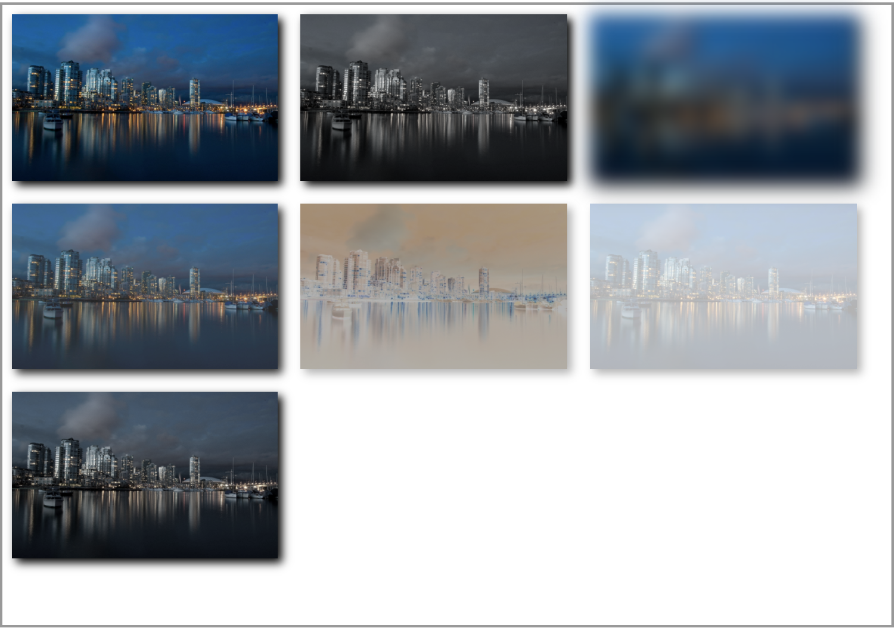

## 3.06 css3 滤镜(filter)

滤镜通常使用百分比 (如：75%), 当然也可以使用小数来表示 (如：0.75)


##### 1. 语法
```
filter: none	         默认值，没有效果。
filter: blur(px)	     高斯模糊。所以值越大越模糊；则默认是0；
filter: brightness(%)	 一种线性乘法，使其看起来更亮或更暗。如果值是0%，图像会全黑。值是100%，则图像无变化。
filter: contrast(%)	     调整图像的对比度。值是0%的话，图像会全黑。值是100%，图像不变。值可以超过100%，意味着会运用更低的对比。若没有设置值，默认是1。
filter: grayscale(%)	 转换为灰度图像。值定义转换的比例。值为100%则完全转为灰度图像，值默认是0；

filter: hue-rotate(deg)	 给图像应用色相旋转。值为0deg，则图像无变化 默认值是0deg。该值虽然没有最大值，超过360deg的值相当于又绕一圈。

filter: invert(%)	     反转输入图像。100%的价值是完全反转。值为0%则图像无变化。默认是0。
filter: opacity(%)	     转化图像的透明程度。值为0%则是完全透明，值为100%则图像无变化。与opacity属性很相似，不同之处在于通过filter，一些浏览器为了提升性能会提供硬件加filter: 速。
filter: saturate(%)	     转换图像饱和度。值为0%则是完全不饱和，值为100%则图像无变化。默认是1。
filter: sepia(%)	     将图像转换为深褐色。值为100%则完全是深褐色的，值为0%图像无变化。默认是0；
filter: url()	         URL函数接受一个XML文件，该文件设置了 一个SVG滤镜，且可以包含一个锚点来指定一个具体的滤镜元素。
 
filter: drop-shadow(h-shadow v-shadow blur spread color)	
给图像设置一个阴影效果。阴影是合成在图像下面，可以有模糊度的，可以以特定颜色画出的遮罩图的偏移版本。 函数接受<shadow>(在CSS3背景中定义)类型的值，除了"inset"关键字是不允许的。该函数与已有的box-shadow box-shadow属性很相似；不同之处在于，通过滤镜，一些浏览器为了更好的性能会提供硬件加速。<shadow>参数如下：

<offset-x> <offset-y> (必须)
这是设置阴影偏移量的两个 <length>值. <offset-x> 设定水平方向距离. 负值会使阴影出现在元素左边. <offset-y>设定垂直距离.负值会使阴影出现在元素上方。查看<length>可能的单位.
如果两个值都是0, 则阴影出现在元素正后面 (如果设置了 <blur-radius> and/or <spread-radius>，会有模糊效果).
<blur-radius> (可选)
这是第三个code><length>值. 值越大，越模糊，则阴影会变得更大更淡.不允许负值 若未设定，默认是0 (则阴影的边界很锐利).
<spread-radius> (可选)
这是第四个 <length>值. 正值会使阴影扩张和变大，负值会是阴影缩小.若未设定，默认是0 (阴影会与元素一样大小). 
注意: Webkit, 以及一些其他浏览器 不支持第四个长度，如果加了也不会渲染。
 
<color> (可选)
查看 <color>该值可能的关键字和标记。若未设定，颜色值基于浏览器。在Gecko (Firefox), Presto (Opera)和Trident (Internet Explorer)中， 会应用colorcolor属性的值。另外, 如果颜色值省略，WebKit中阴影是透明的。

```

##### 2. 示例


```
<!DOCTYPE html>
<html>
<head>
<meta charset="utf-8"> 
<title>txt</title>
<style> 
    div, ul, li, h4, span {
        margin: 0;
        padding: 0;
    }
    div {
        box-sizing: border-box;
    }
    ul {
        list-style: none;
    }

    #one {
        width: 1000px;
        height: 700px;
        border: 3px solid #999;

    }
    #one>img {
        width: 30%;
        margin: 10px 10px;
        box-shadow: 5px 5px 10px;
    }

    #one>img:nth-child(2) {
        filter: grayscale(90%);
    }
    #one>img:nth-child(3) {
        filter: blur(10px);
    }
    #one>img:nth-child(4) {
        filter: contrast(70%);
    }
    #one>img:nth-child(5) {
        filter: invert(70%);
    }
    #one>img:nth-child(6) {
        filter: opacity(30%);
    }
    #one>img:nth-child(7) {
        filter: saturate(30%);
    }
    
    </style>
</head>
<body>
    <div id="one">
        
        
        
        
        
        
        
    </div>
</body>
</html>
```