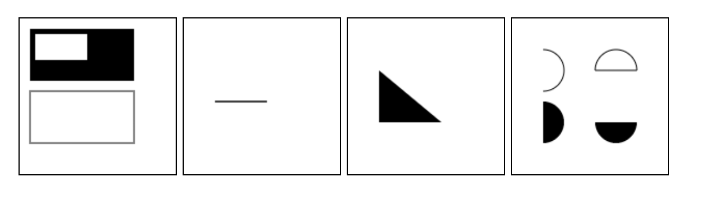
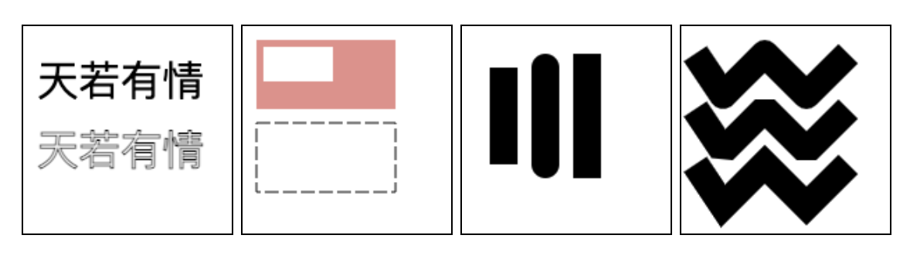
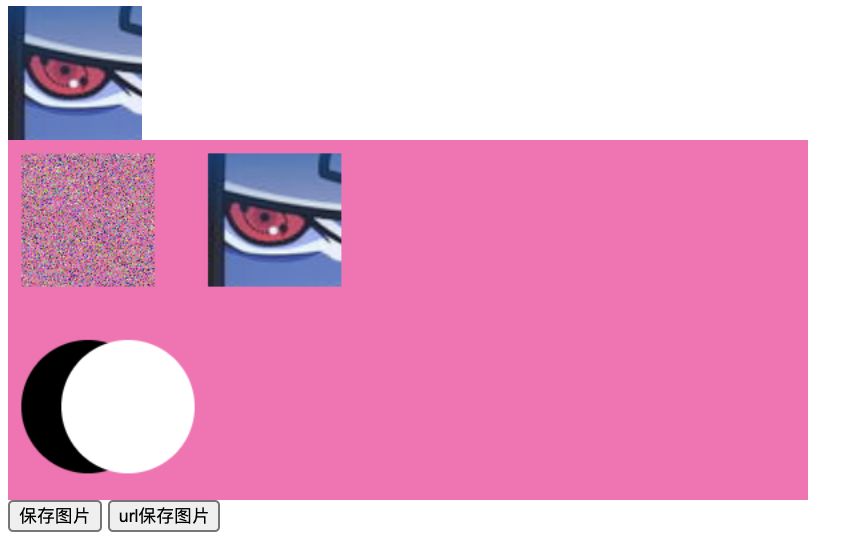
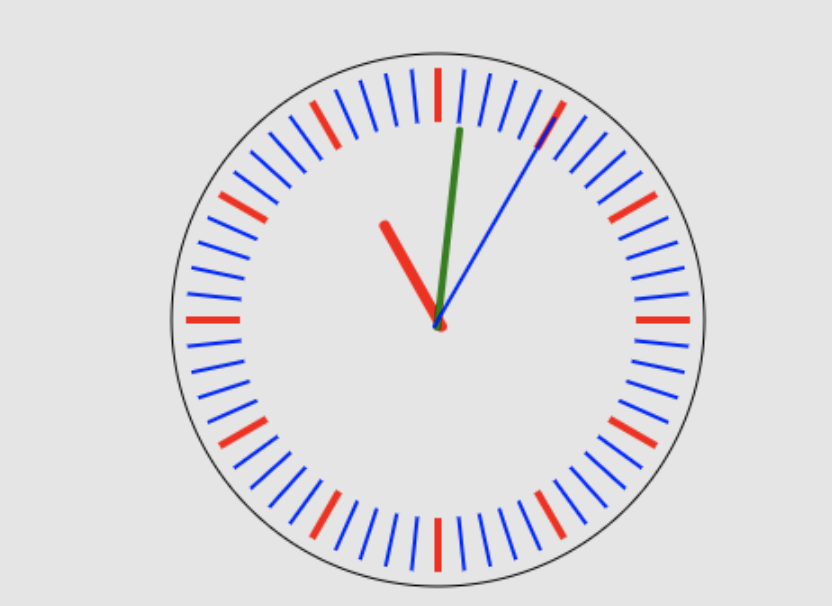

## 3.09 HTML5 画布(canvas)

canvas 是H5更新的最大一个亮点，替代了Flash，制作动画、游戏、实时视频，渲染效率很高，而且不需要安装任何插件。           

canvas 标签只是图形容器，需要通过脚本 (通常是JavaScript)来完成。       

##### 1. 语法

```
// 创建画布 (看起来和类似，但只有两个 width/height 属性，默认宽300px、高150px。建议不要用css设置宽高)
<canvas id="tutorial" width="300" height="300"></canvas>

// 渲染上下文，现在重点研究 2d 对象
var canvas = document.getElementById('tutorial');
var ctx = canvas.getContext('2d');

```

##### 2. 矩形和填充
三种方法：         
1、fillRect(x, y, width, height)     绘制一个填充的矩形             
2、strokeRect(x, y, width, height)   绘制一个矩形的边框
3、clearRect(x, y, widh, height)     清除指定的矩形区域，然后这块区域会变的完全透明              

x, y：指的是矩形的左上角的坐标，width, height：指的是绘制的矩形的宽和高 

##### 3. 绘制路径/圆弧/曲线
图形的基本元素是路径。          

使用路径绘制图形需要一些额外的步骤：
1、beginPath()   新建一条路径    
2、moveTo(x, y)  创建路径起始点 
3、closePath()   闭合路径
4、stroke()      通过线条来绘制图形轮廓
4、fill()        通过填充路径内容区域生成实心图形

绘制圆弧两种方法：      
1、arc(x, y, r, startAngle, endAngle, anticlockwise) 
以(x, y) 为圆心，r为半径，从startAngle弧度开始到endAngle弧度结束。anticlosewise 是布尔值，true 表示逆时针，false 表示顺时针(默认是顺时针)        
Math.PI = 3.14 = 180度    
90度角 * Math.PI / 180   // 90度角 转弧度         

2、arcTo(x1, y1, x2, y2, radius): 根据给定的控制点和半径画一段圆弧，最后再以直线连接两个控制点

```
<body>
	<canvas id="tutorial0" width="150" height="150"></canvas>
    <canvas id="tutorial1" width="150" height="150"></canvas>
	<canvas id="tutorial2" width="150" height="150"></canvas>
    <canvas id="tutorial3" width="150" height="150"></canvas>
<script type="text/javascript">
	function draw0(){
        var canvas = document.getElementById('tutorial0');
        if(!canvas.getContext) return;
        var ctx = canvas.getContext("2d");
    	
    	ctx.fillRect(10, 10, 100, 50);   // 在x=10y=10地方绘制    100*50的矩形
    	
        ctx.strokeRect(10, 70, 100, 50);  // 在x=10y=70地方绘制    100*50的矩形
    	
    	ctx.clearRect(15, 15, 50, 25);    // 绘制清楚矩形，默认颜色    为白色
    }
    function draw1(){
        var canvas = document.getElementById('tutorial1');
        if(!canvas.getContext) return;
    	
        var ctx = canvas.getContext("2d");
    	
    	ctx.beginPath();     //新建一条path
        ctx.moveTo(30, 80);  //把画笔移动到指定的坐标
        ctx.lineTo(80, 80);  //绘制一条从当前位置到指定坐标(70, 50)的直线.
        ctx.closePath();     //闭合路径
        ctx.stroke();        //通过线条绘制路径。
    }
	function draw2(){
        var canvas = document.getElementById('tutorial2');
        if(!canvas.getContext) return;
    	
        var ctx = canvas.getContext("2d");
    	
    	ctx.beginPath();  
        ctx.moveTo(30, 50);
        ctx.lineTo(30, 100);
        ctx.lineTo(90, 100);
        ctx.fill();     //填充闭合区域。如果path没有闭合，则fill()会自动闭合路径。
    }
	function draw3(){
        var canvas = document.getElementById('tutorial3');
        if(!canvas.getContext) return;
    	
        var ctx = canvas.getContext("2d");
    	
    	ctx.beginPath();
        ctx.arc(30, 50, 20, -Math.PI / 2, Math.PI / 2, false);
        ctx.stroke();    // 不闭合，-90度~90度，逆时针，线条绘制路径
     
        ctx.beginPath();
        ctx.arc(100, 50, 20, 0, Math.PI, true);
        ctx.closePath();  
        ctx.stroke();    // 闭合，0~180度，顺时针，线条绘制路径
     
        ctx.beginPath();
        ctx.arc(30, 100, 20, -Math.PI / 2, Math.PI / 2, false);
        ctx.fill();     // 不闭合，-90度~90度，逆时针，填充绘制
     
        ctx.beginPath();
        ctx.arc(100, 100, 20, 0, Math.PI, false);
        ctx.fill();     // 不闭合，0度~180度，逆时针，填充绘制
    }
	
	draw0();
    draw1();
	draw2();
	draw3();
</script>
</body>
```



##### 4. 线条样式/颜色/文本
**颜色设置：**         
1、fillStyle = color   // 设置填充颜色(对标css),可以是渐变、rgba等     
2、strokeStyle = color // 设置轮廓颜色(对标css)      


**线条样式连接点：**          
setLineDash[10, 2]   // 虚线 实线长10 间隙2           
lineDashOffset = -0  // 虚线 起始偏移量             
lineWidth = 10       // 默认是线的宽度1.0               

lineCaps = butt      // 线段末端以方形结束             
lineCaps = round     // 线段末端以圆形结束           
lineCaps = square    // 线段末端以方形结束             

lineJoin = round     // 线段连接处，圆形拐角         
lineJoin = bevel     // 线段连接处，矩形拐角          
lineJoin = miter     // 线段连接处，菱形拐角(默认)          

**阴影：**
shadowOffsetX = -10;
shadowOffsetY =  10;
shadowBlur = 2;
shadowColor = 'yellow'; 

**绘制文本** 
fillText(text,x,y [,maxWidth])  // 在 (x,y) 位置填充text，宽度可选           
strokeText(text,x,y[,maxWidth]) // 在(x,y) 位置绘制text边框，宽度可选         
font = "大小 字体"     // 绘制文本样式，默认的字体是 10px sans-serif

textAlign = value   // 文本对齐 start/end/left/right/center。默认值是 start。          
textBaseline = value  // 文本基线 top/hanging/middle/alphabetic(默认)/ideographic/bottom      
direction = value    // 文本方向ltr, rtl, inherit。默认值是 inherit。        

**案例**
```
<body>
    <canvas id="tutorial1" width="150" height="150"></canvas>
	<canvas id="tutorial2" width="150" height="150"></canvas>
	<canvas id="tutorial3" width="150" height="150"></canvas>
	<canvas id="tutorial4" width="150" height="150"></canvas>
	
<script type="text/javascript">
    function draw1(){
        var canvas = document.getElementById('tutorial1');
        if (!canvas.getContext) return;
        ctx = canvas.getContext("2d");
		
        ctx.font = "30px sans-serif"
        ctx.fillText("天若有情", 10, 50);
        ctx.strokeText("天若有情", 10, 100)
    }
	function draw2(){
        var canvas = document.getElementById('tutorial2');
        if(!canvas.getContext) return;
        var ctx = canvas.getContext("2d");
    	
    	ctx.fillStyle = "rgba(200,0,0,0.5)"; // 绘制填充矩形，默认颜色为    黑色
    	ctx.fillRect(10, 10, 100, 50);       // 在x=10y=10地方绘制    100*50的矩形
    	ctx.clearRect(15, 15, 50, 25);    // 绘制清楚矩形，默认颜色    为白色
		
		ctx.setLineDash([10, 3]);         // [实线长度, 间隙长度]
        ctx.lineDashOffset = -0;
        ctx.strokeRect(10, 70, 100, 50);

    }
	function draw3(){
        var canvas = document.getElementById('tutorial3');
        if(!canvas.getContext) return;
        var ctx = canvas.getContext("2d");
    	
		var lineCaps = ["butt", "round", "square"];
		ctx.lineWidth = 20;
		
		for (var i = 0; i < 3; i++){
            ctx.beginPath();
            ctx.moveTo(30 + 30 * i, 30);
            ctx.lineTo(30 + 30 * i, 100);
            ctx.lineCap = lineCaps[i];
            ctx.stroke();
        }
    }
	function draw4(){
        var canvas = document.getElementById('tutorial4');
        if(!canvas.getContext) return;
        var ctx = canvas.getContext("2d");
    	
		var lineJoin = ['round', 'bevel', 'miter'];
        ctx.lineWidth = 20;
     
        for (var i = 0; i < lineJoin.length; i++){
            ctx.beginPath();
            ctx.moveTo(10, 20 + i * 40);
            ctx.lineTo(30, 50 + i * 40);
            ctx.lineTo(60, 20 + i * 40);
            ctx.lineTo(90, 50 + i * 40);
            ctx.lineTo(120, 20 + i * 40);
			ctx.lineJoin = lineJoin[i];
            ctx.stroke();
        }
    }
    draw1();
	draw2();
	draw3();
	draw4();
</script>
</body>
```



##### 5. 变形/裁剪 
translate(x, y)   // 移动      
rotate(angle)     // 旋转            
scale(x, y)       // 缩小放大               
transform(a, b, c, d, e, f)   // 变形矩阵  

clip();   // 裁剪

```
// 没懂
var ctx;
function draw(){
    var canvas = document.getElementById('tutorial1');
    if (!canvas.getContext) return;
    var ctx = canvas.getContext("2d");
 
    ctx.beginPath();
    ctx.arc(20,20, 100, 0, Math.PI * 2);
    ctx.clip();   // 裁剪
 
    ctx.fillStyle = "pink";
    ctx.fillRect(20, 20, 100,100);
}
draw();
```


##### 6. 状态的保存/恢复
save 和 restore 方法是用来保存和恢复 canvas 状态的，都没有参数                 

save() ：Canvas状态存储在栈中，每当save()方法被调用后，当前的状态就被推送到栈中保存                      
restore()：每一次调用 restore 方法，上一个保存的状态就从栈中弹出，所有设定都恢复(类似数组的 pop())        

    

##### 7. 图像绘制/合成/导出
1、图片绘制      
ctx.drawImage(img,x,y)   // 把 img 放到 x y处            
ctx.drawImage(image, x, y, width, height)   // width/height 缩放大小                
ctx.drawImage(image, sx, sy, sWidth, sHeight, dx, dy, dWidth, dHeight)
// 前 4 个是定义图像源的切片位置和大小，后 4 个则是定义切片的目标显示位置和大小       


2、图像操作           
ctx.createImageData(100,100)      // 创建宽高100的图像块
ctx.getImageData(x,y,width,height)  // 复制xy坐标上，矩形区域的宽高
ctx.putImageData(imageData, 450, 10)  // 把imageData放到x=450 y=10的坐标轴上


3、图像合成                          
globalCompositeOperation = "source-over";    // 覆盖之前的，默认          
globalCompositeOperation = "source-in";      // 仅显示新图像重叠部分           
globalCompositeOperation = "source-out";     // 仅显示新图像没有重叠部分         
globalCompositeOperation = "source-atop";    // 显示老图像及新图像和老图像重叠部分         
globalCompositeOperation = "destination-over";    // 新图像在老图像下边         
globalCompositeOperation = "destination-in";       // 仅显示老图像重叠部分          
globalCompositeOperation = "destination-out";      // 仅显示老图像没有重叠部分            
globalCompositeOperation = "destination-atop";                 

globalCompositeOperation = "lighter";    // 新老图像都显示，重叠部分颜色特殊处理          
globalCompositeOperation = "darken";     // 保留重叠部分最黑的像素            
globalCompositeOperation = "lighten";    // 保留重叠部分最量的像素             
globalCompositeOperation = "xor";        // 重叠部分变透明              
globalCompositeOperation = "copy";       // 只保留新图像             

4、图像导出
canvas.toBlob()   // 图片数据转换为Blob对象
canvas.toDataURL()  // 默认导出 data:png:base64 编码的二进制URL
canvas.toDataURL('image/jpeg') // 指定导出 data:jpg:base64 编码二进制url

```
<html lang="en">
<head>
    <meta charset="UTF-8">
    <meta name="viewport" content="width=device-width, initial-scale=1.0">
    <title>Document</title>
</head>
<style>
    canvas {
        display: block;
        background-color: hotpink;
    }
</style>
<body>
    <br>
    <canvas id="myCanvas" width="600" height="400">
        您的浏览器不支持 canvas，请升级浏览器
    </canvas>
    <input type="button" id="btn1" value="保存图片">
    <input type="button" id="btn2" value="url保存图片">
    <div></div>
    

    <script>
        let myCanvas = document.querySelector('#myCanvas')
        let ctx = myCanvas.getContext('2d')

        // 1. 点击图片 复制到画布的 x=220 y=10 处
        function draw() {
            var img = document.querySelector("img");
            ctx.drawImage(img,220,10);
        }
        document.querySelector("img").onclick = function (){
            draw();
        }

        // 创建空白imageData  宽高100*100 像素点10000个
        // 每个像素点包含4个信息 r red 、g dreen、b blue、a 
        let imageData = ctx.createImageData(100,100) 
        // console.log(imageData.data)
        for (let i = 0; i < imageData.data.length; i += 4) {
            // imageData.data[i] = 0;   // r
            // imageData.data[i+1] = 255; // g
            // imageData.data[i+2] = 0; // b
            // imageData.data[i+3] = 255; // a
            imageData.data[i] = Math.floor(Math.random() * 256);
            imageData.data[i+1] = Math.floor(Math.random() * 256);
            imageData.data[i+2] = Math.floor(Math.random() * 256);
            imageData.data[i+3] = Math.floor(Math.random() * 256);
        }

        // 1. 把 100*100的像素块放到画布 x=10 y=10的地方
        // 2. 把 100*100的随机像素块放到画布 x=10 y=10的地方
        ctx.putImageData(imageData, 10, 10);  

        // 3. 画图片
        let img = new Image()
        img.src = '../source/_static/html5_img_03_09-1.png'
        img.onload = function() {
           ctx.drawImage(this,120,10);   //显示原图片

           let imageData2 = ctx.getImageData(110, 10,100,100);
           console.log(imageData2);
           ctx.putImageData(imageData2, 450, 10);
        }


        // 4. 图片合成
        ctx.beginPath();
        ctx.fillStyle = "black";
        ctx.arc(60,200,50,0, Math.PI * 2);
        ctx.fill();

        // ctx.globalCompositeOperation = "destination-out"; //全局合成操作

        ctx.beginPath();
        ctx.fillStyle = "white";
        ctx.translate(30, 0)
        ctx.arc(60,200,50,0, Math.PI * 2);
        ctx.fill();

        // 5. 下载图片
        function downloadImage1() {
            const link = document.createElement('a');
            link.download = 'mon.jpg';
            link.href = myCanvas.toDataURL('image/jpeg');
            link.click();  // 用代码调用 a.click方法
        }
        function downloadImage2() {
            myCanvas.toBlob((blob) => {
                const link = document.createElement('a')
                link.download = '';
                link.href = window.URL.createObjectURL(blob);
                link.click();
            })
        }
        document
        .getElementById('btn1')
        .addEventListener('click', downloadImage1);
        
        document
        .getElementById('btn2')
        .addEventListener('click', downloadImage2);
    </script>
</body>
</html>
```



##### 8. api动画时钟

动画步骤：     
1、clearRect()   // 清空 canvas。再绘制每一帧动画之前，需要清空所有         
2、save()        // 保存 canvas 状态             
3、绘制动画图形            
4、restore()     // 恢复 canvas 状态，在绘制完成一帧后            

```
<body>
<canvas id="solar" width="300" height="300"></canvas>
<script>
init();
// 1. 初始化画布
function init(){
    let canvas = document.querySelector("#solar");
    let ctx = canvas.getContext("2d");
    draw(ctx);
}
// 2. 请求动画
function draw(ctx){
    requestAnimationFrame(function step(){
        drawDial(ctx);     //绘制表盘
        drawAllHands(ctx); //绘制时分秒针
        requestAnimationFrame(step);  //闭环循环
    });
}
// 3. 绘制表盘
function drawDial(ctx){
    let pi = Math.PI;

    ctx.clearRect(0, 0, 300, 300); // 清除所有内容
    ctx.save();                    // 清除后保存最原始状态

    ctx.translate(150, 150);       // 坐标原点移动到原来的中心
    ctx.beginPath();
    ctx.arc(0, 0, 148, 0, 2 * pi); //x,y,r,绘制最外层圈
    ctx.stroke();
    ctx.closePath();

    for (let i = 0; i < 60; i++){  // 绘制刻度
        ctx.save();                // 每制作一刻度保存
        ctx.rotate(-pi / 2 + i * pi / 30);  //旋转坐标轴。坐标轴x的正方形从 向上开始算起
        ctx.beginPath();
        ctx.moveTo(110, 0);
        ctx.lineTo(140, 0);
        ctx.lineWidth = i % 5 ? 2 : 4;
        ctx.strokeStyle = i % 5 ? "blue" : "red";
        ctx.stroke();
        ctx.closePath();
        ctx.restore();
    }
    ctx.restore();
}
// 4. 绘制时分秒针
function drawAllHands(ctx){
    let time = new Date();

    let s = time.getSeconds();
    let m = time.getMinutes();
    let h = time.getHours();

    let pi = Math.PI; // 180度
    let secondAngle = pi / 180 * 6 * s;  //计算出来s针的弧度
    let minuteAngle = pi / 180 * 6 * m + secondAngle / 60;  //计算出来分针的弧度
    let hourAngle = pi / 180 * 30 * h + minuteAngle / 12;  //计算出来时针的弧度

    drawHand(hourAngle, 60, 6, "red", ctx);       //绘制时针
    drawHand(minuteAngle, 106, 4, "green", ctx);  //绘制分针
    drawHand(secondAngle, 129, 2, "blue", ctx);  //绘制秒针
}
/*绘制时针、或分针、或秒针
 * 参数1：要绘制的针的角度
 * 参数2：要绘制的针的长度
 * 参数3：要绘制的针的宽度
 * 参数4：要绘制的针的颜色
 * 参数4：ctx
 * */
function drawHand(angle, len, width, color, ctx){
    ctx.save();
    ctx.translate(150, 150); //把坐标轴的远点平移到原来的中心
    ctx.rotate(-Math.PI / 2 + angle);  //旋转坐标轴。 x轴就是针的角度
    ctx.beginPath();
    ctx.moveTo(-4, 0);
    ctx.lineTo(len, 0);  // 沿着x轴绘制针
    ctx.lineWidth = width;
    ctx.strokeStyle = color;
    ctx.lineCap = "round";
    ctx.stroke();
    ctx.closePath();
    ctx.restore();
}
</script>
</body>
```



##### 9. api绘图/刮刮乐/

制作一个绘图工具
```


```