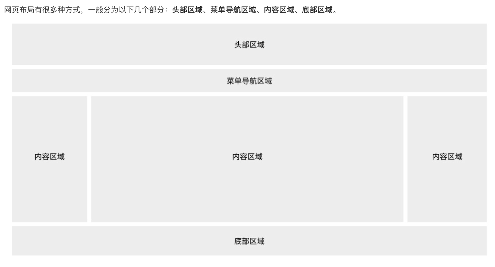

## 4.03 布局及语义化标签及优雅降级




##### 1. H5 语义化标签


**1. 为什么要语义化**
```
代码结构:  使页面没有css的情况下，也能够呈现出很好的内容结构
有利于SEO: 爬虫依赖标签来确定关键字的权重，因此可以和搜索引擎建立良好的沟通，帮助爬虫抓取更多的有效信息
提升用户体验： 例如title、alt可以用于解释名称或者解释图片信息，以及label标签的灵活运用。
便于团队开发和维护: 语义化使得代码更具有可读性，让其他开发人员更加理解你的html结构，减少差异化。
方便其他设备解析: 如屏幕阅读器、盲人阅读器、移动设备等，以有意义的方式来渲染网页。

```

**2. 常用语义化标签**
```
<hearder></hearder>
定义文档的页面组合, 用于定义页面的介绍展示区域
通常包括网站logo、主导航、全站链接以及搜索框。

<nav></nav>
应该放入一些当前页面的主要导航链接，不是所有的链接都需要包含在<nav>中

<main></main>
定义页面的主要内容，一个页面只能使用一次。如果是web应用，则包围其主要功能

<article></articel>
定义页面独立的内容，它可以有自己的header、footer、sections等，专注于单个主题的博客文章，报纸文章或网页文章

<section></section>
元素用于标记文档的各个部分，例如长表单文章的章节或主要部分。

<aside></aside>
定义与主要内容相关的内容块。通常显示为侧边栏。

<footer>
定义文档的底部区域，通常包含文档的作者，著作权信息，链接的使用条款，联系信息等

<small>
不重要的内容定义小字体。如果被包围的字体已经是最小字号，那么它将不起任何作用。

<strong>
把文本定义为语气更强的强调的内容，以表示内容的重要性

<blockquote>
定义块引用，浏览器会在 blockquote 元素前后添加换行，并增加外边距

<mark>
定义带有记号的文本。请在需要突出显示文本时使用 <mark> 标签

```


##### 2. 优雅降级 渐进增强

借用标签 解析顺序是从上至下 的功能，同时定义新老标签

```
p {
    border-color: rgb(0,0,255);    
    border-color: rgba(0,0,255,0.5);   
}
```
