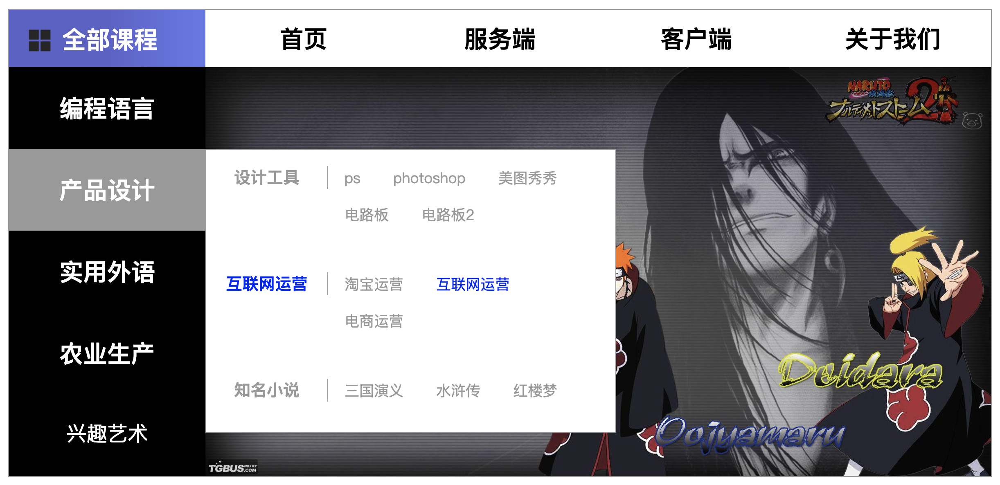

## 5.02 示例 导航

```
思路：
1. 先思考如何布局，div + background-color 搭好框架
2. 填充最外层内容  (大致作好后开始合并代码)
3. 写隐藏部分布局  (先放到一边，显式的写)
4. 隐藏部分功能细节完善
5. hover 出隐藏部分

tips:
1. 元素先去除默认 margin、padding
2. 盒子最外层不使用 盒元素，最内层元素优先使用 padding box-sizing
3. 内容区 不使用盒元素，使用 width、height 等文本元素装饰


用到的元素：
元素选择器：class、空格后代、>子代、逗号并集
定位：position
浮动：float
盒元素：margin padding border box-sizing
隐藏溢出：display + overflow

```


```
<html lang="en">
<head>
    <meta charset="UTF-8">
    <meta name="viewport" content="width=device-width, initial-scale=1.0">
    <title>Document</title>
    <style>
        div, h3, h4, h4, ul, li {
            margin: 0;
            padding: 0;
            list-style: none;
        }
        a {
            text-decoration: none;
            color: #999;
        }
        /* 第一部分： 盒子完成 */
        .all {
            width: 1200px;
            height: 570px;
            border: 1px solid #999;  
            margin: 100px auto;
        }
        .box1 {
            height: 70px;
        }
        .box2 {
            height: 500px;
            background-color: lightblue;
        }
        .box1_1,
        .box1_2 {
            height: 100%;
            float: left;
        }
        .box2_1,
        .box2_2 {
            height: 100%;
            float: left;
        }

        .box1_1,
        .box2_1 {
            width: 20%;
        }
        .box1_2,
        .box2_2 {
            width: 80%;
        }
        
        .box1_1 {
            /* background-color: blue; */
            background: linear-gradient(90deg, rgb(94, 94, 201) 50%, rgb(105, 118, 235) 100%);
            color: white;
        }
        .box2_1 {
            background-color: black;
            color:white;
        }
        /*  第二部分：填充 显示内容  */
        /*  1-2 和 2-1 盒子太多相同，计算好文字和边框占用大小就可以完全统一了 */
        .box1_1>ul>li,
        .box1_2>ul>li,
        .box2_1>ul>li {
            box-sizing: border-box;
            font-size: 25px;
            text-align: center;
            width: 240px; 
            float: left;
        }
        .box1_1 img{
            height: 50%;
            padding: 20px 0px 15px 20px;
            float: left;
        }
        .box1_1 h3{
            padding: 16px 55px 14px 10px;
            float: left;
        }

        .box1_2>ul>li {
            padding: 15px 40px;
        }
        .box2_1>ul>li {
            height: 100px;
            padding: 30px 40px;
            position: relative;
        }
   
        .box1_2>ul>li:hover,
        .box2_1>ul>li:hover {
            background-color: #999;
        }
        /*  第三部分: 书写隐藏部分，需要使用定位 */
        .box2_1_ul {
            display: none;
            width: 500px;
            position: absolute;
            top: 0px;
            left: 100%;
            background-color: white;
            border: 1px solid #999;
        }

        .box2_1_ul>li>h4 {
            box-sizing: border-box;
            width: 149px;
            margin: 20px 0px;
            float: left;

            font-size: 20px;
            border-right: 1px solid #999;
        }

        .box2_1_ul>li>ul {
            box-sizing: border-box;
            width: 70%;
            margin: 20px 0px; 
            float: left;
        } 
        .box2_1_ul>li>ul>li {
            padding: 2px 20px 18px 20px;
            font-size: 18px;
            float: left;
        } 

        /*  第四部分：选中三级标题自动关联二级标题 */
        .box2_1_ul>li:hover>h4 a{
            color: blue;
        }
        .box2_1_ul>li>ul>li:hover a{
            color: blue;
        }

        /*  第五部分：当 hover box2_1>ul>li>h3 时才显示下边的 ul */
        .box2_1>ul>li:hover>ul {
            color: pink;
            display: block;
            overflow: auto;
        }

        
        .box2_2>img {
            width: 100%;
            height: 100%;
        }
    </style>
</head>
<body>
    <div class="all">
        <div class="box1">
            <div class="box1_1">
                <ul>
                    <li>
                         
                        <h3>全部课程</h3>
                    </li>
                </ul>
            </div>
            <div class="box1_2">
                <ul>
                    <li><h3>首页</h3></li>
                    <li><h3>服务端</h3></li>
                    <li><h3>客户端</h3></li>
                    <li><h3>关于我们</h3></li>
                </ul>
            </div>
        </div>
        <div class="box2">
            <div class="box2_1">
                <ul>
                    <li>
                        <h3>编程语言</h3>
                        <ul class="box2_1_ul">
                            <li >
                                <h4><a href="#">工作岗位</a> </h4>
                                <ul >
                                    <li><a href="#">前端工程师</a></li>
                                    <li><a href="#">后端工程师</a></li>
                                    <li><a href="#">运维</a></li>
                                    <li><a href="#">架构师</a></li>
                                    <li><a href="#">经理</a></li>
                                    <li><a href="#">技术总监</a></li>
                                </ul>
                            </li>
                            <li>
                                <h4><a href="#"> 后端开发</a></h4>
                                <ul >
                                    <li><a href="#">php</a></li>
                                    <li><a href="#">java</a></li>
                                    <li><a href="#">go</a></li>
                                    <li><a href="#">c</a></li>
                                    <li><a href="#">c++</a></li>
                                    <li><a href="#">python</a></li>
                                    <li><a href="#">ruby</a></li>
                                    <li><a href="#">lua</a></li>
                                    <li><a href="#">shell</a></li>
                                </ul>
                            </li>
                            <li>
                                <h4><a href="#">前端开发</a> </h4>
                                <ul >
                                    <li><a href="#">html</a></li>
                                    <li><a href="#">js</a></li>
                                    <li><a href="#">vue</a></li>
                                </ul>
                            </li>
                        </ul>
                    </li>
                    <li>
                       <h3>产品设计</h3> 
                       <ul class="box2_1_ul">
                            <li >
                                <h4><a href="#">设计工具</a></h4>
                                <ul>
                                    <li><a href="#">ps</a></li>
                                    <li><a href="#">photoshop</a></li>
                                    <li><a href="#">美图秀秀</a></li>
                                    <li><a href="#">电路板</a></li>
                                    <li><a href="#">电路板2</a></li>
                                </ul>
                            </li>
                            <li >
                                <h4><a href="#">互联网运营</a></h4>
                                <ul>
                                    <li><a href="#">淘宝运营</a></li>
                                    <li><a href="#">互联网运营</a></li>
                                    <li><a href="#">电商运营</a></li>
                                </ul>
                            </li>
                            <li >
                                <h4><a href="#">知名小说</a></h4>
                                <ul> 
                                    <li><a href="#">三国演义</a></li>
                                    <li><a href="#">水浒传</a></li>
                                    <li><a href="#">红楼梦</a></li>
                                </ul>
                            </li>
                        </ul>
                    </li>
                    <li>
                        <h3>实用外语</h3>
                        <ul class="box2_1_ul">
                            <li >
                                <h4><a href="#">中国语言</a></h4>
                                <ul>
                                    <li><a href="#">汉语</a></li>
                                    <li><a href="#">粤语</a></li>
                                    <li><a href="#">闽南语</a></li>
                                    <li><a href="#">东北语</a></li>
                                </ul>
                            </li>
                            <li >
                                <h4><a href="#">各国语言</a></h4>
                                <ul>
                                    <li><a href="#">英语</a></li>
                                    <li><a href="#">法语</a></li>
                                    <li><a href="#">德语</a></li>
                                    <li><a href="#">阿拉伯语</a></li>
                                    <li><a href="#">尼日利亚语</a></li>
                                </ul>
                            </li>
                        </ul>
                    </li>
                    <li>
                        <h3>农业生产</h3>
                        <ul class="box2_1_ul">
                            <li>
                                <h4>001</h4>
                                <ul>
                                    <li>0001</li>
                                    <li>0002</li>
                                    <li>0003</li>
                                </ul>
                            </li>
                            <li>
                                <h4>002</h4>
                                <ul>
                                    <li>0001</li>
                                    <li>0002</li>
                                    <li>0003</li>
                                </ul>
                            </li>
                        </ul> 
                    </li>
                    <li>
                        兴趣艺术
                        <ul class="box2_1_ul">
                            <li>
                                <h4>001</h4>
                                <ul>
                                    <li>0001</li>
                                    <li>0002</li>
                                    <li>0003</li>
                                </ul>
                            </li>
                            <li>
                                <h4>002</h4>
                                <ul>
                                    <li>0001</li>
                                    <li>0002</li>
                                    <li>0003</li>
                                </ul>
                            </li>
                        </ul> 
                    </li>
                </ul>

            </div>
            <div class="box2_2">
                
            </div>
        </div>
    </div>
</body>
</html>
```

