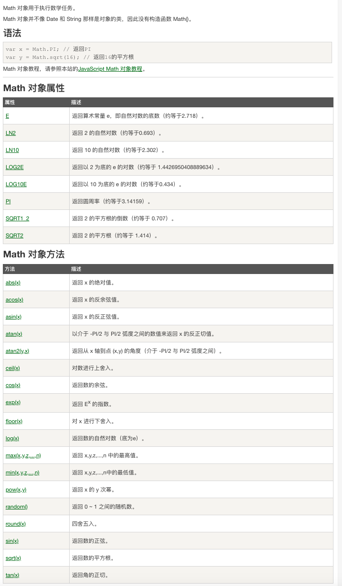

## 3.04 JS: 对象

对象手册 <https://www.runoob.com/jsref/jsref-tutorial.html>

#### 1. arr 属性及方法

用于在变量中存储多个值 var cars = ["sa", "ca", "da"]

数组属性

```
console.log(cars.constructor)   //   打印原型函数
console.log(cars.length)        //   返回数组个数

Array.prototype.myUpcase = function()  // 添加对象属性或者方法
{
  for (i=0; i<this.length; i++ ) {
    this[i] = this[i].toUpperCase();
  }
  return this
}
console.log(cars.myUpcase())

>>>
[Function: Array]
3
[ 'SA', 'CA', 'DA' ]
```

数组方法

```

var cars = ["1", "2", "3", "4", "5"]

// 一：会创建新数组

// 检测数组所有元素是否全符合条件，不符合返回false
function checkNum(car) {
  return car >= "2";
}
function checkNum2(item, index) {
  return "[" + item + "]" + index
}

// 返回数组可迭代对象
console.log(cars.entries())     // Object [Array Iterator] {}
console.log(cars.keys())        // Object [Array Iterator] {}

// 对数组进行循环检测，并输出
console.log(cars.every(checkNum))  // false
console.log(cars.forEach(checkNum2))
// 不会对空数组进行检测，不会改变原始数组，创建一个新数组
console.log(cars.filter(checkNum))    // [ '2', '2', '3' ]
console.log(cars.some(checkNum))      // [ '2', '2', '3' ]
console.log(cars.map(checkNum))       // [ false, true, false, true, true ]


console.log("=================")

// 二：会修改原数组
var cars = [1, 2, 3, 4]
var add1 = ["5"]
console.log(cars.concat(add1))         // [ 1, 2, 3, 4, '5' ] 拼接


console.log(cars.fill("aa", 2, 4))     // [ 1, 2, 'aa', 'aa' ] 用“aa” 填充索引2到索引4的位置
console.log(cars.copyWithin(2, 0, 3))  // [ 1, 2, 1, 2 ] 复制1 2 放到 第0位开始到第4位为止
console.log(cars.push("11", 11))       // 6 在最后添加一个元素 并返回新的长度
console.log(cars.pop())                // 11 在最后删除一个元素，并返回该元素
console.log(cars.shift())              // 1 在首位删除一个元素，并返回该元素
console.log(cars.unshift("22"))        // 5 在首位添加元素，并返回新长度
console.log(cars.reverse())            // [ '11', 2, 1, 2, '22' ]  反转元素顺序
console.log(cars.sort())               // [ 1, '11', 2, 2, '22' ]  排序

console.log(cars.splice(3, 1))          // [ 2 ] 删除索引3的的1位元素
console.log(cars.splice(1, 0, "11",3))  // [] 删除索引1的0位元素，并添加"11",3

console.log(cars)                       // [ 1, '11', 3, '11', 2, '22' ]

// 查找字符串
console.log(cars.find(checkNum))      // 2 返回符合的第一个元素的值
console.log(cars.includes("8", 2))    // false  是否包含某个值 从索引2开始查找
console.log(cars.indexOf("8", 2))     // -1  返回指定元素的起始出现位置 从索引2开始查找
console.log(cars.lastIndexOf("8", 2)) // -1  返回指定元素的最后出现位置 从索引2开始查找
console.log(Array.isArray(cars))      // true 判断是否是数组

// 转字符串
console.log(cars.join("|"))           // 1|11|1|11|2|22  数组所有元素变成字符串，|分隔
console.log(cars.toString())          // 1,11,1,11,2,22  转换成字符串

// 切割字符串
console.log(cars.slice(1, 3))         // [ '11', 1 ] 选取索引 1-2 元素组成新数组

// console.log(cars.valueOf())        // 返回对象的原始值

```

#### 2. bool 属性及方法

属性

```
constructor	// 返回对创建此对象的 Boolean 函数的引用
prototype	  // 使您有能力向对象添加属性和方法
```

方法

```
// valueOf 返回原始值
var bool = new Boolean(0);   // [Boolean: false] object
var myvar = bool.valueOf();  // false boolean

// 转成字符串
var myvar2 = bool.toString(); // false string
```

#### 3. number 属性及方法

var num = new Number(value);

对象属性

```
constructor	        返回对创建此对象的 Number 函数的引用。
MAX_VALUE	          可表示的最大的数。
MIN_VALUE	          可表示的最小的数。
NEGATIVE_INFINITY	  负无穷大，溢出时返回该值。
NaN	                非数字值。
POSITIVE_INFINITY	  正无穷大，溢出时返回该值。
prototype	          允许您可以向对象添加属性和方法
```

对象方法

```
isFinite	        检测指定参数是否为无穷大。
toExponential(x)	把对象的值转换为指数计数法。
toFixed(x)	      把数字转换为字符串，结果的小数点后有指定位数的数字。
toPrecision(x)	  把数字格式化为指定的长度。
toString()	      把数字转换为字符串，使用指定的基数。
valueOf()	        返回一个 Number 对象的基本数字值。
```

新增 Number 属性

```
var x = Number.EPSILON; // 2.220446049250313e-16 , 比1大但接近1的值
var y = Number.MIN_SAFE_INTEGER; // -9007199254740991  最小的安全型数字 (-(2的53方 - 1))
var z = Number.MAX_SAFE_INTEGER; // 9007199254740991 最大的安全整数 （2的53方 - 1）
```

新增 Number 方法

```
Number.isInteger(): 用来判断给定的参数是否为整数。
Number.isSafeInteger(): 判断传入的参数值是否是一个"安全整数"。

安全整数范围为 -(2的53方 - 1)到 2的53方 - 1 (包含)
```

#### 4. string 属性及方法

属性

```
constructor	// 返回对创建此对象的 Boolean 函数的引用
prototype	  // 使您有能力向对象添加属性和方法
length      // 字符串长度
```

方法

```
var str = "HELLO WORLD ";
var str2 = "man";

1. 返回指定位置的字符
str.charAt(2)   // L

2. 返回指定位置字符的unicode编码
str.charCodeAt(2)  // 76

3. 把 unicode编码转为字符
String.fromCharCode(76)  // L

4. 拼接字符串
str.concat(str2)        // HELLO WORLD man

5. 匹配某个字符串在整个字符串中首次出现位置
str.indexOf("L", 3)      // 3  在索引3的位置开始查找
str.lastIndexOf("L")     // 9  反向查找

6. 查找字符串中是否包含指定字符串
str.includes("LL", 0)   // true 在索引0开始查找
str.search("LL")        // 2 查找字符串位置，找不到返回-1
str.startsWith("LL")    // false 检测是否是LL开头

7. 检所正则表达式匹配的值
str.match(/L/g)   // ['L', 'L', 'L']

8. 复制字符串指定次数，并将他们连接返回
str.repeat(2)     // HELLO WORLD HELLO WORLD

9. 查找字符串并替换
str.replace("LL", "aa")   // HEaao WORLD

10. 字符串截取字符
str.slice(1, 5)           // ELLO 从索引1切割5位字符
str.substr(1, 5)          // ELLO
str.substring(1, 5)       // ELLO

11. 分割字符转数组
str.split(" ")            // ['HELLO', 'WORLD', '']
str.split("L")            // ['HE', '', 'O WOR', 'D ']

12. 把字符串转为大小写
str.toLowerCase()         // hello world
str.toUpperCase()         // HELLO WORLD
str.toLocalLowerCase()         // 根据本地语言环境转为小写
str.toLocalUpperCase()         // 根据本地语言环境转为大写

13. 删除字符串头尾空白符 (不包括中间的)
str.trim()                // HELLO WORLD

14. 返回某个字符串的原始值
str.valueOf()             // HELLO WORLD

15. 返回一个字符串
str.toString()            // HELLO WORLD
```

string html 包装方法

```
var str = "HELLO man";

1. 创建闪动字符串
str.blink()     // <blink>HELLO man </blink>

2. 创建html锚
str.anchor()    // <a name="undefined">HELLO man </a>

str.big()       // 大号字体 <big>HELLO man</big>
str.bold()      // 粗体  <b>HELLO man</b>
str.fixed()     // 打字机文本显示 <tt>HELLO man</tt>
str.fontcolor() // 指定颜色显示  <font color="undefined">HELLO man</font>
str.italics()   // 斜体显示  <i>HELLO man</i>
str.link()      // 链接  <a href="undefined">HELLO man</a>
str.small()     // 小号字体 <small>HELLO man</small>
str.strike()    // 删除线字体  <strike>HELLO man</strike>
str.sub()       // 字符串显示下标 <sub>HELLO man</sub>
str.sup()       // 字符串显示上标 <sup>HELLO man</sup>

```

#### 5. Math 对象及方法



#### 6. Date 对象及方法

```
// 日期格式化为指定格式
Date.prototype.format = function(fmt){
  var o = {
    "M+" : this.getMonth()+1,                 //月份
    "d+" : this.getDate(),                    //日
    "h+" : this.getHours(),                   //小时
    "m+" : this.getMinutes(),                 //分
    "s+" : this.getSeconds(),                 //秒
    "q+" : Math.floor((this.getMonth()+3)/3), //季度
    "S"  : this.getMilliseconds()             //毫秒
  };

  if(/(y+)/.test(fmt)){
    fmt=fmt.replace(RegExp.$1, (this.getFullYear()+"").substr(4 - RegExp.$1.length));
  }

  for(var k in o){
    if(new RegExp("("+ k +")").test(fmt)){
      fmt = fmt.replace(
        RegExp.$1, (RegExp.$1.length==1) ? (o[k]) : (("00"+ o[k]).substr((""+ o[k]).length)));
    }
  }

  return fmt;
}

document.getElementById("demo1").innerHTML=new Date(79,5,24,11,33,0).format("MM月dd日");

var now = new Date();
var nowStr = now.format("yyyy-MM-dd hh:mm:ss");
document.getElementById("demo2").innerHTML=new Date().format("yyyy年MM月dd日");
var nowStr = now.format("yyyy-MM-dd hh:mm:ss");
document.getElementById("demo3").innerHTML=new Date().format("yyyy年MM月dd日hh小时mm分ss秒");
```

#### 7. regexp 对象及方法

```
var str="Is this all there is?";
var patt1=/is/gi;
var patt2=new RegExp("is")
document.write(str.match(patt1) + "<br>");  // 不区分大小写的全局搜索
document.write(patt2.exec(str) + "<br>");   // 检索指定值。返回值是被找到的值, 没有匹配返回 null
document.write(patt2.test(str) + "<br>");   // 检索指定值。根据结果并返回真或假

>>>
Is,is,is
is
true
```

\

#### 8. error 属性及方法

#### 9. 全局 对象及方法
