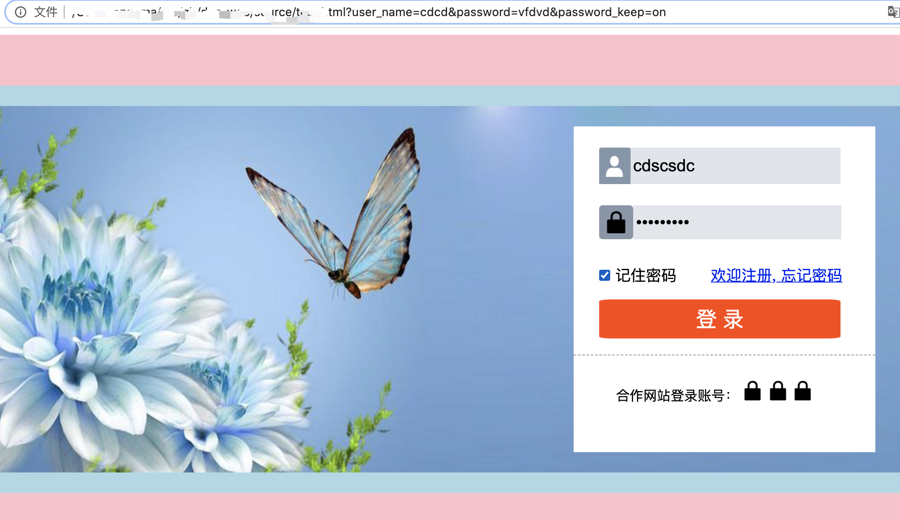

## 5.03 示例 登录页

```
思路：
1. 行内元素 转 块级 的显示方法
定位、浮动，以及 display: block;

2. 当用 border-box 市时，尽量使用 一个方向 margin/padding 压缩

3.

```


```
<html lang="en">
<head>
    <meta charset="UTF-8">
    <meta name="viewport" content="width=device-width, initial-scale=1.0">
    <title>Document</title>
    <style>
        div, h4, input, button, a, img {
            margin: 0px;
            padding: 0px;
        }
        .main {
            max-width: 1200px;
            min-width: 800px;
            height: 600px;
            background-color: pink;
            margin: 050px auto;
        }
        .main>div {
            height: 80%;
            background: lightblue url("https://gimg2.baidu.com/image_search/src=http%3A%2F%2Fpic.616pic.com%2Fbg_w1180%2F00%2F04%2F80%2F1twUCvZ85i.jpg&refer=http%3A%2F%2Fpic.616pic.com&app=2002&size=f9999,10000&q=a80&n=0&g=0n&fmt=jpeg?sec=1612536461&t=7bed628521286fe6619830ac7d676796") ;
            background-repeat: no-repeat;
            background-position: 50% 50%;
            background-size: 98% 90%;
            position: relative;
            top: 10%;
        }

        .login {
            width: 30%;
            height: 80%;
            background-color: white;
            position: absolute;
            top: 10%;
            right: 5%;
        }
        .ltop {
            height: 70%;
            width: 100%;
            
            float: left;
            margin-left: 30px;
        }
        .lbottom {
            
            height: 30%;
            width: 100%;
            border-top: 1px dashed #999;
            float: left;
        }

        #user_name {
            box-sizing: border-box;
            display: block;
            width: 80%;
            height: 16%;
            margin-top: 25px;
            padding-left: 40px;
            font-size: 20px;
            outline: none;
            border-style: none;
        
            background: #e0e5ec url("./_static/icon/user_name_2.png") ;
            background-size: 13% 103%;
            background-repeat: no-repeat;
        }

        .password {
            box-sizing: border-box;
            height: 28%;
            padding: 25px 0px 10px 0px;
            
        }
        .password>img  {
            box-sizing: border-box;
            height: 100%;
            background-color: #8795a8;
            border-radius: 10%;
            padding: 7px;
            float: left;
        }
        .password>input{
            width: 69%;
            height: 100%;
            font-size: 20px;
            padding-left: 3px;
            outline: none;
            border: none;
            background-color: #e1e5eb;
            float: left;
        }
        
        
        .keep, .forget {
            height: 20%; 
            float: left;
            box-sizing: border-box;
            font-size: 18px;
            padding-top: 20px;
        }
        .keep {
            width: 30%;
        }
        .forget {
            width: 50%;
            margin-left: 25px;
        }
        
        .ltop>button {
            width: 80%;
            height: 17%;
            background-color: orangered;
            font-size: 25px;
            color: white;
            border-radius: 5%;
            outline: none;
            border: none;
            margin-top: 7px; 
        }

        .lbottom>img {
            height: 20%;
            margin: 30px 1px 0px 0px;
        }
        .lbottom>h4 {
            display: inline;
            height: 20px;
            font-weight: normal; 
            margin: 0px 0px 0px 50px;
        }
    </style>
</head>
<body>
    <div class="main">
        <div>
            <div class="login">
                <form action="">
                    <div class="ltop">
                        <input type="text" name="user_name" id="user_name" placeholder="用户名/手机号/邮箱账号">
                        <div class="password">
                            
                            <input type="password" name="password" placeholder="请输入密码">
                        </div>
                        <div class="keep">
                            <input type="checkbox" name="password_keep" id="checked1">
                            <label for="checked1"> 记住密码</label>
                        </div>
                        <div class="forget">
                            <a href="#">欢迎注册, </a>
                            <a href="#">忘记密码</a>
                        </div>
                        <button>登  录</button>
                    </div>
                </form>
                
                <div class="lbottom">
                    <h4>合作网站登录账号：</h4>
                    
                    
                    
                </div>        
            </div>
        </div>
    </div>
    
</body>
</html>
```

