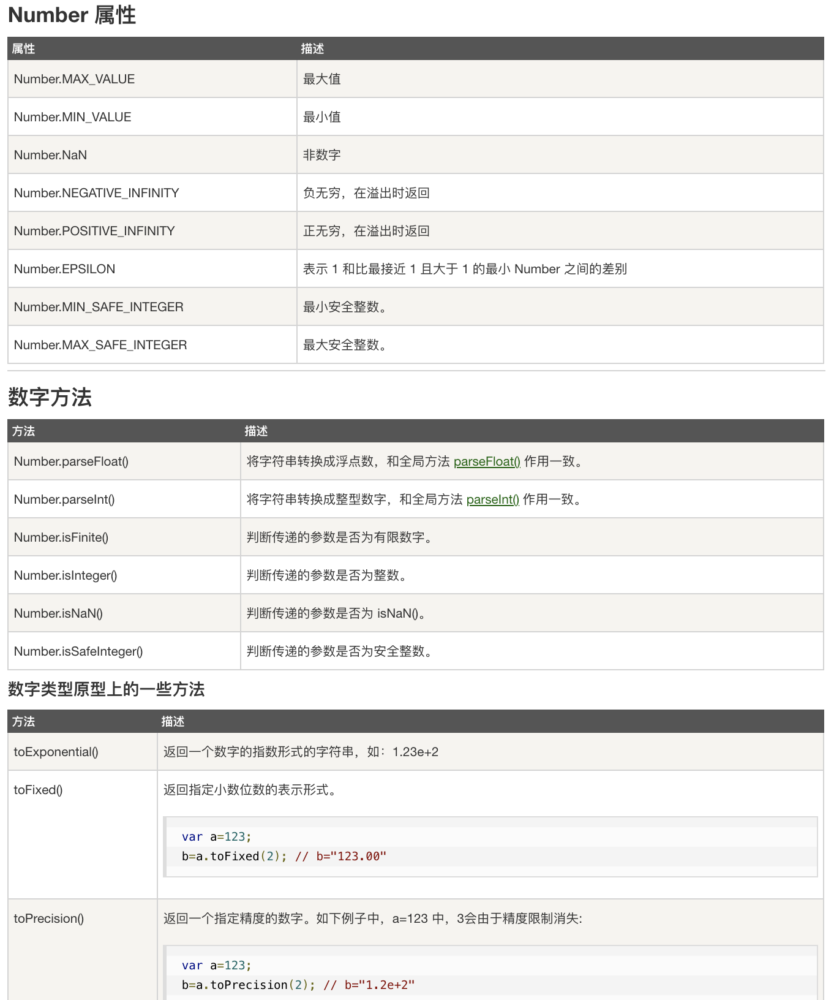

## 6.02 JS 对象 类型

对象手册<https://www.runoob.com/jsref/jsref-tutorial.html> 


##### 1. 数字对象


##### 2. 字符串对象
String 对象用于处理已有的字符块。

```
1. 属性 计算长度
var txt="ABCDEFGHIJKLMNOPQRSTUVWXYZ";
document.write(txt.length);

2. 方法 查找字符串首次出现位置
var str="Hello world, welcome to the universe.";
var n=str.indexOf("welcome");

3. 方法 匹配到字符串输出
var str="Hello world!";
document.write(str.match("world") + "<br>");

4. 方法 字符串转数组
txt="a,b,c,d,e"   // String
txt.split(",");   // 使用逗号分隔
txt.split(" ");   // 使用空格分隔
txt.split("|");   // 使用竖线分隔 

5. 方法 替换 replace() 
6. 方法 大小写转换 toUpperCase() / toLowerCase()
```

##### 3. 日期对象
```
// 日期格式化为指定格式
Date.prototype.format = function(fmt){
  var o = {
    "M+" : this.getMonth()+1,                 //月份
    "d+" : this.getDate(),                    //日
    "h+" : this.getHours(),                   //小时
    "m+" : this.getMinutes(),                 //分
    "s+" : this.getSeconds(),                 //秒
    "q+" : Math.floor((this.getMonth()+3)/3), //季度
    "S"  : this.getMilliseconds()             //毫秒
  };

  if(/(y+)/.test(fmt)){
    fmt=fmt.replace(RegExp.$1, (this.getFullYear()+"").substr(4 - RegExp.$1.length));
  }
        
  for(var k in o){
    if(new RegExp("("+ k +")").test(fmt)){
      fmt = fmt.replace(
        RegExp.$1, (RegExp.$1.length==1) ? (o[k]) : (("00"+ o[k]).substr((""+ o[k]).length)));  
    }       
  }

  return fmt;
}

document.getElementById("demo1").innerHTML=new Date(79,5,24,11,33,0).format("MM月dd日"); 

var now = new Date();
var nowStr = now.format("yyyy-MM-dd hh:mm:ss");
document.getElementById("demo2").innerHTML=new Date().format("yyyy年MM月dd日");
var nowStr = now.format("yyyy-MM-dd hh:mm:ss");
document.getElementById("demo3").innerHTML=new Date().format("yyyy年MM月dd日hh小时mm分ss秒");
```

##### 4. 数组对象


##### 5. 布尔对象


##### 6. 算数对象


##### 7. 正则匹配对象

```
var str="Is this all there is?";
var patt1=/is/gi;
var patt2=new RegExp("is")
document.write(str.match(patt1) + "<br>");  // 不区分大小写的全局搜索
document.write(patt2.exec(str) + "<br>");   // 检索指定值。返回值是被找到的值, 没有匹配返回 null
document.write(patt2.test(str) + "<br>");   // 检索指定值。根据结果并返回真或假

>>>
Is,is,is
is
true
```
