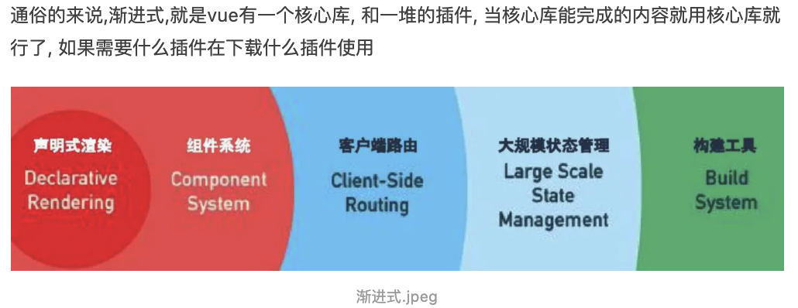

## 1.01 Vue 简介

vue 是一套用于构建用户界面的渐进式框架             
作用：动态构建用户界面       

一个公司赚钱是因为业务赚钱，而不会因为你用了 Vue 或者 Angular 这些技术框架而赚钱。
##### 1. 特点

```
1. 兼容性：        
Vue不支持IE8及以下版本，因为Vue使用的是IE8无法模拟的ECMAScript 5特性。vue.js支持所有兼容ECMAScript 5的浏览器.

2. 特点：
a. 易用、灵活、高效
b. 自底向上逐层应用，核心只关注视图层
c. 编码简洁，体积小，运行效率高
d. 渐进式框架
e. 遵循MVVM模式


3. 背景(开发规范)
目前流行的js模块化开发标准规范有AMD、CMD、CommonJS、ES6的模块系统。
a. AMD(Asynchronous Module Definition) / CMD (Common Module Definition)
相同点：浏览器端JS规范，并行异步加载文件                  
不同一：AMD 是预加载，加载的同时解析，因此，加载会快速，但加载顺序不可控，用户体验好，实现的是RequireJs          
不同二：CMD 是懒加载，加载完等待执行时解析，因此，顺序可控，但是解析叠加时间会长，性能好，实现的是 SeaJs   

b. CommonJs / ES6模块
相同点：针对服务端              
不同一：commonjs 输出的是值拷贝，模块是运行时加载，加载的是一个对象(module.exports)，脚本运行完时生成，实现是nodeJs               
不同二：ES6模块  输出的是值引用，模块是编译时通过export/import加载的，接口是一种静态定义，代码解析阶段就会生成      

```


##### 2. 常用组件  
 
```
1. Vue全家通, vuejs + vue-router + vuex+ axios
声明式渲染 (不关心是如何实现的用就可以了)
组件系统 (大型项目,很多部分可以复用,这就是组件)
客户端路由(vue-router)
大规模状态管理(vuex)
构建工具(vue-cli)

2. 常用插件
vue-cli: Vue 脚手架
vue-resource: ajax请求, 官网已经不推荐使用了,推荐axios
vue-router: 路由
vuex: 状态管理
vue-lazyload: 图片懒加载
vue-scroller : 页面滑动相关
element-ui: 基于vue的UI组件库(PC端)
mint-ui: 基于vue的UI组件库(移动端)
```


##### 3. 视图模型
 
 


##### 2. vs jquery layui ...
```
jquery是js库，不是框架

库：提供一些方法和集合，避免重复定义相同功能函数，并具有一定模式兼容性
```

```
layui、bootstrap、elementui 是UI框架，主要基于css            

框架：完整的解决方案，规范开发者开发，提供相应的库和插件 

---------------
layui <https://www.layui.com/>            
官方：经典的模块化前端框架 (采用自身的模块规范)         
特点：作者贤心，国产不可多得的框架，始于2016年，出发点满足后端程序员          

bootstrap <https://getbootstrap.com/>           
官方：是一个用于快速开发 Web 应用程序和网站的前端框架          
特点：作者Twitter，响应式网站的典型，始于2012年，适合前端           

elementUI <https://element.eleme.cn/#/zh-CN>         
官方：一套为开发者、设计师、产品经理准备的基于Vue2.0的桌面端组件          
特点：
```

##### 3. vs react angular      
借鉴了angular的模板和数据绑定技术         
借鉴了react的组件化和虚拟DOM 技术
 
以下是JS框架，主要基于JS
```
Angular https://angular.cn/
官方：一个应用设计框架与开发平台，创建高效、复杂、精致的单页面应用
特点：约束多，擅长复杂中后台场景和多人协作。

React
https://react.docschina.org/
官方：用于构建用户界面的JS库
特点：组件化设计的好，可以实现比较好的组件生态进行复用

Vue
https://cn.vuejs.org/
官方：一套用于构建用户界面的渐进式框架
特点：灵活，适用于简单业务快速迭代（当然也有 Vue 做中后台的）  
```


```
与React
都使用了 Virtual Dom
都提供了响应式(Reactive)和组件化(Composable)的视图组件    
都将注意力集中保持在核心库，将其他功能 如路由和全局状态管理交给其他库
不同的是 优化方面，组件状态变更时，React会重新渲染整个组件子树，Vue组件自动跟踪，没有子树的问题限制
不同的是 html/css方面，React中一切都是JS，css也纳入js，vue思想是拥抱经典web技术，并在其上扩展
不同的是 学习方面，react学习曲线陡峭，vue向上扩展类似react，向下扩展类似jquery

与AngularJS
vue 早期的的灵感来源于Angular，语法相似
不同的是 复杂性方面，API和设计 vue都要简单得多
不同的是 灵活性和模块化，Angular有特定规则，vue灵活只专注于基础工具，定制性好
不同的是 数据绑定，angular双向绑定，vue在不同的组件间强制使用单向数据流，更清晰
不同的是 指令与组件，angular每件事情由指令来做，组件是特殊指令，vue指令只封装dom，组件代表独立单元

与Ember
他是一个全能框架，提供了大量约定，一旦熟悉，开发效率会很高。不过学习曲线比较高

与Knockout
是 MVVM 领域内的先驱，并且追踪依赖，支持IE6。但发展缓慢，略显老旧

与Polymer
谷歌赞助，灵感来源于Vue，基于新版web components标准之上，需要重量级polyfills帮助工作

与Riot
设计理念有很多相似地方，vue相对重一点，性能较好，支持工具成熟完善

``` 