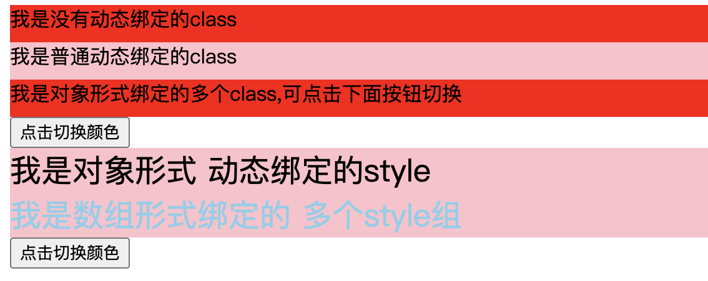

## 1.03 指令 常用合集

vue 指令directive 只是dom 的行间属性，vue给他们赋予了意义，实现特殊功能                   
指令的职责是，当表达式改变时，将其产生连带影响，响应式的作用于DOM             

##### 1. 基础指令
指令是带有 v- 前缀的特殊属性。      
```
1、v-text='msg' 
引号内是表达式，既能展示内容，也能做运算。
指令等同于 innerText，会覆盖标签内的内容

2、v-html='msg'
把html字符串渲染成html，类似 innerHTML
谨慎使用会出现xss攻击的风险

3、{{ msg }}
字符串渲染，无法渲染 html

4、v-cloak
vue和浏览器性能极大提升后，用不到了
用来在页面未加载出来时，不出现原始代码{{msg}}

5、v-once
只初始化一次，不随数据变化改变页面

6、v-pre
跳过该元素的编译过程，显示原始的Mustache标签，加快编译
```

```
<script src="https://cdn.staticfile.org/vue/2.2.2/vue.min.js"></script>
<div id="app">
    <p v-text='msg1 + "msg1"'>who</p>    
    <p v-html='msg2 '>who</p> 
    <p v-once='msg3'>{{ msg1 }}</p> 
    <p v-pre='msg3'>{{ msg1 }}</p> 
</div>

<script>
    var freeze_msg = {foo: 'bar'}
    Object.freeze(freeze_msg)
    let vm = new Vue({
      el:'#app',
      data:{
        msg1: 'hello',
        msg2: '<h3>hello<h3>',
        msg3: 'msg3',
      }
    })
</script>

>>>
hellomsg1
hello
hello
{{ msg1 }}
```

##### 2. v-bind(:) 动态绑定
指令会将普通属性的字面值变成表达式值，并监听响应         
缩写：v-bind:herf === :herf        

在属性绑定时有两个属性比较特殊：class、style，vue 做了增强，表达式除了字符串可以是对象和数组。          

**class**   
```
1、混用 动态class与普通class
<h2 class="wrap" :class="msg">你好</h2>

2、多个 动态class绑定 用数组
<h2 :class="[boxClass, wrapClasss]">你好</h2>

3、逻辑判断 动态class绑定 用对象
<h2 :class="!isTrue ? msg1 : 'msg2'">hello</h2>

4、多个 动态class绑定 用对象
<h2 :class="{box:isTrue, wrap: !isTrue}">你好</h2>
data: {isTrue: true}

```

**style**      
```
注意：一旦使用动态绑定，style属性值将变成js表达式，则不支持 -，需要用双引号或者驼峰式表达

1、对象写法(对象内都是表达式，字符串需要括起来)
<h2 :style="{color:'red',fontSize:'30px'}">Hello World</h2>

2、多个 动态style绑定 用对象
<h2 :style="styleObject">Hello World</h2>
data: {styleObject: {color: "red", fontSize: "30px"}}

3、多个 动态style绑定 用数组，将样式分离方便复用
<h2 :style="[styleObject, baseStyle]">Hello World</h2>

```



```
<html lang="en">
<head>
    <meta charset="UTF-8">
    <meta name="viewport" content="width=device-width, initial-scale=1.0">
    <title>txt</title>
    <style>
        #app div {
            width: 700px;
            height: 30px;
        }
        .box1 {
            background-color: pink;
        }
        .className {
            background-color: red;
        }
    </style>
</head>
<body>
    <script src="https://cdn.staticfile.org/vue/2.2.2/vue.min.js"></script>
    <div id="app">
        <div class="className">我是没有动态绑定的class</div>   
        <div v-bind:class="className">我是普通动态绑定的class</div>
        <div :class="{box1:isTrue, className: !isTrue}">我是对象形式绑定的多个class,可点击下面按钮切换</div>   
        <button @click="changClassName">点击切换颜色</button> 
    </div>
    <div id="app2">
        <div :style="styleObject">我是对象形式 动态绑定的style</div>
        <div :style="[styleObject, baseStyle]">我是数组形式绑定的 多个style组</div>
        <button @click="changColor">点击切换颜色</button> 
    </div>
    
    <script>
        var freeze_msg = {foo: 'bar'}
        Object.freeze(freeze_msg)
        let vm = new Vue({
          el:'#app',
          data:{
            className: 'box1',
            isTrue: 'true',
          },
          methods:{
            changClassName(){
                this.isTrue = !this.isTrue
            }
          }
        })
        let vm2 = new Vue({
          el:'#app2',
          data:{
            styleObject: {
                backgroundColor: "pink",
                fontSize: "25px"
            },
            baseStyle: {
                color: "red",
                margin: 0,
            }
          },
          methods:{
            changColor(){
                this.baseStyle.color = this.baseStyle.color == "red"? "skyblue": "red"
            }
          }
        })

    </script>
</body>
</html>

```


##### 3. v-on(@) 事件绑定
和其他指令一样,通过v-on绑定事件后,事件属性值将不再是字符串,而是表达式             
缩写：v-on:click="countFn" === @click="countFn"

```
1、原生行内事件绑定
原生绑定事件方式不常用，耦合性较高

2、v-on 绑定表达式
表达式只能处理单个逻辑，处理的事件太复杂就不太适合了

3、v-on 绑定方法 methods
methods方法名不能和data中的重名，因为data和methods都会在初始化时成为vue的属性和方法

```


```
<html lang="en">
<head>
    <meta charset="UTF-8">
    <meta name="viewport" content="width=device-width, initial-scale=1.0">
    <title>txt</title>
    <style>
        #app div {
            width: 700px;
            height: 30px;
        }
        .box1 {
            background-color: pink;
        }
        .box2 {
            background-color: red;
        }
    </style>
</head>
<body>
    <div id="app">
        <div id="box" class="box1">我是原生js类型</div>   
        <button onclick="changeColor()">点击切换颜色</button>

        <div class="box1"> 使用 v-on 绑定表达式自增: {{ count }}</div>
        <button v-on:click="count++">加一</button>
        <div class="box1"> 使用 v-on 绑定方法自增(最大到5): {{ count1 }}</div>
        <button v-on:click="handleClick">加一</button>

        <div class="box1">{{ msg }}</div>
        <button v-on:click="reverseMsg">点击翻转上面文字</button>
    </div>

    <script src="https://cdn.staticfile.org/vue/2.2.2/vue.min.js"></script>
    <script>
        let className="box1"
        function changeColor(){
            if(className =='box1'){
                box.className = className = "box2"
    
            }else{
                box.className = className =  "box1"
            }
        }
        let vm = new Vue({
            el: "#app",
            data: {
                count:  0,
                count1:  0,
                msg: "hello world",
            },
            methods: {
                handleClick(){
                    this.count1 = Math.min(++this.count1, 5)
                },
                reverseMsg: function(){
                    this.msg = this.msg.split('').reverse().join('')
                }
            }
        })
    </script>
</body>
</html>
```


##### 4. v-model 双向绑定
v-model 轻松实现了表单输入和应用状态之间的双向绑定，数据改变视图，视图改变数据      

```
1、模拟使用 v-model 
2、input 上使用 v-model

3、checkbox 上使用 v-model
单个checkbox绑定一个字符串，转成bool值使用
多个checkbox绑定一个数组，转换成复选框内的内容

4、radio 使用 v-model
收集单选按钮的数据
设置默认选中项，在 data 中给定个初始值
单选按钮是通过name的名字建立互斥关系，v-model模式下通过v-model名字建立互斥关系

5、select 使用 v-model
单选时，data属性为字符串变量即可
多选时，data属性为数组即可，select添加

```


```
<html lang="en">
<head>
    <meta charset="UTF-8">
    <meta name="viewport" content="width=device-width, initial-scale=1.0">
    <title>txt</title>
</head>
<body>
    <div id="app">
        <!-- 通过ref获取dom元素，已更改msg内容 -->
        <div><input type="text" ref="msg" v-bind:value="msg" v-on:keyup="logName"> 模拟v-model: {{ msg }}</div>
        <div><input type="text" v-model="msg"> 使用v-model: {{ msg }}</div>

        <div>
            <input type="checkbox" v-model="chb_val" value="apple"> 
            <input type="checkbox" v-model="chb_val" value="xigua"> 
            <input type="checkbox" v-model="chb_val" value="lizi"> 
             checkbox收集到的数据是: {{ chb_val }}
            <p></p>
            <input type="radio" id="male" name="sex" value="男" v-model="sex" />男
            <input type="radio" id="male" name="sex" value="女"  v-model="sex"/>女
             radio选择的性别是: {{ sex }}
        </div>
        <div>
            <select name="fluit" v-model="fluits" multiple>
                <option value="苹果">苹果</option>
                <option value="梨子">梨子</option>
                <option value="香蕉">香蕉</option>
            </select>
             select 选择的是: {{ fluits }}
        </div>
    </div>

    <script src="https://cdn.staticfile.org/vue/2.2.2/vue.min.js"></script>
    <script>
       
        let vm = new Vue({
            el: "#app",
            data: {
                msg: "hello",
                chb_val: [],
                sex: '',
                fluits: [],
            },
            methods: {
               logName(){
                   this.msg = this.$refs.msg.value
               }
            }
        })
    </script>
</body>
</html>
```