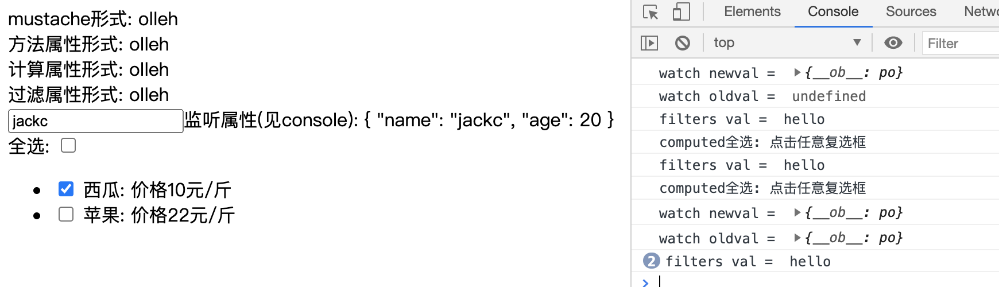

## 2.02 实例: 方法/计算/等

除了 data property，还有各种其他的组件选项，可以将用户定义的 property 添加到组件实例中，例如 methods，props，computed，inject 和 setup

#### 1. data proprety

数据是写在 vue 的 data 属性中，通过模板语法 mustache 引用

响应式原理：  
1、get/set 方法就是 vue 响应系统的核心函数方法  
2、get/set 在 data 实例化时开始监听，并根据变化做出响应

##### 1. 普通数据响应

```
1、data 对象中初始化的对象才能被响应，新加的数据不能 (建议即使不使用也初始化进去)
2、Object.freeze() 是冻结方法，即不允许修改对象的属性值，也不会触发响应系统
```

##### 2. 对象数据响应

```
新增的对象不会被响应，因为vue只监听了对象，没监听对象内部属性

如何让新增的对象属性被监听？
方法一：vm.$set(vm.msg_obj, "sex", "男") 这样插入数据
方法二：直接更改整个对象
方法三：采用对象方法 vm.msg_obj = Object.assign({}, vm.msg_obj, {ass: "true"})
```

##### 3. 数组数据响应

测试过程，感觉新版本的 vue 不用方法也可以监听到 list 变动

```
不使用以下方法，虽然可以更改渲染的内容，但是无法触发vue响应系统

如何让数组的属性被监听？
变异方法(即更改原数组)
push()
pop()
shift()
unshift()
splice()
sort()
reverse()

非变异方法(即不会更改原数组)
filter()
concat()
slice()
```

#### 2. 过滤器 filter

Vue.js 允许你自定义过滤器，被用作一些常见的文本格式化。由"管道符"指示。

```
1、过滤器 不能使用this访问数据或者其他方法
2、过滤器 只能 在插值时 或 v-bind指令中使用
3、过滤器 将前边结果作为第一个参数，再加参数放在括号内
4、可进行链式处理，不断跟管道符

5、一般使用
<p>苹果价格:{{ (priceOne/100).toFixed(2) }} 元/斤</p> //mustache
<p>苹果价格:{{ priceHandle(priceOne)}} 元/斤</p>  //methods
<p>苹果价格:{{ priceOne | formatPrice}} 元/斤</p> //filter

```

#### 3. 方法属性 methods

```
methods: {
    increment() {
      // `this` 指向该组件实例
      this.count++
    }
}

1、Vue 自动为 methods 绑定 this，以便于它始终指向组件实例
2、methods 中避免使用箭头函数，会阻止 vue 绑定 this 指向
3、一般被用作事件监听

附加：防抖和节流(见官方文档)
```

#### 4. 计算属性 computed

对于任何包含响应式数据的复杂逻辑，你都应该使用计算属性

```
1、计算属性中的方法也是函数
2、方法没有缓存，它是根据依赖处理逻辑对数据缓存的
3、计算属性的 get 和 set
computed:{
     // 计算属性写成对象,就需要手动设置get方法,set方法
    sum:{
        get(){
            // 获取时调用的方法
        },
        set(val){
            // 设置时调用
       }
    },

    // 如果计算属性写成函数, 默认只调用了get方法,没有set方法
    sum(){
    }
}
```

#### 5. 侦听器 watch

当需要在数据变化时执行异步或开销较大的操作时，这个方式是最有用的

```
1、watch 的属性名必须和被观察人保持一致
2、watch (被传入)两个值，第一个是变化后的值，第二个变化前的值
3、监听对象属性 (默认值监听对象整体)
解决一：需要用 . 操作符
解决二：使用深度监听 deep:true
深度监听后，获取到的值都是新值？
因为对象是引用类型，通过地址找值，需要用computed，JSON.parse出两个值

4、监听配置
vm.$watch("msg",(val,newVal) => {
    console.log(val, newVal)
    },
    {deep: true}
)
```

#### 6. 对比

##### 1. computed vs methods

1、computed 基于依赖关系缓存，methods 没有缓存  
2、computed 的函数是属性(缓存)，methods 的函数是方法(不缓存)

##### 2. computed vs watch

1、computed 监听的值我们需要用它，依赖变化运算过程  
2、watch 监听的值我们不需要用它，只是在他改变时做点事情

#### 7. 示例 (xxx)



```
<html lang="en">
<head>
    <meta charset="UTF-8">
    <meta name="viewport" content="width=device-width, initial-scale=1.0">
    <title>txt</title>
    <style>
        #app div {
            width: 700px;

        }
        .box1 {
            height: 40px;
            background-color: lightcyan;
        }
        .box2 {
            height: 30px;
            background-color: pink;
        }
    </style>
</head>
<body>
    <script src="https://cdn.staticfile.org/vue/2.2.2/vue.min.js"></script>

    <div id="app">

        <!-- mustache 模板来处理逻辑 -->
        <div>mustache形式: {{ msg.split("").reverse().join("") }}</div>

        <!-- 方法属性调用 处理代码逻辑 -->
        <div>方法属性形式: {{ reverseStr() }}</div>

        <!-- 计算属性调用 处理代码逻辑 -->
        <div>计算属性形式: {{ reverseStr2 }}</div>

        <!-- 过滤属性调用 处理代码逻辑 -->
        <div>过滤属性形式: {{ msg | reverseStr3() }}</div>

        <div><input type="text" v-model.number="msg1.name">监听属性(见console): {{ msg1 }}</div>

        <!-- 全选案例-->
        <div>
            全选: <input type="checkbox" v-model="checkAll">
        </div>
        <ul>
            <li
                v-for="fruit in fruits"
                :key="fruit.title"
                >
                <input type="checkbox" v-model="fruit.isSelect">
                {{fruit.title}}: 价格{{fruit.price}}元/斤
            </li>
        </ul>

    </div>

    <script>
        const vm = new Vue({
            el: "#app",
            data: {
                msg: 'hello',
                msg1: {name: 'jack', age: 20},
                fruits:[
                    {
                        title:"西瓜",
                        price: 10,
                        isSelect:false,
                    },
                    {
                        title:"苹果",
                        price: 22,
                        isSelect:false,
                    }
                ]
            },
            methods: {
                reverseStr(){
                    return this.msg.split("").reverse().join("")
                },
            },
            computed:{
                reverseStr2(){
                    return this.msg.split("").reverse().join("")
                },
                msg1(){
                    return JSON.parse(JSON.stringify(this.name));
                },
                checkAll:{
                    get(){
                        console.log("computed全选: 点击任意复选框")
                        // 如果用户全部选中,那么计算数据返回true,否则返回false
                        return this.fruits.every((fruit) => {
                            return fruit.isSelect;
                        })
                    },
                    set(isCheckAll){
                        // 更加用户是否点击全选改变数据里的选中问题
                        this.fruits.forEach(fruit => {
                            fruit.isSelect = isCheckAll
                        });

                    }
                }
            },
            filters:{
                reverseStr3(val){
                    console.log("filters val = ", val)
                    return val.split("").reverse().join("")
                }
            },
            watch:{
                msg1:{// 此时 msg1 就是一个配置对象,里面的属性都是配置选项
                    // handler 就是原来的监听函数, 当数据变化是执行的函数
                    handler(val, oldval){
                        console.log("watch newval = ", val);
                        console.log("watch oldval = ", oldval);
                    },
                    deep:true,     // 深度监听选项
                    immediate: true, // 初始化就执行一次触发回调，从无到有
                }
            },

        })
    </script>
</body>
</html>
```
