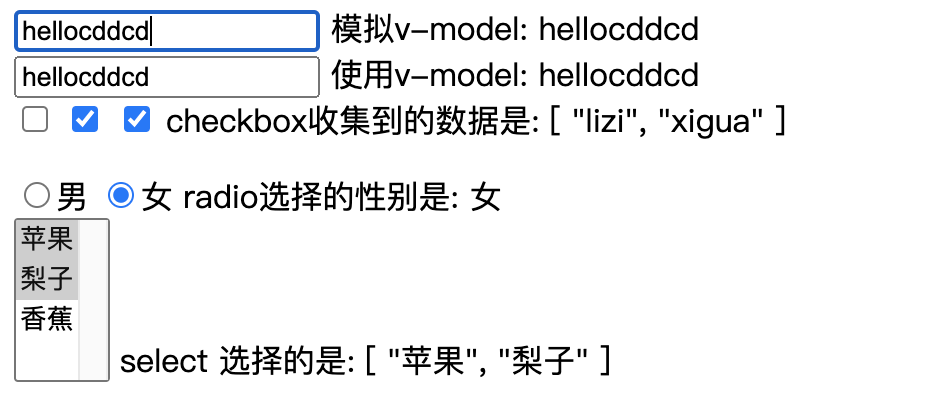

## 3.03 指令: 表单绑定(v-model)

##### 1. 双向绑定 v-model

v-model 轻松实现了表单输入和应用状态之间的双向绑定 MVVM。

基础绑定

```
// 1. 文本 text
<input v-model="message" placeholder="edit me" /> {{ message }}

// 2. 多上文本 textarea
<textarea v-model="message" placeholder="mult lines">
{{ message }}
</textarea>


// 3. 复选框 checked
<input type="checkbox" id="test"  value="test" v-model="value" /> {{ value }}


// 4. 多个复选框可以把内容绑定到数组

// 5. 单选框 radio
<input type="radio" id="one" value="One" v-model="picked" />{{ picked }}

// 6. 选择框 select
<select v-model="selected">
    <option disabled value="">Please select one</option>
    <option>A</option>
    <option>B</option>
    <option>C</option>
  </select>
<span>Selected: {{ selected }}</span>

```

动态值绑定

```
// 1. 单选框
<input type="radio" v-model="pick" v-bind:value="a" />

>>> 选中时：vm.pick === vm.a

// 2. 选择框
<select v-model="selected">
  <!-- 内联对象字面量 -->
  <option :value="{ number: 123 }">123</option>
</select>

>>> 选中时：vm.selected.number // => 123
```

##### 2. 修饰符

```
1. 在“change”时而非“input”时更新
<input v-model.lazy="msg" />

2. 输入值转为数值类型
<input v-model.number="age" type="number" />

3. 自动过滤首尾空格
<input v-model.trim="msg" />


```

##### 3. 组件上使用 model

学到 组件 再说吧

##### 4. 示例 (旧版)



```
<html lang="en">
<head>
    <meta charset="UTF-8">
    <meta name="viewport" content="width=device-width, initial-scale=1.0">
    <title>txt</title>
</head>
<body>
    <div id="app">
        <!-- 通过ref获取dom元素，已更改msg内容 -->
        <div><input type="text" ref="msg" v-bind:value="msg" v-on:keyup="logName"> 模拟v-model: {{ msg }}</div>
        <div><input type="text" v-model="msg"> 使用v-model: {{ msg }}</div>

        <div>
            <input type="checkbox" v-model="chb_val" value="apple">
            <input type="checkbox" v-model="chb_val" value="xigua">
            <input type="checkbox" v-model="chb_val" value="lizi">
             checkbox收集到的数据是: {{ chb_val }}
            <p></p>
            <input type="radio" id="male" name="sex" value="男" v-model="sex" />男
            <input type="radio" id="male" name="sex" value="女"  v-model="sex"/>女
             radio选择的性别是: {{ sex }}
        </div>
        <div>
            <select name="fluit" v-model="fluits" multiple>
                <option value="苹果">苹果</option>
                <option value="梨子">梨子</option>
                <option value="香蕉">香蕉</option>
            </select>
             select 选择的是: {{ fluits }}
        </div>
    </div>

    <script src="https://cdn.staticfile.org/vue/2.2.2/vue.min.js"></script>
    <script>

        let vm = new Vue({
            el: "#app",
            data: {
                msg: "hello",
                chb_val: [],
                sex: '',
                fluits: [],
            },
            methods: {
               logName(){
                   this.msg = this.$refs.msg.value
               }
            }
        })
    </script>
</body>
</html>
```
