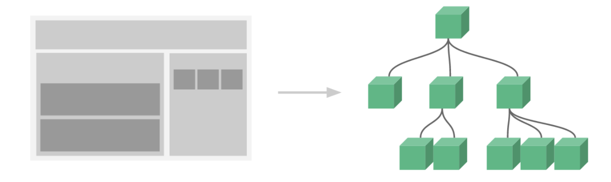

## 4.01 组件: 基础

##### 1. 简介



组件是独立的，也拥有和根实例相同的 data/computed/watch/生命周期钩子

```
1、特点：
a. 可复用的 提高开发效率
b. 独立的 更容易管理维护
c. 独立的 便与项目协同开发互不影响

2、组件命名
a. 使用 kebab-case (强烈推荐)
b. 使用 PascalCase 驼峰式
my-component-name == MyComponentName


```

##### 2. 组件分类

全局注册

```
const app = Vue.createApp({})
app.component('component-a', {
  /* ... */
})
app.component('component-b', {
  /* ... */
})
app.mount('#app')

<div id="app">
  <component-a></component-a>
  <component-b></component-b>
</div>
```

局部注册 (vue2 写法)

```
<div id="app-one">
    <my-com><my-com>
</div>
<div id="app-two">
    <my-com><my-com>
</div>
<script>
    const MyCom = Vue.extend({
        template: `<div>这是全局组件的内容</div>`
    })
    new Vue({
        el: "#app-one",
        components: {MyCom}     // es6简化写法
    })
    new Vue({
        el: "#app-two",
    })

</script>
```

模块系统中注册

```
import ComponentA from './ComponentA'
import ComponentB from './ComponentB'

export default {
  components: {
    ComponentA,
    ComponentB
  }
}
```

##### 3. 组件基本使用

```
$ vim main.js

// 创建一个Vue 应用
const app = Vue.createApp({})

// 定义一个名为 button-counter 的新全局组件
app.component('button-counter', {
  data() {
    return {
      count: 0
    }
  },
  template: `
    <button @click="count++">
      You clicked me {{ count }} times.
    </button>`
})
app.mount('#components-demo')


$ index.html
<div id="components-demo">
  <button-counter></button-counter>
</div>
```
