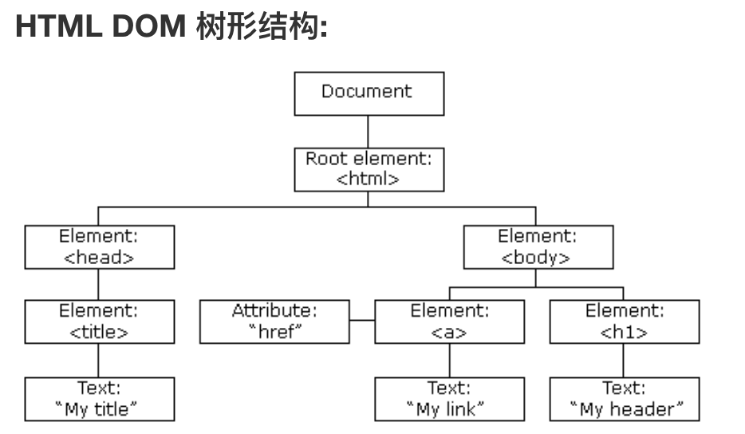
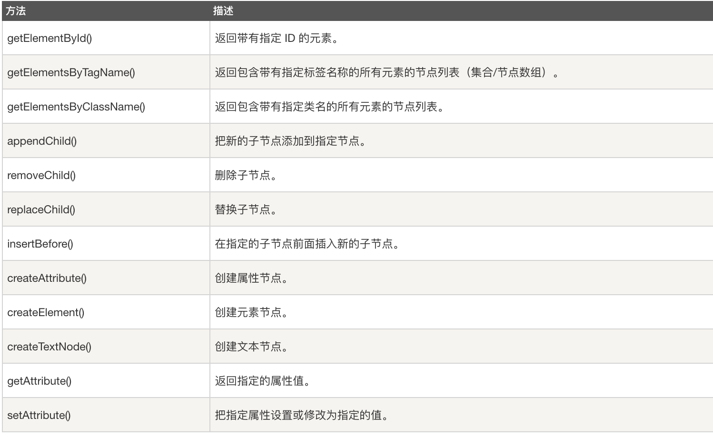

## 4.01 JS DOM 简介




##### 1. DOM 简介


当网页被加载时，浏览器会创建页面的文档对象模型（Document Object Model   

**它是什么？**       
它以树结构表达 HTML 文档，并定义了访问和操作所有元素的标准方法      
是标准的 HTML 文档对象模型(Document Object Model)      
是标准的 HTML 和 XML 文档的编程接口      
是 W3C （万维网联盟）标准   


**它可以做什么？**       
JavaScript 能够改变页面中的所有 HTML 元素      
JavaScript 能够改变页面中的所有 HTML 属性       
JavaScript 能够改变页面中的所有 CSS 样式       
JavaScript 能够对页面中的所有事件做出反应      

##### 2. docment对象示例

**查找 html 元素**
```
1. 通过 id 名
var x=document.getElementById("intro");

2. 通过 class 类名
var x=document.getElementsByClassName("intro");

3. 通过 tag 标签名
var x=document.getElementById("main");
var y=x.getElementsByTagName("p");
```

```
注意：
getElementsByTagName 和 getElementsByClassName 这两个方法查找多个 dom 元素，返回的是 htmlcollection 类型，是伪数组而不是真数组，故不能使用数组的方法。
可以使用数组原型配合 slice 方法，利用 call，apply，bind 方法将伪数组转为真数组

var x=document.getElementById("main");
var y=x.getElementsByTagName("p");
console.log(y)      //在控制台我们可以看到原型proto为htmlcollection，是伪数组

console.log(Array.prototype.slice.call(y))    //转换一：在控制台我们可以看到原型proto为Array(0)，是真数组
console.log(Array.prototype.slice.apply(y))   //转换二：在控制台我们可以看到原型proto为Array(0)，是真数组
console.log(Array.prototype.slice.bind(y)())   //转换三：在控制台我们可以看到原型proto为Array(0)，是真数组
```

**改变 html 元素**
```
document.getElementById(id).innerHTML=新的 HTML    // 改变内容
document.getElementById(id).attribute=新属性值      // 改变属性
document.getElementById(id).style.property=新样式   // 改变样式css

<body>
    <p id="p1">Hello World!</p>
    
    <p id="p2">Hello World!</p>
<script>
    document.getElementById("image").src="landscape.jpg";
    document.getElementById("p1").innerHTML="新文本!";
    document.getElementById("p2").style.color="blue"
</script>
</body>
```
注意：注意：早期的 Internet Explorer 浏览器不支持 node.remove() 方法。


