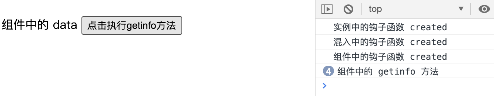

## 4.02 组合 混入mixins

混入(mixins)是一种代码的组织方式，定义了一部分可复用的方法或者计算属性。

##### 1. 混入的基本使用
```
混入提供了一种很灵活的方式，来分发vue组件中的可复用功能。        
一个混入对象可以包含任意组件选项，当组件使用混入时，所有混入对象的选项将被"混合"进入该组件本身的选项。   

混入对象与组件与实例的选项合并关系：
优先级原则：混入 < 组件 < 实例
1、当混入和组件的数据对象冲突时，发生合并，并以组件数据优先
2、同名钩子函数，将合并为一个数组，同时被调用。混入对象在组件对象之前
3、值为对象的选项，例如methods、components、directives，将被合并为一个对象，对象名冲突优先取组件的。

全局混入：
可以使用全局注册混入对象，但注意使用。一旦使用将会影响到所有之后创建的vue实例。
使用恰当时，可谓自定义对象注入处理逻辑
```

##### 2. 示例



```
<body>
    <script src="https://cdn.staticfile.org/vue/2.2.2/vue.min.js"></script> 
    <div id="app">
        <!-- 使用组件 -->
        <my-component></my-component>
    </div>
    
    
    <!-- 组件模板 -->
    <template id="mycomponent">
        <div>
            {{ msg }}
            <button @click="getInfo">点击执行getinfo方法</button>
        </div>
    </template>
    
    <script>
        // 定义混入对象
        let mixin = {
            data(){
                return {
                    msg:"混入中的 data",
                    foo: "foo_mixin"
                }
            },
            methods:{
                getInfo(){
                    console.log("混入中的 getinfo 方法")
                }
            },
            created(){
                console.log("混入中的钩子函数 created")
            },
        }
    
        //  组件选项对象
        let MyComponent = {
            mixins:[mixin],
            template: `#mycomponent`,
            data(){
                return {
                    msg: "组件中的 data",
                    bar: "bar_components"
                }
            },
            methods:{
                getInfo(){
                    console.log("组件中的 getinfo 方法")
                }
            },
            created(){
                console.log("组件中的钩子函数 created")
            },
        };
        //  实例中注册组件
        const vm = new Vue({
            el:"#app",
            data:{},
            components: {
                MyComponent
            },
            methods:{
                getInfo(){
                    console.log("实例中的 getinfo 方法")
                }
            },
            created(){
                console.log("实例中的钩子函数 created")
            },
        })
    </script>
</body>
```