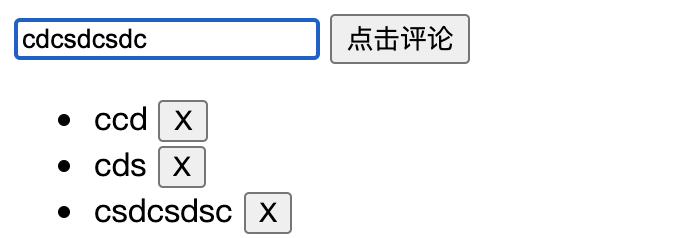

## 4.04 组件: 非父子传参

##### 1. 祖父关系 provide/inject

父传子用 props，如果有一些深度嵌套组件呢？

```
Root
└─ TodoList
   ├─ TodoItem
   └─ TodoListFooter
      ├─ ClearTodosButton
      └─ TodoListStatistics


const app = Vue.createApp({})

app.component('todo-list', {
  data() {
    return {
      todos: ['Feed a cat', 'Buy tickets']
    }
  },
  provide: {
    user: 'John Doe'
  },
  template: `
    <div>
      {{ todos.length }}
      <!-- 模板的其余部分 -->
    </div>
  `
})

app.component('todo-list-statistics', {
  inject: ['user'],
  created() {
    console.log(`Injected property: ${this.user}`) // > 注入 property: John Doe
  }
})
```

如果要访问组件实例 property，将 property 转换为返回对象函数即可

```
app.component('todo-list', {
  data() {
    return {
      todos: ['Feed a cat', 'Buy tickets']
    }
  },
  provide() {
    return {
      todoLength: this.todos.length
    }
  },
  template: `
    ...
  `
})
```

##### 2. 兄弟关系数据传递

原理：兄弟 A 组件通过自定义事件传给父组件，父组件通过 props 传递给兄弟 B 组件

##### 3. Bus/总线/发布订阅模式

背景：全部用父子组件通信会很繁琐，还有一些不是父子组件的数据更改  
原理：利用公共的 vue 实例作为总线，处理发布和订阅 (总线最好绑定在原型，避免每次都要创建实例)



```
<body>
    <script src="https://cdn.staticfile.org/vue/2.2.2/vue.min.js"></script>
    <div id="app">
        <first-component></first-component>
        <second-component></second-component>
    </div>
    <template id="firstComponent">
        <div>
            <input type="text" v-model="comment">
            <button @click="handleClick">点击评论</button>
        </div>
    </template>
    <template id="secondComponent">
        <ul>
            <li v-for="comment,index in comments" :key="index">
                <span>{{comment}}</span>
                <button @click="deleteClick(index)">X</button>
            </li>
        </ul>
    </template>

    <script>
        // 将作为总线的vue实例绑定到构造函数bus上
        Vue.prototype.bus = new Vue();
        // 组件一
        let firstComponent = {
            template: `#firstComponent`,
            data(){
                return {
                    comment: ''
                }
            },
            methods: {
                handleClick(){
                    let comment = this.comment.trim();
                    if(!comment)return
                    this.bus.$emit("addcomment",comment)
                    this.comment = ""
                }
            }
        };
        // 组件二
        let secondComponent = {
            template: `#secondComponent`,
            data(){
                return {
                    comments: []
                }
            },
            // 创建组件的时候,监听自定义事件
            // 注意函数中的this
            created(){
                this.bus.$on("addcomment", (comment) =>{
                    this.comments.push(comment)
                })
            },
            methods:{
                deleteClick(index){
                    this.comments.splice(index,1)
                }
            }
        }
        //  实例中注册组件
        const vm = new Vue({
            el:"#app",
            components: {
                secondComponent,
                firstComponent,
            }
        })
    </script>
</body>
```

##### 4. ref 在组件上的使用(访问子组件)

尽管存在 prop 和事件，但是我们还有可能直接访问 js 的子组件。为此，ref attribute 为子组件的或 html 元素的指定引用 id。

注意：  
$refs 只会在组件渲染完成之后生效。这仅作为一个用于直接操作子元素的“逃生舱”——你应该避免在模板或计算属性中访问 $refs

例子：2000ms 后，父组件调用子组件的 hide 方法，改变 flag 的值，把加载中隐藏

```
<body>
    <script src="https://cdn.staticfile.org/vue/2.2.2/vue.min.js"></script>
    <div id="app">
        <loading ref="load"></loading>
    </div>

    <template id="myalert">
        <div>
            <h2 v-show="flag">加载中...</h2>
        </div>
    </template>

    <script>
        const loading = {
            data() {
                return { flag: true }
            },
            template: '#myalert',
            methods: {
                hide() {
                    this.flag = false;
                }
            }
        };
        var vm = new Vue({   // 根实例
            el: '#app',
            data: {
            },
            components: {
                loading
            },
            mounted() {
                // console.log(this.$refs.load)
                setTimeout(() => {
                    this.$refs.load.hide()
                }, 2000)
            }
        });
    </script>
</body>
```
