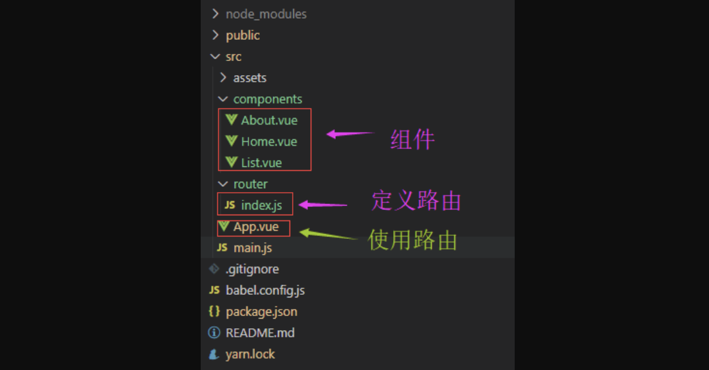

## 6.01 路由 基本认识

##### 1. 前端和后端的区别
```
路由：把信息从原地址传输到目的地的活动，即根据不同url展示不同的页面。

1、后端路由
a. 每次访问不同的url地址，都会重新发送请求到服务器
b. 服务器根据前端的路由，返回不同的数据，或者HTML页面
c. 后端路由是url映射到服务器上的不同资源

2、前端路由
a. 每次访问不同url，不向服务器发送请求，在浏览器端处理
b. 前端路由是url映射到浏览器的不同DOM元素


3、单页面应用
前端路由一般多用于单页面应用(SPA)
特点：
a. 单页面是指整个项目只有一个页面，第一次加载时就将资源从服务器下载了
b. 页面显示的内容被抽离为一个一个小组件，根据不同的url来决定显示与否

优点一：提升响应速度，用户体验好
缺点一：不利于SEO优化 (单页面只有一个页面会被百度收录，其他页面都是虚拟的)
缺点二：单页面无法记住滚动条位置，前进后退都重新发起请求，没有合理的利用缓存

4、服务端渲染
用户发送url请求，服务端获取对应模板和数据，整合成一个html页面，发送给浏览器端

优势一：前端资源消耗少，不占用客户端运算资源
优势二：首屏加载时间快，浏览器获取的就是完整页面，因此可以直接渲染视图
优势三：SEO好优化，因为SEO蜘蛛获取的事完整页面，可以更好的分析页面内容

缺点一：占用太多服务器资源

5、前端渲染
浏览器通过ajax获取服务端数据，页面模板在前端获取，然后组合解析成html页面

优点一：不占用服务端资源，
优点二：网络传输数据小，因为一个完整页面是两次请求获得的

缺点一：前端资源消耗多，模板解析、数据处理都是前端处理
缺点二：对SEO优化不友好，因为搜索引擎获取的是页面模板，没法分析页面全部内容
```


##### 2. 前端路由实现技术
```
1、基于hash实现的前端路由
a. hash 就是url地址 # 后面的内容。
b. web不会解析hash地址，他仅是客户端的一个状态
c. 前端可以通过js在windows.location.hash来读取
d. hash能兼容旧版本浏览器
e. hash值的改变，不会向服务端发送请求，只会在访问历史留下记录 (既可使用前进后退)

2、基于HTML新增的history api实现前端路由

说明：
a. 浏览器窗口提供history api保存历史访问过的url
b. 使用前进后退键时，url地址会发生变化，但是不会向服务端发送请求
c. 因此我们借助history api，将url添加到历史记录中

history api:
a. history.pushState: 向history对象中添加一条历史记录
b. history.replaceState: 替换掉当前的history记录

history api的三个参数：
a. state用来存放将要插入的history实体的相关信息，它是一个json格式的参数；
b. title就是传入history实体的标题
c. url用来传递新的history实体的相对路径

```
```
<!DOCTYPE html>
<html lang="en">
    <head>
        <meta charset="UTF-8">
        <meta name="viewport" content="width=device-width, initial-scale=1.0">
        <title>Document</title>
        <style>
            *{
                padding: 0;
                margin:0;
            }
            
            ul{
                position: fixed;
                left: 0;
                right:0;
                bottom: 0;
                height:60px;
                border-top:1px solid #999;
                display: flex;
            }
            li {
                list-style:none;
                flex: 1;
                background: lightcyan;
                border-right:1px solid #999;
            }
            a{
                display:block;
                line-height:60px;
                text-align: center;
                font-size:20px;
                text-decoration: none;
            }

            .content{
                position: fixed;
                top:0;
                left:0;
                right:0;
                bottom: 61px;
                background: skyblue;
                color:#fff;
                text-align:center;
                font-size:40px;
            }
            .box{
                display: none;
            }
            .show{
                display: block;
            }
        </style>
    </head>
    <body>
        <!-- 1. 基于hash的方式 -->
        <ul>
            <li>
                <a href="#/">首页</a>
            </li>
            <li>
                <a href="#/list">列表</a>
            </li>
            <li>
                <a href="#/about">关于作者</a>
            </li>
        </ul>
        <!-- 2. 基于 history api 的方式 -->
        <!-- <ul>
            <li>
                <a id="homelink">首页2</a>
            </li>
            <li>
                <a  id="listlink">列表2</a>
            </li>
            <li>
                <a id="aboutlink">关于作者2</a>
            </li>
        </ul> -->
        <div class="content">
            <div id="home" class="show">首页</div>
            <div id="list" class="box">列表页</div>
            <div id="about" class="box">关于作者</div>
        </div>
        <script>

            window.onhashchange = function(){
                let path = window.location.hash.slice(1)
                // console.log(path );
                switch(path){
                    case "/":
                        home.className = "show";
                        list.className = "box"
                        about.className = "box"
                        break;
                    case "/list":
                        home.className = "box";
                        list.className = "show"
                        about.className = "box"
                        break;
                    case "/about":
                        home.className = "box";
                        list.className = "box"
                        about.className = "show"
                        break;
                }
            }
            // homelink.onclick = function(){
            //     history.replaceState({},"home","/home")
            //     home.className = "show";
            //     list.className = "box"
            //     about.className = "box"
            // }

            // listlink.onclick = function(){
            //     history.replaceState({},"list","/list")
            //     home.className = "box";
            //     list.className = "show"
            //     about.className = "box"
            // }

            // aboutlink.onclick = function(){
            //     history.replaceState({},"about","/about")
            //     home.className = "box";
            //     list.className = "box"
            //     about.className = "show"
            // }
        </script>
    </body>
</html>
```


##### 3. 前端路由的基本认识
Vue Router 是 Vue.js 官方的路由管理器。它和 Vue.js 的核心深度集成，让构建单页面应用变得易如反掌.


```
1、安装路由
$ npm install vue-router --save-dev

2、路由的三个基本概念
route：是一条路由，就是url和组件的映射关系
routes：是一组路由，把每条route合并起来，形成一个数组
router：是一个路由管理者。根据用户点击按钮改变路径，router去处理不同组件

3、路由内置的两个组件
router-link:
a. 用来切换路由，通过to属性跳转到
b. 编译的时候会自动编译为a标签，可以使用tag指定编译成的标签

router-view:
a. 指定当前路由所映射的组件 显示的位置
b. 可以理解为占位符，为路由映射的组件占位，不同路由映射的组件通过替换显示

```

##### 4. 路由示例




源码解析：组件首页 components => Home.vue
```
<template>
    <div id="home">
        <h2>首页</h2>
        <div>这就是首页</div>
     </div>
</template>

<script>
    export default {
        name:"Home"
    }
</script>

<style>
    #home{
        color:#fff;
        text-align:center;
    }
    h2{
        font-size:40px;
        line-height: 80px;
    }
</style>
```
源码解析：组件列表 components => List.vue
```
<template>
    <div id="list">
        <h2>列表页</h2>
        <div>这就是列表页</div>
    </div>
</template>

<script>
    export default {
        name:"List"
    }
</script>

<style>
    #list{
        color:#fff;
        text-align:center;
    }
    h2{
        font-size:40px;
        line-height: 80px;
    }
</style>
```

源码解析：组件关于 components => About.vue
```
<template>
    <div id="about">
        <h2>关于作者</h2>
        <div>这就是关于作者页</div>
    </div>
</template>

<script>
    export default {
        name:"About"
    }
</script>

<style>
    #about{
        color:#fff;
        text-align:center;
    }
    h2{
        font-size:40px;
        line-height: 80px;
    }
</style>
```

源码解析：配置路由关系 router => index.js
```
// 1. 导入模块
import Vue from 'vue';
import VueRouter from 'vue-router';

// 2. 使用VueRouter插件
Vue.use(VueRouter)

// 3. 导入组件
import Home from '../components/Home';
import List from '../components/List';
import About from '../components/About';

// 4. 配置路由与组件映射关系
// 对根路由推荐使用重定向的方式 redirect
let routes = [
    {
        path:'/',
        //component: Home,
        redirect: '/home',  
    },
    {
        path:'/home',
        component: Home
    },
    {
        path:'/list',
        component: List
    },
    {
        path:'/about',
        component: About
    }
]

// 5.实例化路由
// 附加 history api的模式，模式是hash跳转模式
const router = new VueRouter({
    //mode: "history",
    routes
})

export default router
```

源码解析：使用路由进行跳转 App.vue
```
<template>
    <div id="app">
        <div class="content">
            <router-view></router-view>
        </div>

        <ul>
            <li>
                <router-link to="/home">首页</router-link>
            </li>
            <li>
                 <router-link to="/list">列表页</router-link>
            </li>
            <li>
                <router-link to="/about">关于作者<router-link>
            </li>
        </ul>

    </div>
</template>

<script>
    export default {
        name: 'App'
    }
</script>

<style>
    #app{
        position: fixed;
        top:0;
        left:0;
        right:0;
        bottom:0;
        background: skyblue;
    }
    ul{
        display: flex;
        position: fixed;
        bottom: 0;
        left: 0;
        right:0;
        height:60px;
        border-top:1px solid #999;

    }
    li{
        flex:1;
        background: #eee;
        border-right:1px solid #999;
    }
    a{
        display:block;
        line-height:60px;
        text-align: center;
        font-size:20px;
        text-decoration: none;
    }

    .content{
        position: fixed;
        top:0;
        left:0;
        right:0;
        bottom:61px;

    }
</style>
```

