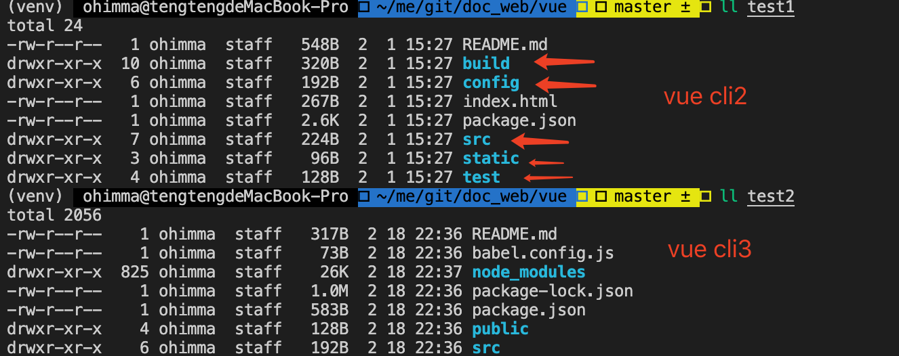

## 1.01 工具: cli 脚手架

##### 1. 简介
Vue CLI 是一个基于 Vue.js 进行快速开发的完整系统.
```
1、什么是脚手架？          
比如要盖一栋大楼，大楼外侧脚手架是必须搭建的，每个大楼都需要。
我们每次都要重复的搭建脚手架会又繁琐又耗时，如果有人已经提前把脚手架搭好，那我们会极度省时省力。
vue也一样，于是就有了脚手架，即搭建项目的基础摸板。

2、什么时候用脚手架？
如果项目很简单，只将基本的数据进行渲染，那就不需要用脚手架。
如果是中大型项目，因为要考虑代码结构、部署、热更新等琐碎的事，最好就交给脚手架处理了。

3、vue cli 是什么？
CLI 全称就是 Command-Line Interface, 翻译为命令行界面,俗称脚手架
Vue CLI就是一个官网发布的vue.js项目的脚手
Vue CLI可以帮我们快速的搭建Vue开发环境以及对应的webpack配置

Vue CLI 需要 Node.js 8.9 或更高版本 (推荐 8.11.0+)
Vue CLI 的包名称由 vue-cli 改成了 @vue/cli
```


##### 2. vue cli 2项目
```
$ npm install vue-cli -g
$ vue --version
2.9.6

$ vue init webpack myvue   // 初始化，回车逐步配置
$ npm run dev   // 运行项目

访问 http://localhost:8080
```

##### 3. vue cli 3 项目
vue cli2 和 vue cli3 区别：               
1、 cli3 是基于 webpack4 开发，cli2 是基于 webpack3 开发        
2、 cli3 设计原则是'0配置'，移除了build/config/static，增加了public目录             
3、 cli3 提供了 vue ui，更加人性化的进行可视化的配置               

    

```
$ npm uninstall vue-cli -g
$ npm install -g @vue/cli
$ npm list -g
$ vue --version
@vue/cli 4.5.11

$ vue create test2  // 创建项目目录并配置
$ cd test2
$ npm run serve

$ vue ui  // 通过界面配置
```

##### 4. 单文件组件测试
```
以下可单独测试某些.vue文件

$ npm install -g @vue/cli-service-global
$ vue serve hello.vue        
```


