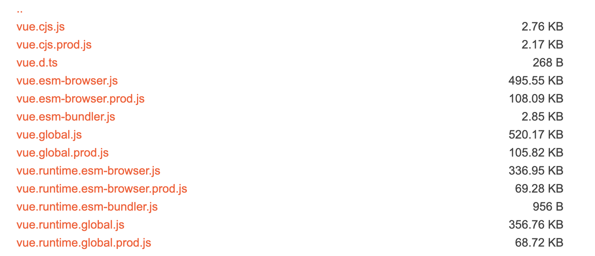

## 1.02 基础: 安装使用

##### 1. 安装四种方式

1、本地文件引入

```
在官网下载 vue.min.js 到本地，然后 scripts 直接引入
<https://vuejs.org/js/vue.min.js>

<script src="./vue.min.js"></script>
```

2、cdn 方式

```
cdnjs: <https://cdnjs.cloudflare.com/ajax/libs/vue/2.1.8/vue.min.js>
综合cdn平台：<https://www.bootcdn.cn/vue/>

<script src="https://unpkg.com/vue@next"></script>
```

3、npm 方式

```
$ npm -v     // 版本要大于2.3.0

$ npm install vue@next
```

4、命令行工具 cli

```
$ npm install -g @vue/cli
$ vue create demo
$ cd demo
$ npm run serve
```

5、vite 方式
web 开发构建工具，原生 es 模块导入，闪电般冷服务器启动

```
$ npm init @vitejs/app <project-name>
$ cd <project-name>
$ npm install
$ npm run dev

or

$ yarn create @vitejs/app <project-name>
$ cd <project-name>
$ yarn
$ yarn dev
```

##### 2. 构建

在构建后的 dist 目录，会找到很多不同的 vue.js 版本



```
1. 使用cdn和没用构建工具的
vue.global.js 是包含编译器和运行时的“完整”构建，支持动态编译模板。
vue.runtime.global.js 只包含运行时，并且需要在构建步骤期间预编译模板。
vue(.runtime).esm-browser(.prod).js 原生es模块导入

2. 使用构建工具
vue(.runtime).esm-bundler.js
vue.esm-bundler.js

3. 对于服务端渲染
vue.cjs(.prod).js

```

```
// 需要编译器，需要完整构建版本
Vue.createApp({
  template: '<div>{{ hi }}</div>'
})

// 不需要
Vue.createApp({
  render() {
    return Vue.h('div', {}, this.hi)
  }
})
```

##### 3. hello world

```
<html lang="en">
<head>
    <meta charset="UTF-8">
    <meta name="viewport" content="width=device-width, initial-scale=1.0">
    <title>Document</title>
</head>
<body>
    <div id="app">
        {{ msg }}
    </div>
    <script src="https://cdn.staticfile.org/vue/2.2.2/vue.min.js"></script>
    <script>
      let vm = new Vue({
        el: '#app',    // 告诉vue能管理那个部分,使用 querySelector
        data: {        // data中的数据会被vm所代理
          msg: 'hello world',  // 可以通过vm.msg取到对应的内容 ,也可以赋值
        }
      })
    </script>
</body>
</html>
```

##### 4. 模板语法 插值

vue 基于 html 的模板语法(mustache)，允许开发者声明式的将 DOM 绑定至底层的 vue 实例数据上。

```
文本：
<span>Message: {{ msg }}</span>
<span v-once>只更改一次: {{ msg }}</span>

HTML：
<span v-html="html_msg"></span>

表达式：
{{ number + 1 }}
{{ ok ? 'YES' : 'NO' }}
{{ message.split('').reverse().join('')}}

注意：每个绑定都只能包含单个表达式
<!--  这是语句，不是表达式：-->
{{ var a = 1 }}
<!-- 流控制也不会生效，请使用三元表达式 -->
{{ if (ok) { return message } }}
```
