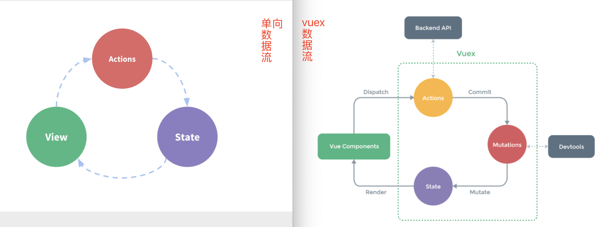
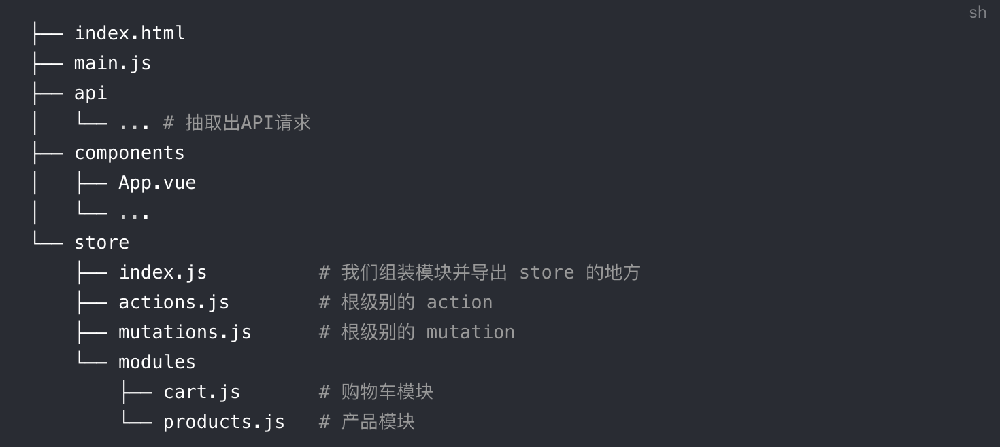

## 1.06 核心: vuex 基础

Vuex 是一个专门为 Vue.js 应用程序开发的状态管理模式

##### 1. 基本概念

```
状态管理就是对项目中数据的操作管理

特点：
1、状态就是Vue组件中data里面的属性，也叫做数据
2、vuex 采用集中式管理，将所有数据集中在一起管理
3、vuex 也继承到了调试工具  devtool 里

```

##### 2. 原始 状态管理

```
// 示例：每次点击都会加一
<template>
<div class="home">
    <div class="count">点击次数: {{ count }}</div>
    <button @click="increment">点击</button>
    </div>
</template>

<script>
    export default {
        name: 'Home',
        data(){
            return {
                count: 0
            }
        },
        methods:{
            increment(){
                this.count++
            }
        }
    }
</script>

<style >
    .count{
        font-size:30px;
        padding:20px;
    }
</style>
```

以上示例中：  
1、每次点击触发 方法 increment  
2、方法中修改 数据 count  
3、数据改变触发 vue 响应系统，改变视图 {{count}}

单项数据流：  
view: 以声明的方式把 state 映射到视图，即{{ count }}  
state: (状态)驱动数据源，数据存放地方，即 count  
action: 触发 view 视图上的状态改变动作，即 increment

##### 3. vuex 状态管理

```
1、vuex 背景(多组件共享问题)：
上面单项数据流看似简洁方便，但是遇到多组建数据共享就会出现问题。
a. 多个试图依赖于同一状态
b. 不同的视图会修改同一个状态

对于一：以前使用组件嵌套传递状态，但对于非父子组件状态传递就变得频繁
对于二：以前采用自定义事件传递数据更改，逻辑将变得复杂

于是有了vuex，将不同组件的共享状态(数据)抽离出来，以全局单例模式进行管理。

2、vuex 特点：
vuex 通过定义和隔离状态管理的各种概念，并通过强制规则维持视图和状态间的独立性，使得代码更结构化易维护。


3、vuex 应用场景：
a. 用户登录状态、用户名称、头像等信息
b. 商品收藏。购物车等商品

4、五个核心概念

a. state：存放数据的地方，vuex所维护的状态都定义在state中
b. mutation：存放修改数据的方法(同步)，虽然可以直接修改，但是不推荐
c. actions：存放修改数据的方法(异步)，他不直接修改state，而是先调用mutations
d. getter：vuex的计算属性，每次都获取数据不太友好，getter对于数据进行过滤并缓存
e. modules：应用变得复杂时，vuex允许store分割成多个module，每个模块有自己的state、mutation等

5、mutation和action区别：
当使用devtools时，可以帮我们捕获mutation的快照，检测状态变化。
如果是异步操作，devtools 不能很好跟踪这个操作什么时候完成
所以通常情况下，vuex要求我们mutation种方法必须是同步方法，actions处理异步修改

```



##### 4. vuex 安装简单使用

```
$ npm install vuex --save


$ vim store/index.vue  // 简单用muation创建一个实例
import { createStore } from 'vuex'

export default createStore({
  state: {
    count: 0
  },
  mutations: {
    increment (state) {
      state.count++
    }
  }
})

$ vim main.js  //将store从根组件向下注入 this.ca$store property
import store from './store'
const app = createApp(App)
app.use(store)
app.mount('#app')

$ vim views/home.vue  //可以直接使用了
<template>
    <button @click="increment">+1</button>
</template>
export default {
  name: 'Home',
  methods: {
    increment() {
      this.$store.commit('increment')
      console.log(this.$store.state.count)
    }
  }
}
</script>

```

vuex 应有的状态目录


