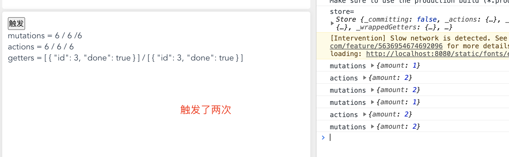

## 1.07 核心: vuex 进阶

初始案例


```
$ vim store/index.js
import { createStore } from 'vuex'

export default createStore({
  state: {
    count: 0,
    todos: [
      { id: 2, done: false },
      { id: 3, done: true },
    ]
  },
  getters: {
    doneTodos: state => {
      return state.todos.filter(todos => todos.done)
    }
  },
  mutations: {
    increment1 (state, payload) {
      console.log("mutations", payload)
      state.count += payload.amount
    }
  },
  actions: {
    increment2 (context, payload) {
      console.log("actions",payload)
      context.commit('increment1', payload)
    }
  },
  modules: {
  }
})

$ view/home.vue
<template>
  <div class="home">
    <button @click="increment">触发</button>
    <p>mutations = {{ count }} / {{ this.$store.state.count }} </p>
    <p>actions = {{ count }} / {{ this.$store.state.count }} </p>
    <p>getters = {{ this.doneTodos() }} / {{ this.$store.getters.doneTodos }} </p>
  </div>
</template>

<script>
import { mapState,mapGetters,mapActions,mapMutations } from 'vuex'
export default {
  name: 'Home',
  components: {
  },
  computed: {
    ...mapState({
      count: state => state.count
    }),
  },
  methods: {  // 先放到method，computed会有缓存
    ...mapGetters(['doneTodos']),
    ...mapMutations(['increment1']),
    ...mapActions(['increment2']),
    increment() {
      this.$store.commit('increment1',{amount: 1})
      this.increment2({amount: 2})
    },
  }
}
</script>
```

tips：  
state 在 computed 下 map 方式下正常调用，在 methods 下要加()访问  
事件 在 computed 下触发一次就不触发了(缓存)，methods 下没问题

##### 1. state

1、vuex 使用单一状态树，即只有一个 store 实例(包含了全部的应用层级状态)  
2、vuex 状态和 vue data 遵循相同的规则，状态对象必须纯粹  
3、vue 获取状态 state

```
// 内部方式
store.state.count

// 外部组件 实例方式
this.$store.state.count

// 外部组件 辅助函数方式
import { mapState } from 'vuex'
computed: {
  ...mapState({
    count: state => state.count,
    aliasCount: 'count',  // 'count' 等同于 `state => state.count`
  }),
},

```

##### 2. getter

1、getter 可以认为是 store 的计算属性 (类比 computed)  
2、getter 返回值会被依赖缓存起来，依赖值改变才重新计算  
3、getters 参数

```
// 定义一个参数时为 state
doneTodos: state => {
  return state.todos.filter(todos => todos.done)
}

// 定义第二个参数为getters
doneTodosCount: (state, getters) => {
    return getters.doneTodos.length
}
```

4、vue 使用 getters

```
// 内部 通过属性访问
store.getters.doneTodos

// 外部 组件内 实例对象方式
this.$store.getters.doneTodosCount

// 外部 辅助函数方式
import { mapGetters } from 'vuex'

...mapGetters(['doneTodos', 'xxx']),

...mapGetters({
  // 对象形式 `this.doneCount` 映射为 `this.$store.getters.doneTodosCount`
  doneCount: 'doneTodosCount'
})
```

5、怎么可以不缓存结果 (通过方法)

```
getTodoById: (state) => (id) => {
    return state.todos.find(todo => todo.id === id)
}

store.getters.getTodoById(2) // -> { id: 2, done: false }
```

##### 3. mutation

1、更改 store 中的 state 的唯一方法就是提交 mutation  
2、每个 mutation 都有一个 事件类型(type)、回调函数(handle)  
3、mutation 有两个参数，第一个是 state，第二个是载荷(payload)[建议是对象]  
4、mutations 一定是同步函数  
debug 时我们要捕捉前一状态和后一状态的快照，但是异步函数让这不能实现，不可追踪  
5、vue 中使用

```
// 内部 属性方式
store.commit('increment')
store.commit('increment1', 10)

// 内部 对象方式
store.commit({
  type: 'increment',
  amount: 10
})

// 外部 组件 实例方式
this.$store.commit('xxx')

// 外部组件 辅助函数 方式
import { mapMutations } from 'vuex'
...mapMutations([
  'increment', // 将 `this.increment()` 映射为 `this.$store.commit('increment')`
  // `mapMutations` 也支持载荷：
  'incrementBy' // 将 `this.incrementBy(amount)` 映射为 `this.$store.commit('incrementBy', amount)`
]),
...mapMutations({
  add: 'increment' // 将 `this.add()` 映射为 `this.$store.commit('increment')`
})

this.increment()
```

6、建议使用常量代替 type 事件类型

```
$ vim mutation-types.js
export const SOME_MUTATION = 'SOME_MUTATION'

$ vim store.js
import Vuex from 'vuex'
import { SOME_MUTATION } from './mutation-types'

const store = new Vuex.Store({
  state: { ... },
  mutations: {
    // 我们可以使用 ES2015 风格的计算属性命名功能来使用一个常量作为函数名
    [SOME_MUTATION] (state) {
      // mutate state
    }
  }
})
```

##### 4. actions

1、可以包含任意异步操作  
2、action 接受的是 context 对象，context.commit 提交 mutation  
3、action 提交执行的是 mutation

```
const store = new Vuex.Store({
  state: {count: 0},
  mutations: {
    increment (state) {
      state.count++
    }
  },
  actions: {
    increment (context) {
      context.commit('increment')
    }
  }
})

// 解构方式
actions: {
  increment ({ commit }) {
    commit('increment')
  }
}
```

4、vue 中使用

```
// 内部一般方式分发
store.dispatch('increment')

// 内部以载荷形式分发
store.dispatch('incrementAsync', {
  amount: 10
})

// 内部 以对象形式分发
store.dispatch({
  type: 'incrementAsync',
  amount: 10
})

// 外部 组件中分发 实例方式
this.$store.dispatch('increment')`

// 外部 组件中分发 辅助函数
import { mapActions } from 'vuex'
export default {
  methods: {
    ...mapActions([
      'increment', // 将 `this.increment()` 映射为 `this.$store.dispatch('increment')`

      // `mapActions` 也支持载荷：
      'incrementBy' // 将 `this.incrementBy(amount)` 映射为 `this.$store.dispatch('incrementBy', amount)`
    ]),
    ...mapActions({
      add: 'increment' // 将 `this.add()` 映射为 `this.$store.dispatch('increment')`
    })
  }
}
```

##### 5. modules

1、单一状态树，使应用集中在一个比较大的对象，会比较臃肿。  
2、可以使用 module 切割成多个 store，每个含有自己的对象属性  
3、和全局一样，mutation/getter 接受的第一个参数是模块内 state 对象  
4、局部 actions 参数 ({ state, commit, rootState })  
5、局部 getters 参数 (state, getters, rootState)  
6、命名空间：namespaced: true  
不指定默认注册是全局的，可以直接调用，指定后变成局部的，需要加 name 值  
7、在命名空间访问全局内容

```
getters: {
  // 你可以使用 getter 的第四个参数来调用 `rootGetters`
  someGetter (state, getters, rootState, rootGetters) {
    getters.someOtherGetter // -> 'foo/someOtherGetter'
    rootGetters.someOtherGetter // -> 'someOtherGetter'
  },
  someOtherGetter: state => { ... }
},

actions: {
  // 他们可以接受 `root` 属性以访问根 dispatch 或 commit
  someAction ({ dispatch, commit, getters, rootGetters }) {
    getters.someGetter // -> 'foo/someGetter'
    rootGetters.someGetter // -> 'someGetter'

    dispatch('someOtherAction') // -> 'foo/someOtherAction'
    dispatch('someOtherAction', null, { root: true }) // -> 'someOtherAction'

    commit('someMutation') // -> 'foo/someMutation'
    commit('someMutation', null, { root: true }) // -> 'someMutation'
  },
  someOtherAction (ctx, payload) { ... }
}
```

8、在命名空间注册全局内容

```
{
  actions: {
    someOtherAction ({dispatch}) {
      dispatch('someAction')
    }
  },
  modules: {
    foo: {
      namespaced: true,

      actions: {
        someAction: {
          root: true,
          handler (namespacedContext, payload) { ... } // -> 'someAction'
        }
      }
    }
  }
}
```

9、在命名空间使用辅助函数  
mapState/mapGetters 等函数绑定带命名空间的模块时，写起来比较繁琐

```
// 方式一
...mapState({
    a: state => state.test.module.a,
    b: state => state.test.module.b
})
...mapActions([
    'test/module/foo', // -> this['test/module/foo']()
    'test/module/bar' // -> this['test/module/bar']()
])

// 方式二：
...mapActions('test/module', [
    'foo', // -> this.foo()
    'bar' // -> this.bar()
])

// 方式三
import { createNamespacedHelpers } from 'vuex'
const { mapState, mapActions } = createNamespacedHelpers('test/module')
export default {
  methods: {
    // 在 `test/module` 中查找
    ...mapActions([
      'foo',
      'bar'
    ])
  }
}
```

10、模块动态注册

```
$ vim store/index/js
import { createStore } from 'vuex'
const store = createStore({ /* options */ })

// register a module `myModule`
store.registerModule('myModule', {
})

// register a nested module `nested/myModule`
store.registerModule(['nested', 'myModule'], {
})
```

##### 6. 严格模式

```
export default createStore({
  // strict: process.env.NODE_ENV !== 'production',
  strict: false,
})

1、任何不是由 mutation 函数引起的变更，都将抛出错误

```

##### 7. 表单处理

严格模式下，input v-model 将不能双向变更 state 状态。

```

解决一：定义组件方法
<input :value="message" @input="updateMessage">

mutations: {
    updateMessage (state, message) {
      state.message = message
    }
},

methods: {
    updateMessage (e) {
      this.$store.commit('updateMessage', e.target.value)
    }
}

解决二：使用 setter 双向绑定计算属性
<input v-model="obj.message">

computed: {
    message: {
      get () {
        return this.$store.state.message
      },
      set (value) {
        this.$store.commit('updateMessage', value)
      }
    }
},
```

##### 8. 测试 (未)

##### 9. 热重载 (未)
