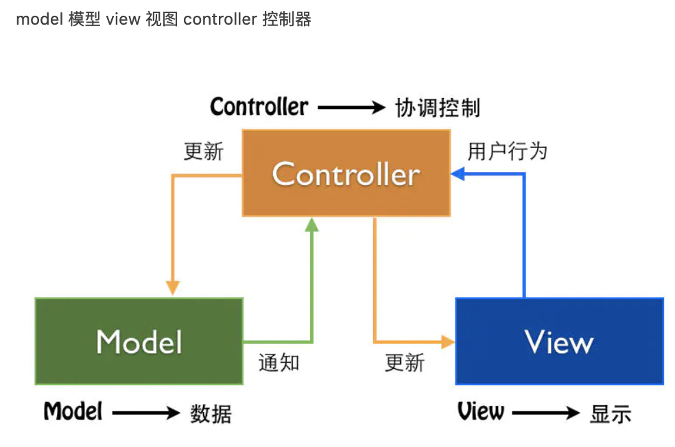
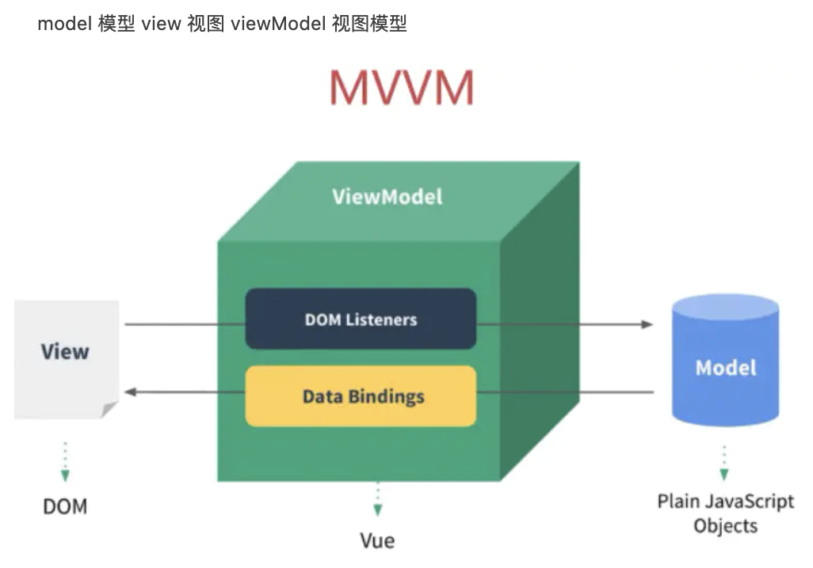

## 2.01 Vue 简介

##### 1. 简介

vue 是一套用于构建用户界面的渐进式框架           
作用：动态构建用户界面      

```
兼容性：        
Vue不支持IE8及以下版本，因为Vue使用的是IE8无法模拟的ECMAScript 5特性。vue.js支持所有兼容ECMAScript 5的浏览器.

特点：
1、易用、灵活、高效
2、自底向上逐层应用，核心只关注视图层
3、编码简洁，体积小，运行效率高
4、渐进式框架
5、遵循MVVM模式
```

##### 2.和 jquery layui 区别
```
与jquery： jquery是js库，不是框架
与layui：是前端框架，主要基于css，不是js

库：提供一些方法和集合，避免重复定义相同功能函数，并具有一定模式兼容性             
框架：完整的解决方案，规范开发者开发，提供相应的库和插件 
```

##### 3. 和其他前端框架的关联       
借鉴了angular的模板和数据绑定技术         
借鉴了react的组件化和虚拟DOM 技术

```
与React
都使用了 Virtual Dom
都提供了响应式(Reactive)和组件化(Composable)的视图组件    
都将注意力集中保持在核心库，将其他功能 如路由和全局状态管理交给其他库
不同的是 优化方面，组件状态变更时，React会重新渲染整个组件子树，Vue组件自动跟踪，没有子树的问题限制
不同的是 html/css方面，React中一切都是JS，css也纳入js，vue思想是拥抱经典web技术，并在其上扩展
不同的是 学习方面，react学习曲线陡峭，vue向上扩展类似react，向下扩展类似jquery

与AngularJS
vue 早期的的灵感来源于Angular，语法相似
不同的是 复杂性方面，API和设计 vue都要简单得多
不同的是 灵活性和模块化，Angular有特定规则，vue灵活只专注于基础工具，定制性好
不同的是 数据绑定，angular双向绑定，vue在不同的组件间强制使用单向数据流，更清晰
不同的是 指令与组件，angular每件事情由指令来做，组件是特殊指令，vue指令只封装dom，组件代表独立单元

与Ember
他是一个全能框架，提供了大量约定，一旦熟悉，开发效率会很高。不过学习曲线比较高

与Knockout
是 MVVM 领域内的先驱，并且追踪依赖，支持IE6。但发展缓慢，略显老旧

与Polymer
谷歌赞助，灵感来源于Vue，基于新版web components标准之上，需要重量级polyfills帮助工作

与Riot
设计理念有很多相似地方，vue相对重一点，性能较好，支持工具成熟完善

```  

##### 4. 常用组件  
 
```
1. Vue全家通, vuejs + vue-router + vuex+ axios
声明式渲染 (不关心是如何实现的用就可以了)
组件系统 (大型项目,很多部分可以复用,这就是组件)
客户端路由(vue-router)
大规模状态管理(vuex)
构建工具(vue-cli)

2. 常用插件
vue-cli: Vue 脚手架
vue-resource: ajax请求, 官网已经不推荐使用了,推荐axios
vue-router: 路由
vuex: 状态管理
vue-lazyload: 图片懒加载
vue-scroller : 页面滑动相关
element-ui: 基于vue的UI组件库(PC端)
mint-ui: 基于vue的UI组件库(移动端)
```


##### 5. 视图模型
 
 


