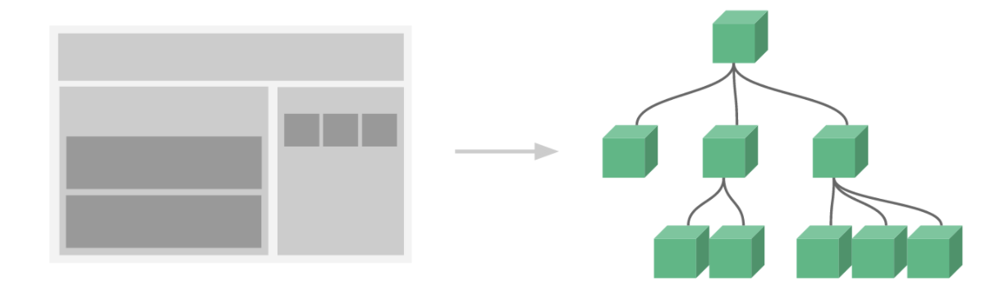

## 2.11 组件 基本认识


##### 1. 简介


组件是一段独立的，能代表页面某部分的代码片段，拥有独立的数据、js脚本、样式标签等

优点：
1、提高开发效率
2、方便重复利用
3、便与协同开发
4、更容易被管理和维护


##### 2. 组件创建使用
```
组件创建三步骤：
1、创建组件构建器 Vue.extend()
2、注册组件 Vue.component()
3、使用组件 (需要挂载到某个vue实例下，否则不生效)


vue组件同时也是vue实例，以下可以直接把构造器当做选项对象作为第二参数传给Vue.component
Vue.component("Geeting",{template:xxxxx, data:xxxx, methods:{} })

```

```
<body>
    <script src="https://cdn.staticfile.org/vue/2.2.2/vue.min.js"></script>

    <div id="app">
        <div>{{msg}}</div>
        <Greeting></Greeting>
    </div>
    
   <script>
       // 1. 创建组件构造器
       let MyComponent = Vue.extend({
           // 配置对象，组件没有挂载点，所以使用模板
           template: `
            <div>
                <p>大家好，我叫{{name}}</p>
                <button @click="changeName">点击换名字</button>
            </div>
           `,
           data(){
               return {name: "渣渣辉"}
           },
           methods: {
               changeName(){
                   this.name = "古天乐"
               }
           }
       })
       // 2. 通过 component 方法，将构造器扩展的构造函数创建组件实例
       Vue.component("Greeting", MyComponent)

       // 创建vue示例
       let vm = new Vue({
           el: "#app",
           data: {
               msg: "hello",
           }
       })
   </script>
</body>
```


##### 3. 组件分类
**全局组件**     
```
<div id="app-one">
    <my-com><my-com>
</div>
<div id="app-two">
    <my-com><my-com>
</div>
<script>
    Vue.component('MyCom', {
        template: `<div>这是全局组件的内容</div>`
    })
    new Vue({
        el: "#app-one",
    })
    new Vue({
        el: "#app-two",
    })
</script>
```

**局部组件**
```
<div id="app-one">
    <my-com><my-com>
</div>
<div id="app-two">
    <my-com><my-com>
</div>
<script>
    let MyCom = Vue.extend({
        template: `<div>这是全局组件的内容</div>`
    })
    
    new Vue({
        el: "#app-one",
        components: {MyCom}     // es6简化写法
    })
    new Vue({
        el: "#app-two",
    })

</script>
```

##### 4. 注意事项

```

1、组件名命名注意：
定义时推荐使用驼峰式，因为可以使用es6简化方式合并对象的属性和值，很优雅
使用时推荐使用连字符，因为html不区分大小写，MyCom会识别成mycom而找不到
组件名不能和html标签相同


2、template 选项：
template 选项耦合在注册组件中，使用维护比较麻烦，以下有两种分离方式：
解决一：使用script标签
<!-- type要指定为text/-x-template告诉浏览器这不是script脚本 -->
<script id="myComponent" type="text/x-template">
    <div>
        <h2>我想被创建为局部组件</h2>
    </div>
</script>
let MyComponent = {
    template: "#myComponent",  // 此时的模板template的值就是一个选择器
}

解决二：使用template标签处理
<template id="myComponent">
    <div>
        <h2>我想被创建为局部组件</h2>
    </div>
</template>
let MyComponent = {
    template: "#myComponent",  // 此时的模板template的值就是一个选择器
}


3、组件中选项对象的特例：
组件中不能使用 el 实例属性
组件中data属性值必须是一个函数，不是对象，因为对象是引用类型，用对象会共享一组数据

```
