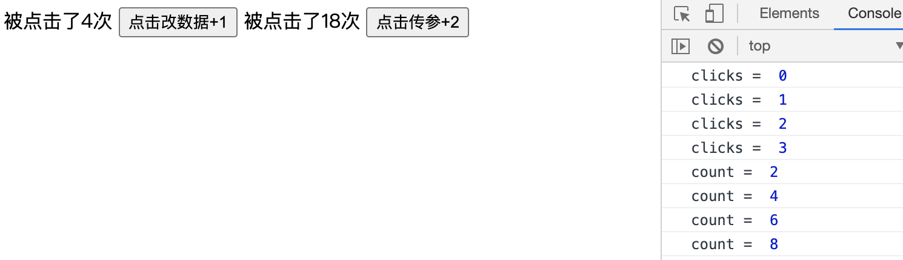

## 2.13 组件 父组件传参emit


##### 1. 子组件更改父组件
```
通过上节学习，我们知道              
由于vue是单向下行数据流，子组件更改props不会影响父组件              
由于响应式原理，父组件数据的改变会改变子组件props内的值               


思路：
1. 子组件没法更改父组件数据，就让父组件自己的函数改变自己
2. 子组件通过自定义事件触发父组件的函数
3. 父组件数据一改变，因为响应式，子组件中数据也会自动改变
```

```
<body>
    <script src="https://cdn.staticfile.org/vue/2.2.2/vue.min.js"></script>

    <div id="app">
        <!-- 使用组件 -->
        <!-- 3.在子组件中绑定自定义事件, 将父组件的方法绑定为自定义事件的处理函数-->
        <my-component 
                      :clicks="clicks" 
                      :clicks2="clicks2" 
                      @count="handleParentClick"
                      @count2="handleParentClick2"
         ></my-component>
        
    </div>
    
    <!-- 组件模板 -->
    <template id="MyComponent">
        <div>
            被点击了{{clicks}}次
            <!-- 1. 子组件通过原生click事件触发子组件自己的函数 -->
            <button @click="handleClick">点击改数据+1</button>
            被点击了{{clicks2}}次
            <button @click="handleClick2">点击传参+2</button>
        </div>
    </template>
    
    
    <script>
    
        //  组件选项对象
        let MyComponent = {
            props:["clicks","clicks2"],
            template: `#MyComponent`,
            data(){
                return {
                    count: this.clicks2
                }
            },
            methods:{
                handleClick(){
                    // 2. 改变数据 子子组件函数中触发自定义事件count
                    this.$emit("count")
                },
                handleClick2(){
                    // 2. 子向父传参：子子组件函数中触发自定义事件
                    // 2.1 子向父传参：在触发自定义事件的时候向自定事件传参
                    this.count+=2
                    this.$emit("count2",this.count)
                }
            }
        }
        const vm = new Vue({
            el:"#app",
            data: {
                clicks:0,
                clicks2:0,
            },
            components: {
                "MyComponent": MyComponent
            },
            methods:{
                handleParentClick(){
                    // 4. 在父组件函数中修改父组件中的数据
                    console.log("clicks = ",this.clicks)
                    this.clicks++
                },
                handleParentClick2(count){
                    // 4. 在父组件函数中修改父组件中的数据
                    // 4.1 接受自定义事件触发时传递的参数
                    console.log("count = ",count)
                    this.clicks2 = count
                }
            }
        })
    </script>
</body>
```


##### 2. 原生事件修饰符 .native
组件标签是没办法触发原生js事件的，vue会将其作为自定义事件处理，需要用.native标识

```
<div id="app">
    <!--  click 事件不会被当做DOM原生事件处理,只会被当做自定义事件处理-->
    <my-component @click="handleParentClick"></my-component>
</div>

<template id="MyComponent">
    <div>被点击了
        <!-- 1. 子组件通过原生click事件触发子组件自己的函数 -->
        <button @click="handleClick">点击</button>
    </div>
</template>
let MyComponent = {
    template: `#MyComponent`,
    methods:{
        handleClick(){
            // 触发组件标签上自定义事件click
            this.$emit("click")
        }
    }
}

>>>>
<div id="app">
     <!-- 在组件标签上,如果需要使用原生事件,使用修饰符native, 这样vue就会把他当做原生事件处理了-->
    <my-component @click.native="handleParentClick"></my-component>
</div>
<template id="MyComponent">
    <div>被点击了
        <button>点击</button>
    </div>
</template>
let MyComponent = {
    template: `#MyComponent`,
}

```


##### 3. 双向绑定修饰符 .sync           
一些情况下，我们需要对一个prop进行双向绑定。这是vue1.x提供的功能。            
但他破坏了单向数据流，子组件prop改变很难发现父组件变化，debug时很麻烦,vue2.0移除。          
但开发复用组件库时很有用，升级了让子组件改变父组件状态的代码更容易区分,在vue2.3添加           


##### 4. 双向数据绑定 v-model

```
方案一：使用事件的表单控件

<div id="app">
    <input type="text" :value="value" @input = "changeValue"/>{{ value }}
</div>

<script>
    const vm = new Vue({
        el:"#app",
        data:{
            value: '' 
        },
        methods:{
            changeValue(){
                // 在事件里获取表单的内容
                this.value = event.target.value;
            }
        }
    })
</script>

方案二：利用自定义事件处理
单向下行数据流方式将父组件数据传递给子组件
自定义事件的方式将子组件数据传递给父组件，实现双向绑定

<div id="app">
    <my-component :value="value" @input = "handleParentClick"></my-component>{{ value }}
</div>
<template id="MyComponent">
    <div>
        <input type="text" :value="value" @input="handleInput"/>
    </div>
</template>

<script>
    //  组件选项对象
    let MyComponent = {
        props:["value"],
        template: `#MyComponent`,
        methods: {
            handleInput(){
                this.$emit("input",event.target.value)
            }
        }
    }

    //  实例中注册组件
    const vm = new Vue({
        el:"#app",
        data:{
            value: '' 
        },
        components: {
            "MyComponent": MyComponent
        },
        methods:{
            handleParentClick(value){
                this.value = value
            },
        }
    })
</script>

方案三：vue2.2.0允许在自定义组件上使用v-model形式
<div id="app">
    <my-component v-model="value"></my-component>{{ value }}
</div>
<template id="MyComponent">
   <div>
      <input type="text" :value="value" @input="handleInput"/>
   </div>
</template>

<script>
   let MyComponent = {
       props:{
           value:{
               type:String,
               required: true
           }
       },
       template: `#MyComponent`,
       methods: {
           handleInput(){
               this.$emit("input",event.target.value)
           }
       }
   }
   //  实例中注册组件
   const vm = new Vue({
       el:"#app",
       data:{
           value: '' 
       },
       components: {
           "MyComponent": MyComponent
       }
   }) 
</script>
```

