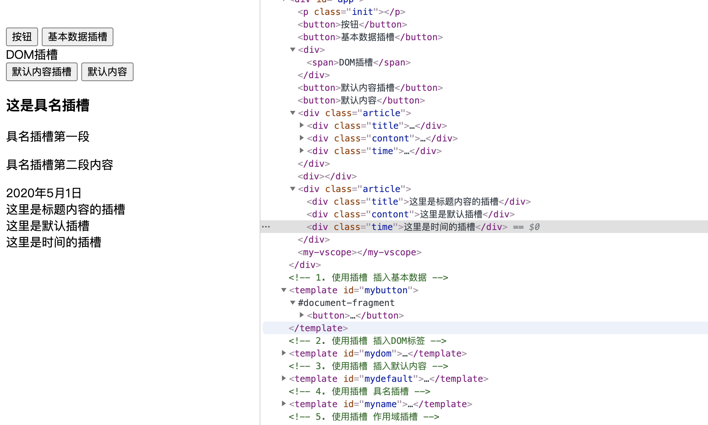

## 2.15 组件 插槽slot 

Vue 实现了一套内容分发的 API，这套 API 的设计灵感源自 [Web Components 规范草案](https://github.com/WICG/webcomponents/blob/gh-pages/proposals/Slots-Proposal.md)，将 <slot> 元素作为承载分发内容的出口。

##### 1. 基本认识
背景：组件里边是不能写内容的，会被template替换               

1、插入基本的文本内容         
2、插入DOM标签             
3、插入默认内容               


##### 2. 具名插槽
<slot>插槽可以用一个特殊的殊性name配置如何分发内容           
使用 name 属性的插槽被称为具名插槽。         
未使用 name 属性的插槽被称为匿名插槽。           


##### 3. 作用域插槽

作用域插槽是一种特殊类型插槽，用作一个可重用模板，代替已经渲染好的元素。就是利用slot将子组件的数据传递到父组件。      

在父级中的 slot-scope 表示作用域插槽模板，其值用作临时变量名，接受子组件传递过来的props对象。      

在 2.5.0+ 后，solt-scope 能被用在任意元素或组件中不再局限于template


##### 4. v-slot指令
v-slot 在 vue2.6 被引入，提供更好的支持，而slot、slot-scope已经被vue3废弃。      

```
注意： v-slot 只能添加在 <template> 上

1. 处理具名插槽

2. 处理作用域插槽
绑定在v-slot元素上的attribute被称为插槽prop。在父级作用域，可以使用带值的v-slot老丁已提供的插槽prop的名字。


3. 作用域插槽的特殊处理
<my-child v-slot:default="props"><button>{{ props.text }}</button></my-child>
<my-child v-slot="props"><button>{{ props.text }}</button></my-child>
不带参数的话被认为只有default标签，如果有多个插槽，需要使用完整语法

4. 动态插槽
2.6.0 新增，使用中括号，中括号内是变量，是父组件中的数据变量
比如v-slot:[head] 实际调用的是实例vm中的 data:{head: "title"}

5. v-slot 插槽缩写 #
2.6.0 新增，和其他缩写一样，必须有参数的情况下才支持
```

##### 5. 示例



```
<html lang="en">
<head>
    <meta charset="UTF-8">
    <meta name="viewport" content="width=device-width, initial-scale=1.0">
    <title>txt</title>
    <style>
        .init {
            height: 120px;
        }
    </style>
</head>
<body>
    <script src="https://cdn.staticfile.org/vue/2.2.2/vue.min.js"></script> 
    <div id="app">
        <p class="init"></p>
        <!-- 1. 使用插槽 插入基本数据 -->
        <!-- 使用插槽 否则组件内容默认会被template替换 -->
        <my-button>{{msg}}</my-button>
        <my-button>基本数据插槽</my-button>

        <!-- 2. 使用插槽 插入DOM标签 -->
        <my-dom><span>DOM插槽</span></my-dom>

        <!-- 3. 使用插槽 插入默认内容 -->
        <my-default>默认内容插槽</my-default>
        <my-default></my-default>
          
        <!-- 4. 使用插槽 具名插槽 -->
        <my-name>
            <h3 slot="title">这是具名插槽</h3>
            <template slot="contont">
                <p>具名插槽第一段</p>
                <p>具名插槽第二段内容</p>
            </template>
            <span slot="time">2020年5月1日</span>
        </my-name>

        <!-- 5. 使用插槽 作用域插槽 -->
        <my-scope>
            <!-- 作用域插槽也可以用解构写法 slot-scpoe={text2} -->
            <!-- <button slot-scope="props">{{ props.text }}</button> -->
        </my-scope>

        <!-- 6. v-slot 具名插槽的使用 -->
        <my-vname >
            <template v-slot:title>
                <h3>这是 v-slot 具名插槽的文章</h3>
            </template>
            <template v-slot:contont>
                <p>v-slot具名插槽的第一段</p>
                <p>v-slot具名插槽的第二段内容</p>
            </template>
            <template #time>
                <span>2021年5月1日</span>
            </template>
        </my-vname>

        <!-- 7. 使用插槽 v-slot 作用域插槽 -->
        <my-vscope >
            <template v-slot:default="props">
                <!-- <button>{{ props.text }}</button> -->
            </template>
        </my-child>
   </div>

    <!-- 1. 使用插槽 插入基本数据 -->
    <template id="mybutton">
        <button><slot></slot></button>
   </template>
   <!-- 2. 使用插槽 插入DOM标签 -->
   <template id="mydom">
    <div><slot></slot></div>
   </template>
   <!-- 3. 使用插槽 插入默认内容 -->
   <template id="mydefault">
    <button><slot>默认内容</slot></button>`
   </template>

   <!-- 4. 使用插槽 具名插槽 -->
   <template id="myname">
    <div class="article">
        <div class="title">
            <slot name="title">这里是标题内容的插槽</slot>
        </div>
        <div class="contont">
            <slot name="contont">这里是默认插槽</slot>
        </div>
        <div class="time">
            <slot name="time">这里是时间的插槽</slot>
        </div>
    </div>
   </template>

   <!-- 5. 使用插槽 作用域插槽 -->
   <template id="myscope">
        <div><slot :text="text"></slot></div>
    </template>
    <!-- 6. 使用插槽 v-slot的使用 具名插槽 -->
    <template id="myvname">
        <div class="article">
            <div class="title">
                <slot name="title">这里是标题内容的插槽</slot>
            </div>
            <div class="contont">
                <slot name="contont">这里是默认插槽</slot>
            </div>
            <div class="time">
                <slot name="time">这里是时间的插槽</slot>
            </div>
        </div>
    </template>
    <!-- 7. 使用插槽 v-slot 作用域插槽 -->
    <template id="myvscope">
        <div><slot :text="text"></slot></div>
    </template>
   <script>
        //  组件选项对象
        let MyButton = {
            template: '#mybutton',
        };
        let MyDom = {
            template: '#mydom',
         };
        let MyDefault = {
            template: '#mydefault',
        };
        let MyName = {
            template: '#myname',
        };
        let MyScope = {
            template: '#myscope',
            data(){
                return {text: "普通作用域"}
            }
        };
        let MyVname = {
            template: '#myvname',
        };
        let MyVscope = {
            template: '#myvscope',
            data(){
                return {text: "v-slot作用域"}
            }
        };
        const vm = new Vue({
            el:"#app",
            data: {
                msg: "按钮"
            },
            components: {
                MyButton,MyDom,MyDefault,MyName,MyScope,MyVname
            }
        })
   </script>
</body>
</html>

```