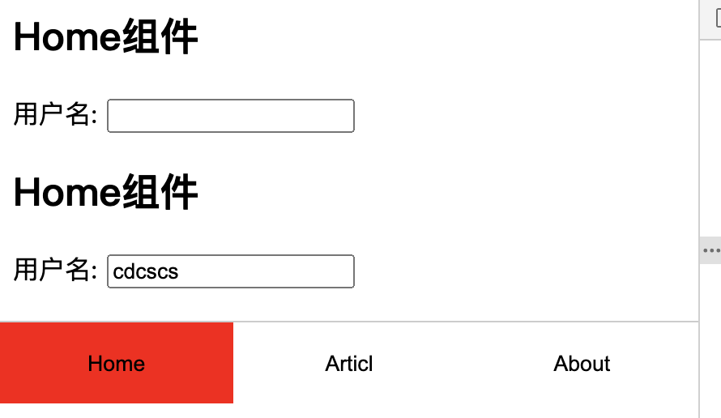

## 2.16 组件 动态is和keep-alive


##### 1. 动态组件

动态组件：              
顾名思义就是组件会动态的切换显示              
通过使用保留的关键字 <component> 元素，对其 is 特性进行动态绑定，便可以在同一挂载点动态切换              

需求：需要根据不通的状态切换显示不同的组件                                           
解决一(常规)：使用 v-if 或 v-show 指令切换，每个组件都要指定-vif，太麻烦                     
解决二：使用动态组件进行切换                         

```
<Home v-if="com=='Home'"></Home>
<Articl v-if="com=='Articl'"></Articl>
<About v-if="com=='About'"></About>

可替换为
<component :is="com"></component>

此时is属性的值是通过v-bind指令动态绑定到data属性中的数据
```

##### 2. keep-alive
未使用keep-alive，每次的切换都会创建一个新的组件，删除旧的组件，都会走一遍自己的生命周期            
使用keep-alive，组件便不会销毁，处于缓存状态               

##### 3. 示例



```
<html lang="en">
<head>
    <meta charset="UTF-8">
    <meta name="viewport" content="width=device-width, initial-scale=1.0">
    <title>txt</title>
    <style>
        .bottom{
            display:flex;
            position: fixed;
            left:0;
            right:0;
            top: 200px;
            height:50px;
            background: #fff;
            border-top:1px solid #ccc;
        }
        button{
            flex:1;
            border:0;
            outline:none;
            background: #fff;
        }
        .active{
            background: red;
        }
    </style>
</head>
<body>
    <script src="https://cdn.staticfile.org/vue/2.2.2/vue.min.js"></script> 
    <div id="app">
        <!-- 1. 常规组件切换 -->
        <Home v-if="com=='Home'"></Home>
        <Articl v-if="com=='Articl'"></Articl>
        <About v-if="com=='About'"></About>
    
        <!-- 2. 动态组件切换 -->
        <keep-alive>
            <component :is="com"></component>
        </keep-alive>
        

        <!-- 切换组件的按钮 -->
        <div class="bottom">
            <button
                    v-for="value in components"
                    @click="change(value)" 
                    :class="{active:com == value}"
                    >
                {{value}}
            </button>
        </div>
    </div>
    
    <script>
        let Home = {
            template:`
            <div>
                <h2>Home组件</h2>
                用户名: <input type="text"/>
            </div>`
        }
        // 注意不能使用article 因为html有原生的article标签
        let Articl = {
            template:`<div>
                    <h2>Article组件</h2>
                </div>`
        }
        let About = {
            template:`<div>
                    <h2>About组件</h2>
                </div>`
        }
    
        // vue 实例
        var vm = new Vue({   
            el: '#app',
            data: {
                com:"Home",
                components:["Home", "Articl", "About"],
            },
            methods:{
                change(value){
                    this.com = value;
                }
            },
            components: {
                Home,Articl,About
            },
        });
    </script>
</body>
</html>

```
