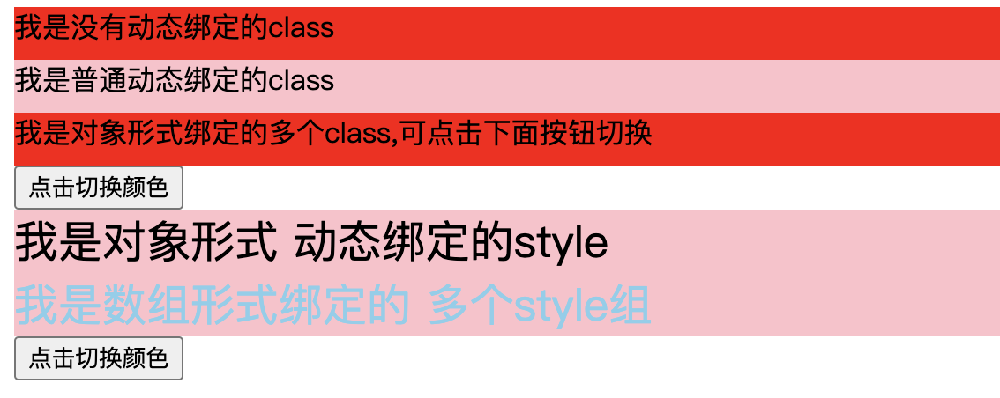

## 3.01 指令: 动态绑定:(v-bind)

指令 (Directives) 是带有 v- 前缀的特殊 attribute。

指令的职责是，当表达式的值改变时，将其产生的连带影响，响应式地作用于 DOM

#### 1. 基础指令

```
<script>
let vm = new Vue({
  el:'#app',
  data:{
    msg1: 'hello',
    msg2: '<h3>hello<h3>',
    msg3: 'msg3',
  }
})
</script>

1、v-text
引号内是表达式，指令等同于 innerText，会覆盖标签内的内容
<p v-text='msg1 + "msg1"'>who</p>  // hellomsg1

2、v-html
把字符串渲染成html，类似 innerHTML，谨慎出现xss攻击的风险
<p v-html='msg2 '>who</p>    // hello   (h2标签大小)

3、v-once
只初始化一次，不随数据变化改变页面
<p v-once='msg3'>{{ msg1 }}</p>   // hello

4、v-pre
跳过该元素的编译过程，显示原始的Mustache标签，加快编译
<p v-pre='msg3'>{{ msg1 }}</p>  // {{ msg1 }}

5、v-cloak
vue和浏览器性能极大提升后，用不到了
用来在页面未加载出来时，不出现原始代码{{msg}}
```

#### 2. v-bind(:) 动态绑定

缩写：v-bind:herf="var" === :herf="var"  
指令会将普通属性的字面值变成表达式值，并监听响应

在属性绑定时有两个属性比较特殊：  
class、style，vue 做了增强，除了表达式语法，还可以是对象和数组。

##### 1. class

```
// 对象语法
<div
  class="static"
  :class="{ active: isActive, 'text-danger': hasError}"
></div>

data() {
  return {
    isActive: true,
    hasError: false
  }
}

>>> <div class="static active"></div>

// 数组语法
<div :class="[activeClass, errorClass]"></div>

data() {
  return {
    activeClass: 'active',
    errorClass: 'text-danger'
  }
}
>>>> <div class="active text-danger"></div>

三元表达式 vs 数组对象
<div :class="[isActive ? activeClass : '', errorClass]"></div>
<div :class="[{ active: isActive }, errorClass]"></div>

// 组件内使用
const app = Vue.createApp({})

app.component('my-component', {
  template: `<p class="foo bar">Hi!</p>`
})

<div id="app">
  <my-component class="baz" :class="{ active: truthy }"></my-component>
</div>

>>>> <p class="foo bar baz active">Hi</p>
```

##### 2. style

1、:style 的对象语法看着非常像 CSS，但其实是一个 JavaScript 对象  
2、JS 表达式不支持 - ，需要用驼峰式表达 or 短横线+双引号的方式

```
(对象内都是表达式，字符串需要括起来)
<h2 :style="{color:'red',fontSize:'30px'}">Hello</h2>

// 对象语法
建议不用内联样式，抽离出样式对象来，易懂
<div :style="styleObject"></div>

data() {
  return {
    styleObject: {
      color: 'red',
      fontSize: '13px'
    }
  }
}


// 数组
<div :style="[baseStyles, overridingStyles]"></div>

// 自动添加前缀
:style 中使用需要 CSS property 时(如 transform)，Vue 将自动侦测并添加相应的前缀

// 多重值
// 只会渲染数组中最后一个被浏览器支持的值
<div :style="{ display: ['-webkit-box', '-ms-flexbox', 'flex'] }"></div>


```

##### 3. truthy

<https://developer.mozilla.org/zh-CN/docs/Glossary/Truthy>

truthy 不是 true，是真值，以下都是真值，可转换为 true

```
if (true)
if ({})
if ([])
if (42)
if ("foo")
if (new Date())
if (-42)
if (3.14)
if (-3.14)
if (Infinity)
if (-Infinity)
```

#### 3. 示例(old)



```
<html lang="en">
<head>
    <meta charset="UTF-8">
    <meta name="viewport" content="width=device-width, initial-scale=1.0">
    <title>txt</title>
    <style>
        #app div {
            width: 700px;
            height: 30px;
        }
        .box1 {
            background-color: pink;
        }
        .className {
            background-color: red;
        }
    </style>
</head>
<body>
    <script src="https://cdn.staticfile.org/vue/2.2.2/vue.min.js"></script>
    <div id="app">
        <div class="className">我是没有动态绑定的class</div>
        <div v-bind:class="className">我是普通动态绑定的class</div>
        <div :class="{box1:isTrue, className: !isTrue}">我是对象形式绑定的多个class,可点击下面按钮切换</div>
        <button @click="changClassName">点击切换颜色</button>
    </div>
    <div id="app2">
        <div :style="styleObject">我是对象形式 动态绑定的style</div>
        <div :style="[styleObject, baseStyle]">我是数组形式绑定的 多个style组</div>
        <button @click="changColor">点击切换颜色</button>
    </div>

    <script>
        var freeze_msg = {foo: 'bar'}
        Object.freeze(freeze_msg)
        let vm = new Vue({
          el:'#app',
          data:{
            className: 'box1',
            isTrue: 'true',
          },
          methods:{
            changClassName(){
                this.isTrue = !this.isTrue
            }
          }
        })
        let vm2 = new Vue({
          el:'#app2',
          data:{
            styleObject: {
                backgroundColor: "pink",
                fontSize: "25px"
            },
            baseStyle: {
                color: "red",
                margin: 0,
            }
          },
          methods:{
            changColor(){
                this.baseStyle.color = this.baseStyle.color == "red"? "skyblue": "red"
            }
          }
        })

    </script>
</body>
</html>

```
