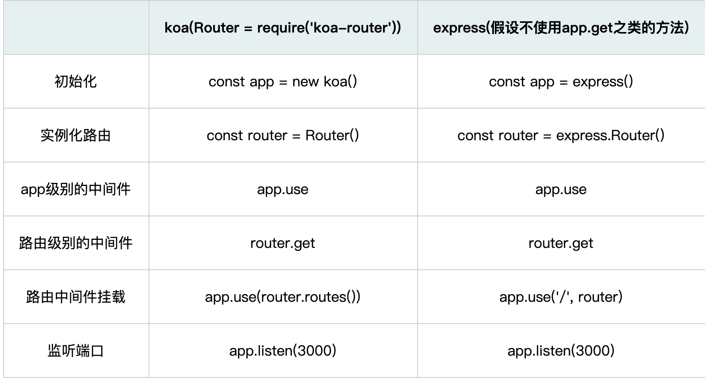

## 3.01 框架


##### 1. 框架
参考：           
<https://github.com/linxiaowu66/express-vs-koa>                    
<https://www.zhihu.com/question/391604647>        

express: 最早的一款框架，作者TJ             
koa2: 微型的web框架，只提供了核心中间件功能，其他由三方组件实现，作者TJ            
egg:  基于koa，开箱即用，多进程启动，热更新                
typeScript: 基于egg，开发室提供类型检查              

  
##### 2. express vs koa
express.js有着精妙的中间件设计(层层递归和调用)，但是以当前js标准来说，这种精妙的设计在现在可以说是太复杂。
koa2 的代码呢？简直可以用四个字评论：精简彪悍！




express 
```
const express = require('express')

const app = express()
const router = express.Router()

app.use(async (req, res, next) => {
  console.log('I am the first middleware')
  next()
  console.log('first middleware end calling')
})

router.get('/api/test1', async(req, res, next) => {
  console.log('I am the router middleware => /api/test1')
  res.status(200).send('hello')
})

app.use('/', router)

app.use(async(err, req, res, next) => {
  if (err) {
    console.log('last middleware catch error', err)
    res.status(500).send('server Error')
    return
  }
  console.log('I am the last middleware')
  next()
  console.log('last middleware end calling')
})

app.listen(3000)
console.log('server listening at port 3000')
```
koa
```
const koa = require('koa')
const Router = require('koa-router')

const app = new koa()
const router = Router()

app.use(async(ctx, next) => {
  console.log('I am the first middleware')
  await next()
  console.log('first middleware end calling')
})

router.get('/api/test1', async(ctx, next) => {
  console.log('I am the router middleware => /api/test1')
  ctx.body = 'hello'
})

router.get('/api/testerror', async(ctx, next) => {
  throw new Error('I am error.')
})

app.use(router.routes())

app.listen(3000)
console.log('server listening at port 3000')

```

##### 3. 选型
1、如果是Express的老项目，那么建议继续使用Express
2、如果是新项目，环境对ES7语法没有限制，团队有较高的定制化需求和性能要求，那么优先选择Koa
3、喜欢一体式，快速集成开发，选 express；喜欢插拔式，自由积木组合，选koa