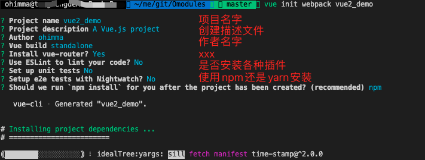
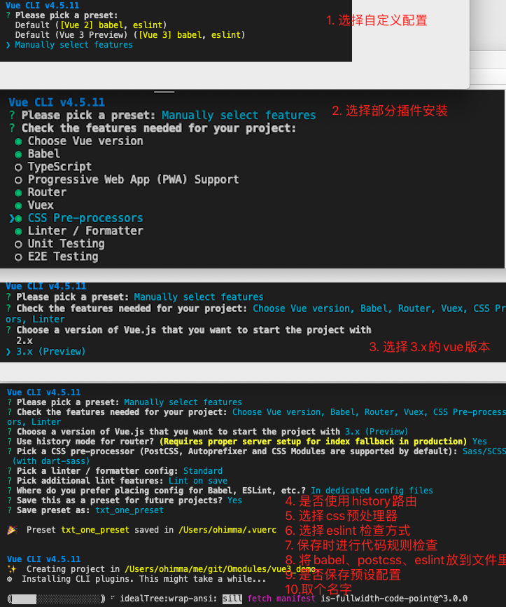

## 3.03 构建: vue2/vue3

```
$ node -v    // v15.6.0
$ npm -v     // 7.4.0

为什么前端框架需要nodejs？
webpack 是基于nodejs的前端项目打包工具
vue-cli 是基于webpack构建，并带有合理的配置
所以说 vue 框架，需要用到 nodejs 构建项目
```

#### 1. vue2

##### 1. 初始化项目

```
$ npm uninstall @vue/cli
$ npm install -g vue-cli    // vue 2.9.6

$ vue init webpack vue2_demo
$ cd vue2_demo
```



##### 2. 目录结构

```
tree -I "node_modules"
├── README.md
├── build      构建脚本目录
│   ├── build.js  生产环境构建脚本
│   ├── check-versions.js  检查npm nodejs版本
│   ├── logo.png
│   ├── utils.js  构建相关工具方法
│   ├── vue-loader.conf.js    配置了css加载器以及编译
│   ├── webpack.base.conf.js  webpack基本配置
│   ├── webpack.dev.conf.js   webpack开发配置
│   └── webpack.prod.conf.js  webpack生产配置
├── config
│   ├── dev.env.js    开发环境变量
│   ├── index.js      项目配置文件
│   └── prod.env.js   生产环境变量
├── index.html        首页入口文件，可以添加一些meta元数据信息
├── package-lock.json
├── package.json      npm包配置文件，定义了项目npm、依赖包等
├── src
│   ├── App.vue     根组件
│   ├── assets      资源目录，放置一些图片、公共js/css，会被webpack构建
│   │   └── logo.png
│   ├── components  组件目录
│   │   └── HelloWorld.vue
│   ├── main.js     入口js文件
│   └── router      前端路由，需要配置的路由路径写在index.js里面
│       └── index.js
└── static        静态资源目录，图片、字体，不会被webpack构建
```

##### 3. demo

```
1. 创建二级组件first
2. 创建三级组件confirm
3. 通过三级组件更改frist数据
4. 使用rouer-link跳转
5. 使用less语法 （需要指定版本）--save-dev把依赖写到devDependencies测试中
npm install less@3.9.0 less-loader@4.1.0 --save-dev

6. 自动打开浏览器 config/index.js  autoOpenBrowser: true

```

参考 demo：<https://github.com/Ohimma/Omodules/tree/master/vue2_demo>

#### 2. vue3

##### 1. 初始化目录

```
$ npm uninstall -g vue-cli
$ npm install -g @vue/cli   // 4.5.11

$ vue creat vue3_demo
```

##### 2. 项目结构

```
1. 选择默认
tree -I "node_modules"
├── .gitignore
├── README.md
├── babel.config.js
├── package-lock.json
├── package.json
├── public
│   ├── favicon.ico
│   └── index.html
└── src
    ├── App.vue
    ├── assets
    │   └── logo.png
    ├── components
    │   └── HelloWorld.vue
    └── main.js

2. 自定义配置
├── .browserslistrc   // 给开发者设置浏览器版本范围
├── .editorconfig     //
├── .eslintrc.js      // eslint规则检查配置文件
├── .gitignore
├── README.md
├── babel.config.js   // babel 配置工具
├── package-lock.json
├── package.json
├── public
│   ├── favicon.ico
│   └── index.html   // 静态文件夹，不会被webpack编译，构建时直接拷贝一份
└── src
    ├── App.vue      // vue页面的顶层文件
    ├── assets       // 页面和组件用的到静态资源，会被wenpack编译
    │   └── logo.png
    ├── components   // 组件目录
    │   └── HelloWorld.vue
    ├── main.js      // 整个项目的入口文件
    ├── router       // 路由配置目录
    │   └── index.js
    ├── store        // vuex 配置目录
    │   └── index.js
    └── views        // 存放页面
        ├── About.vue
        └── Home.vue
```



##### 3. 基本配置文件

```
$ vim vue.config.js
const path = require('path')

module.exports = {
  // 部署应用包时的基本 URL, 用法和 webpack 本身的 output.publicPath 一致
  publicPath: './',
  // 输出文件目录
  outputDir: './dist',
  // 放置静态资源的目录，从生成的资源覆写 filename 或 chunkFilename 时，assetsDir 会被忽略
  assetsDir: 'static',
  // 指定生成的 index.html 的输出路径 (相对于 outputDir)
  indexPath: 'index.html',
  // 文件名hash。生成的静态资源在它们的文件名中包含了 hash 以便更好的控制缓存
  filenameHashing: true,

  // eslint-loader 是否在保存的时候检查
  lintOnSave: true,
  // 是否使用包含运行时编译器的 Vue 构建版本
  runtimeCompiler: false,
  // 生产环境是否生成 sourceMap 文件
  productionSourceMap: false,
  // 生成的 HTML 中的 <link rel="stylesheet"> 和 <script> 标签上启用 Subresource Integrity (SRI)
  integrity: false,

  pages: {
    index: {
      // 入口文件
      entry: 'src/main.js',　　/*这个是根入口文件*/
      // 模板文件
      template: 'public/index.html',
      // 输出文件
      // filename: 'index2.html',
      // 页面title
      title: 'txt Page'
    },
    // 简写格式
    // 模板文件默认是 `public/subpage.html`
    // 如果不存在，就是 `public/index.html`.
    // 输出文件默认是 `subpage.html`.
    // subpage: 'src/main.js'　　　　/*注意这个是*/
  },

  // webpack相关配置
  chainWebpack: (config) => {
    config.resolve.alias
      .set('vue$', 'vue/dist/vue.esm-browser.js')
      .set('@', path.resolve(__dirname, './src'))
  },
  configureWebpack: (config) => {
  if (process.env.NODE_ENV === 'production') {
      // 生产环境
      config.mode = 'production'
    } else {
      // 开发环境
      config.mode = 'development'
    }
  },
  // css相关配置
  css: {
    // 是否分离css（插件ExtractTextPlugin）
    extract: true,
    // 是否开启 CSS source maps
    sourceMap: false,
    // css预设器配置项
    loaderOptions: {},
    // 是否启用 CSS modules for all css / pre-processor files.
    modules: false
  },
  // 是否使用 thread-loader
  parallel: require('os').cpus().length > 1,
  // PWA 插件相关配置
  pwa: {},
  // webpack-dev-server 相关配置
  devServer: {
    open: true,
    host: 'localhost',
    port: 8080,
    https: false,
    hotOnly: false,
    // http 代理配置
    proxy: {
      '/api': {
        target: 'http://127.0.0.1:3000/api',
        changeOrigin: true,
        pathRewrite: {
            '^/api': ''
        }
      }
    },
    before: (app) => {}
  },
  // 第三方插件配置
  pluginOptions: {

  }
}
```

##### 4. vue4.5 + elementui

<https://github.com/Ohimma/Omodules/tree/master/vue3_demo>

参考: <https://github.com/whiskyma/vue3-elementui.git>  
参考: <https://github.com/dingFY/vue-iview3-admin.git>

```
1. 修改目录结构
mkdir src/{api,router,utils,views,store}


下面的先忽略
1. 新建配置文件 vue.config.js
2. 创建各个环境的 变量文件 .env.dev/.env.test/.env.pre/.env.prod
3. 安装使用ui框架 elementui
4. 安装使用axios
```
