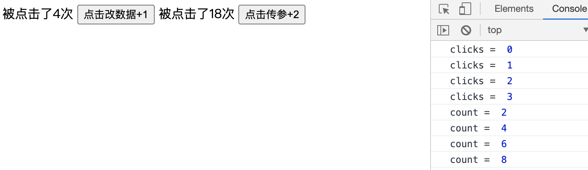

## 4.03 组件: 子传父 emit

```
vue是单向下行数据流，即父组件通过prop改变子组件
但是子组件却没办法改变父组件，怎么办？

思路：
子组件通过自定义事件触发父组件事件函数，改变父组件
父组件的更改在通过prop传递给子组件，实现双向更改
```

##### 1. 传统更改 vue2 版



```
<body>
    <script src="https://cdn.staticfile.org/vue/2.2.2/vue.min.js"></script>
    <div id="app">
        <!-- 3.在子组件中绑定自定义事件, 将父组件的方法绑定为自定义事件的处理函数-->
        <my-component
            :clicks="clicks" :clicks2="clicks2"
            @count="handleParentClick"  @count2="handleParentClick2"
         ></my-component>
    </div>

    <!-- 组件模板 -->
    <template id="MyComponent">
        <div>
            <!-- 1. 子组件通过原生click事件触发子组件自己的函数 -->
            被点击了{{clicks}}次 <button @click="handleClick">点击改数据+1</button>
            被点击了{{clicks2}}次 <button @click="handleClick2">点击传参+2</button>
        </div>
    </template>

    <script>
        //  组件选项对象
        let MyComponent = {
            props:["clicks","clicks2"],
            template: `#MyComponent`,
            data(){
                return {
                    count: this.clicks2
                }
            },
            methods:{
                handleClick(){
                    // 2. 改变数据 子子组件函数中触发自定义事件count
                    this.$emit("count")
                },
                handleClick2(){
                    // 2. 子向父传参：子子组件函数中触发自定义事件
                    // 2.1 子向父传参：在触发自定义事件的时候向自定事件传参
                    this.count+=2
                    this.$emit("count2",this.count)
                }
            }
        }
        const vm = new Vue({
            el:"#app",
            data: {
                clicks:0,
                clicks2:0,
            },
            components: {
                "MyComponent": MyComponent
            },
            methods:{
                handleParentClick(){
                    // 4. 在父组件函数中修改父组件中的数据
                    console.log("clicks = ",this.clicks)
                    this.clicks++
                },
                handleParentClick2(count){
                    // 4. 在父组件函数中修改父组件中的数据
                    // 4.1 接受自定义事件触发时传递的参数
                    console.log("count = ",count)
                    this.clicks2 = count
                }
            }
        })
    </script>
</body>
```

##### 2. 基本用法

```
1、事件名
事件名不会被用作js变量或property，所以命名没必要用camelCase或PascalCase。
v-on事件监听器在DOM模板中会转为小写，@myEvent会变成@myevent
所以始终建议是使用 kebab-case 语法

2、自定义事件名
在emits中使用原生事件(如click)时，优先会使用组件中的事件代替原生事件。
如果想使用原生事件，可添加 .native，即 @click.native="handleParentClick"

3、
```

##### 3. 验证自定义事件

与 prop 类型验证类似，使用对象语法而不是数组语法的时候可以进行验证。

```
app.component('custom-form', {
  emits: {
    // 没有验证
    click: null,

    // 验证submit 事件
    submit: ({ email, password }) => {
      if (email && password) {
        return true
      } else {
        console.warn('Invalid submit event payload!')
        return false
      }
    }
  },
  methods: {
    submitForm() {
      this.$emit('submit', { email, password })
    }
  }
})
```

##### 4. v-model 双向绑定

1、使用 modelvalue 作为 prop、update:modelvalue 作为事件  
2、我们可以在单组件上创建多个 v-model 绑定

```
$ html
<div id="v-model-example" class="demo">
   <p>First name: {{ firstName }}</p>
   <p>Last name: {{ lastName }}</p>
   <user-name
    v-model:first-name="firstName"
    v-model:last-name="lastName"
  ></user-name>
</div>

$ js
const UserName = {
  props: {
    firstName: String,
    lastName: String
  },
  template: `
    <input
      type="text"
      :value="firstName"
      @input="$emit('update:firstName', $event.target.value)">

    <input
      type="text"
      :value="lastName"
      @input="$emit('update:lastName', $event.target.value)">
  `
};

const HelloVueApp = {
  components: {
    UserName,
  },
  data() {
    return {
      firstName: 'John',
      lastName: 'Doe',
    };
  },
};

Vue.createApp(HelloVueApp).mount('#v-model-example')

```

##### 5. v-model 修饰符

学习表单输入绑定时，v-model 有一些内置修饰符--.trim/.number/.lazy 等  
当然我们也可以自定义修饰符

```
<my-component v-model.capitalize="myText"></my-component>

<div id="app">
  <my-component v-model.capitalize="myText"></my-component>
  {{ myText }}
</div>

const app = Vue.createApp({
  data() {
    return {
      myText: ''
    }
  }
})

app.component('my-component', {
  props: {
    modelValue: String,
    modelModifiers: {
      default: () => ({})
    }
  },
  emits: ['update:modelValue'],
  methods: {
    emitValue(e) {
      let value = e.target.value
      if (this.modelModifiers.capitalize) {
        value = value.charAt(0).toUpperCase() + value.slice(1)
      }
      this.$emit('update:modelValue', value)
    }
  },
  template: `<input
    type="text"
    :value="modelValue"
    @input="emitValue">`
})

app.mount('#app')
```

##### 6. v-model 示例 (旧版)

```
方案一：使用事件的表单控件

<div id="app">
    <input type="text" :value="value" @input = "changeValue"/>{{ value }}
</div>

<script>
    const vm = new Vue({
        el:"#app",
        data:{
            value: ''
        },
        methods:{
            changeValue(){
                // 在事件里获取表单的内容
                this.value = event.target.value;
            }
        }
    })
</script>

方案二：利用自定义事件处理
单向下行数据流方式将父组件数据传递给子组件
自定义事件的方式将子组件数据传递给父组件，实现双向绑定

<div id="app">
    <my-component :value="value" @input = "handleParentClick"></my-component>{{ value }}
</div>
<template id="MyComponent">
    <div>
        <input type="text" :value="value" @input="handleInput"/>
    </div>
</template>

<script>
    //  组件选项对象
    let MyComponent = {
        props:["value"],
        template: `#MyComponent`,
        methods: {
            handleInput(){
                this.$emit("input",event.target.value)
            }
        }
    }

    //  实例中注册组件
    const vm = new Vue({
        el:"#app",
        data:{
            value: ''
        },
        components: {
            "MyComponent": MyComponent
        },
        methods:{
            handleParentClick(value){
                this.value = value
            },
        }
    })
</script>

方案三：vue2.2.0允许在自定义组件上使用v-model形式
<div id="app">
    <my-component v-model="value"></my-component>{{ value }}
</div>
<template id="MyComponent">
   <div>
      <input type="text" :value="value" @input="handleInput"/>
   </div>
</template>

<script>
   let MyComponent = {
       props:{
           value:{
               type:String,
               required: true
           }
       },
       template: `#MyComponent`,
       methods: {
           handleInput(){
               this.$emit("input",event.target.value)
           }
       }
   }
   //  实例中注册组件
   const vm = new Vue({
       el:"#app",
       data:{
           value: ''
       },
       components: {
           "MyComponent": MyComponent
       }
   })
</script>
```
