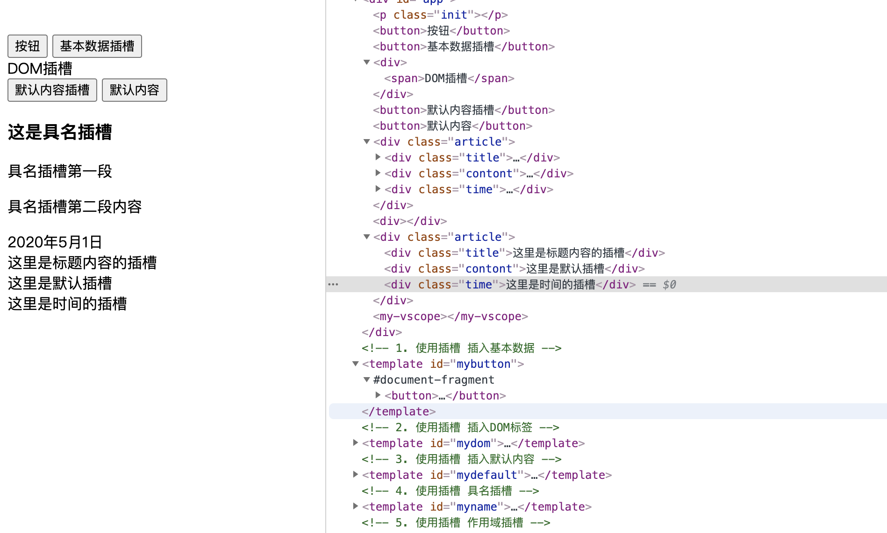

## 4.05 组件: 插槽 v-slot

Vue 实现了一套内容分发的 API，这套 API 的设计灵感源自 [Web Components 规范草案](https://github.com/WICG/webcomponents/blob/gh-pages/proposals/Slots-Proposal.md)，将 <slot> 元素作为承载分发内容的出口。

背景：组件里边是不能写内容的，会被 template 替换，所以需要插槽

##### 1. 基本插槽 slot

1、可以插入文本内容  
2、可以插入 DOM 标签  
3、可以插入默认备用内容

```
组件框架
<template id="todo-button">
    <button class="btn-primary">
      <slot>备用内容</slot>
    </button>
</template>

插槽
<todo-button> Add todo </todo-button>
<todo-button></todo-button>   // 会输出备用内容

渲染结果：
<button class="btn-primary">Add todo</button>
<button class="btn-primary">备用内容</button>
```

##### 2. 渲染作用域

插槽可以访问与模板其余部分相同的实例 prperty；  
不可以访问<tod-button>作用域，例如以下无效

```
<todo-button action="delete">
  Clicking here will {{ action }} an item
  <!-- action 未被定义，因为它的内容是传递*到<todo-button>，而不是*在<todo-button>里定义的。 -->
</todo-button>
```

即：父级模板里所有内容都是在父级作用域编译的，子模板都在子作用域中编译

##### 3. 具名插槽 (#)

使用 name 属性的插槽被称为具名插槽。  
未使用 name 属性的插槽被称为匿名插槽。

```
组件框架
<template id="my-vname">
    <div class="article">
        <hearder>
            <slot name="title">这里是标题区的备用插槽</slot>
        </hearder>
        <main>
            <slot name="content">这里是内容区的备用插槽</slot>
        </main>
        <footer>
            <slot>这里是默认区的备用插槽</slot>
        </footer>
    </div>
</template>

插槽
<my-vname>
    <template v-slot:title>
        // slot形式，<h3 slot="title">这是具名插槽</h3>
        <h3>这是 v-slot 具名插槽的文章</h3>
    </template>
    <template v-slot:content>
        <p>v-slot具名插槽的第一段</p>
        <p>v-slot具名插槽的第二段内容</p>
    </template>
    <template v-slot:default>
        <span>2021年5月1日</span>
    </template>
</my-vname>

渲染：
<div class="container">
  <header>
    <h3>这是 v-slot 具名插槽的文章</h3>
  </header>
  <main>
    <p>v-slot具名插槽的第一段</p>
    <p>v-slot具名插槽的第二段内容</p>
  </main>
  <footer>
    <span>2021年5月1日</span>
  </footer>
</div>
```

具名插槽的缩写：#

```
<my-vname>
    <template #title>
        // slot形式，<h3 slot="title">这是具名插槽</h3>
        <h3>这是 v-slot 具名插槽的文章</h3>
    </template>
    <template #content>
        <p>v-slot具名插槽的第一段</p>
        <p>v-slot具名插槽的第二段内容</p>
    </template>
    <template #default>
        <span>2021年5月1日</span>
    </template>
</my-vname>
```

##### 4. 作用域插槽

有时插槽内容能够访问子组件中才有得数据是很有用的  
所以需要使用 插槽 prop，即绑定在<slot>元素上的 attribute

父级中的 slot-scope 表示作用域插槽模板，其值用作临时变量名，接受子组件传递过来的 props 对象  
2.5.0+后，solt-scope 能被用在任意元素或组件中不再局限于 template

```
插槽
<my-scope>
    <template v-slot:default="props">
        <button>{{ props.text }}</button>
        <!-- <button slot-scope="props">{{ props.text }}</button>  不使用v-slot形式-->
    </template>
</my-child>

组件框架
<template id="my-scope">
    <div>
        <slot :text="text"></slot>
    </div>
</template>

渲染：
<div>
    <button>xxxx</button>
</div>
```

如果出现多个插槽，请始终为所有的插槽使用完整的基于 <template> 的语法

```
<todo-list>
  <template v-slot:default="slotProps">
    <span class="green">{{ slotProps.item }}</span>
  </template>

  <template v-slot:other="otherSlotProps">
    ...
  </template>
</todo-list>
```

##### 5. 动态插槽名

```
<base-layout>
  <template v-slot:[dynamicSlotName]>
    ...
  </template>
</base-layout>
```

##### 6. 示例 (旧版)



```
<html lang="en">
<head>
    <meta charset="UTF-8">
    <meta name="viewport" content="width=device-width, initial-scale=1.0">
    <title>txt</title>
    <style>
        .init {
            height: 120px;
        }
    </style>
</head>
<body>
    <script src="https://cdn.staticfile.org/vue/2.2.2/vue.min.js"></script>
    <div id="app">
        <p class="init"></p>
        <!-- 1. 使用插槽 插入基本数据 -->
        <!-- 使用插槽 否则组件内容默认会被template替换 -->
        <my-button>{{msg}}</my-button>
        <my-button>基本数据插槽</my-button>

        <!-- 2. 使用插槽 插入DOM标签 -->
        <my-dom><span>DOM插槽</span></my-dom>

        <!-- 3. 使用插槽 插入默认内容 -->
        <my-default>默认内容插槽</my-default>
        <my-default></my-default>

        <!-- 4. 使用插槽 具名插槽 -->
        <my-name>
            <h3 slot="title">这是具名插槽</h3>
            <template slot="contont">
                <p>具名插槽第一段</p>
                <p>具名插槽第二段内容</p>
            </template>
            <span slot="time">2020年5月1日</span>
        </my-name>

        <!-- 5. 使用插槽 作用域插槽 -->
        <my-scope>
            <!-- 作用域插槽也可以用解构写法 slot-scpoe={text2} -->
            <!-- <button slot-scope="props">{{ props.text }}</button> -->
        </my-scope>

        <!-- 6. v-slot 具名插槽的使用 -->
        <my-vname >
            <template v-slot:title>
                <h3>这是 v-slot 具名插槽的文章</h3>
            </template>
            <template v-slot:contont>
                <p>v-slot具名插槽的第一段</p>
                <p>v-slot具名插槽的第二段内容</p>
            </template>
            <template #time>
                <span>2021年5月1日</span>
            </template>
        </my-vname>

        <!-- 7. 使用插槽 v-slot 作用域插槽 -->
        <my-vscope >
            <template v-slot:default="props">
                <!-- <button>{{ props.text }}</button> -->
            </template>
        </my-child>
   </div>

    <!-- 1. 使用插槽 插入基本数据 -->
    <template id="mybutton">
        <button><slot></slot></button>
   </template>
   <!-- 2. 使用插槽 插入DOM标签 -->
   <template id="mydom">
    <div><slot></slot></div>
   </template>
   <!-- 3. 使用插槽 插入默认内容 -->
   <template id="mydefault">
    <button><slot>默认内容</slot></button>`
   </template>

   <!-- 4. 使用插槽 具名插槽 -->
   <template id="myname">
    <div class="article">
        <div class="title">
            <slot name="title">这里是标题内容的插槽</slot>
        </div>
        <div class="contont">
            <slot name="contont">这里是默认插槽</slot>
        </div>
        <div class="time">
            <slot name="time">这里是时间的插槽</slot>
        </div>
    </div>
   </template>

   <!-- 5. 使用插槽 作用域插槽 -->
   <template id="myscope">
        <div><slot :text="text"></slot></div>
    </template>
    <!-- 6. 使用插槽 v-slot的使用 具名插槽 -->
    <template id="myvname">
        <div class="article">
            <div class="title">
                <slot name="title">这里是标题内容的插槽</slot>
            </div>
            <div class="contont">
                <slot name="contont">这里是默认插槽</slot>
            </div>
            <div class="time">
                <slot name="time">这里是时间的插槽</slot>
            </div>
        </div>
    </template>
    <!-- 7. 使用插槽 v-slot 作用域插槽 -->
    <template id="myvscope">
        <div><slot :text="text"></slot></div>
    </template>
   <script>
        //  组件选项对象
        let MyButton = {
            template: '#mybutton',
        };
        let MyDom = {
            template: '#mydom',
         };
        let MyDefault = {
            template: '#mydefault',
        };
        let MyName = {
            template: '#myname',
        };
        let MyScope = {
            template: '#myscope',
            data(){
                return {text: "普通作用域"}
            }
        };
        let MyVname = {
            template: '#myvname',
        };
        let MyVscope = {
            template: '#myvscope',
            data(){
                return {text: "v-slot作用域"}
            }
        };
        const vm = new Vue({
            el:"#app",
            data: {
                msg: "按钮"
            },
            components: {
                MyButton,MyDom,MyDefault,MyName,MyScope,MyVname
            }
        })
   </script>
</body>
</html>

```
