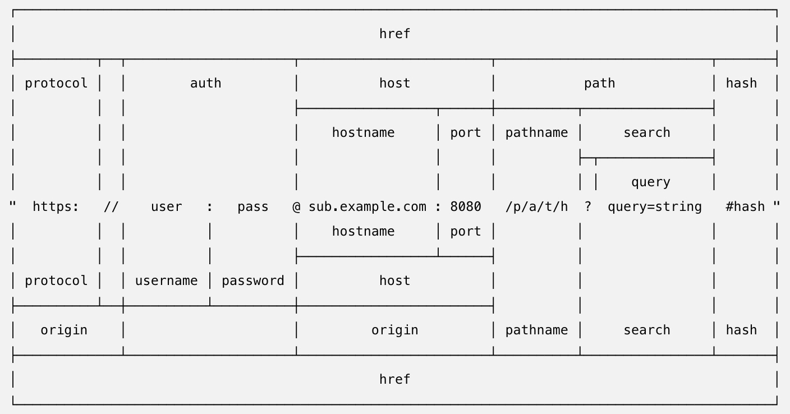

## 4.09 模块 url

参考：<https://nodejs.org/api/url.html>        
参考：<https://nodejs.org/api/querystring.html>       

##### 1. URL解析

```
http://localhost:8888/start?foo=bar&hello=world

url.parse(string).query    = foo=bar&hello=world
url.parse(string).pathname = /start

querystring.parse(queryString)["foo"]   = bar
querystring.parse(queryString)["hello"] = world

```



##### 2. 案例
```
//  server.js
var http = require("http");
var url = require("url");
//const { route } = require("./router");
 
function start(route) {
  function onRequest(request, response) {
    var pathname = url.parse(request.url).pathname;
    console.log("Request for " + pathname + " received.");

    route(pathname)
    response.writeHead(200, {"Content-Type": "text/plain"});
    response.write("Hello World");
    response.end();
  }
 
  http.createServer(onRequest).listen(8888);
  console.log("Server has started.");
}
 
exports.start = start;


// router.js
function route(pathname) {
  console.log("About to route a request for " + pathname);
}
 
exports.route = route;

// index.js
var server = require("./server");
var router = require("./router");
 
server.start(router.route);


>>> node index.js
Server has started.
Request for /aaa received.
About to route a request for /aaa
Request for /favicon.ico received.
About to route a request for /favicon.ico

```
