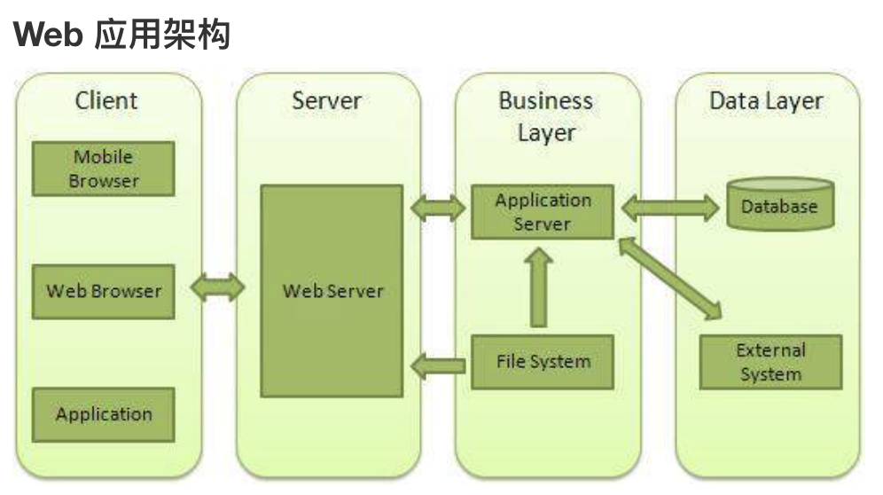

## 4.10 模块 http

参考：<https://nodejs.org/api/http.html>

##### 1. web 服务器

web服务器一般指网站服务器。用来给用户提供访问html/js的一个服务应用。      
主流的有：nginx、apache、IIS       

而Nodejs提供了 http 模块，主要用于搭建 http 的服务器端和客户端。     




##### 2. 服务端
创建 html 网页
```
<!DOCTYPE html>
<html>
<head>
<meta charset="utf-8">
<title>菜鸟教程(runoob.com)</title>
</head>
<body>
    <h1>我的第一个标题</h1>
    <p>我的第一个段落。</p>
</body>
</html>
```

创建 http 服务端
```
var http = require('http');
var fs = require('fs');
var url = require('url');
 
http.createServer( function (request, response) {  
   // 解析请求，包括文件名
   var pathname = url.parse(request.url).pathname;
   console.log("Request for " + pathname + " received.");
   
   // 从文件系统中读取请求的文件内容
   fs.readFile(pathname.substr(1), function (err, data) {
      if (err) {
         console.log(err);
         response.writeHead(404, {'Content-Type': 'text/html'});
      }else{             
         response.writeHead(200, {'Content-Type': 'text/html'});    
        
         response.write(data.toString());  // 响应文件内容   
      }
      
      response.end();   //  发送响应数据
   });   
}).listen(8080);
 
// 控制台会输出以下信息
console.log('Server running at http://127.0.0.1:8080/');
```

##### 3. 客户端

1、浏览器直接访问  http://127.0.0.1:8080/index.html

2、node http 模拟浏览器访问
```
var http = require('http');
 
// 用于请求的选项
var options = {
   host: 'localhost',
   port: '8080',
   path: '/index.html'  
};
 
// 处理响应的回调函数
var callback = function(response){
   // 不断更新数据
   var body = '';
   response.on('data', function(data) {
      body += data;
   });
   
   response.on('end', function() {
      // 数据接收完成
      console.log(body);
   });
}
// 向服务端发送请求
var req = http.request(options, callback);
req.end();
```
