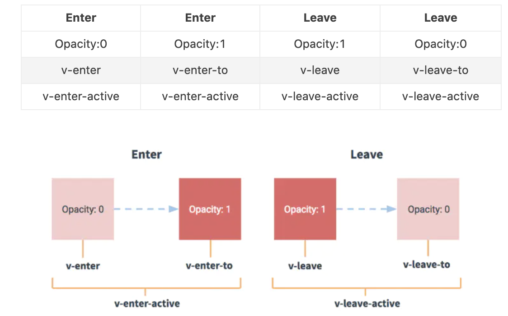

## 5.01 过渡: 介绍

##### 1. 基本概念

```
1、转换效果的方法
vue插入。更新、移除DOM时，提供多种不同方式的应用过度效果，包括以下工具：
在css过渡和动画中自动应用css
配合使用三方css动画库，如Animate.css
在过渡钩子函数中使用Javascript直接操作DOM
可以配合使用第三方JavaScript动画库，如Velocity.js

2、使用场景
在条件渲染中(v-if)
在条件展示中(v-show)
在动态组件中
在组件的根节点中

3、使用说明
只有在DOM的隐藏到显示，显示到隐藏，才能使用过渡或动画
动画的元素需要被 vue 提供的组件 transition 包裹
在插入或删除 transition 包裹元素时，vue会在恰当的实际中添加或删除类名
如果过渡的组件提供了Javascript钩子函数，则vue会在恰当的时机调用它
如果没有找到javascript钩子函数，并且也没检测到css过渡/动画，则在下一帧执行
```

##### 2. 过渡 class



```
vue 动画/过渡分为两个过程，进入和离开。中间有6个class的切换

1. v-enter：过渡开始的状态，元素被插入之前生效，被插入之后下一帧移除
2. v-enter-active: 过渡生效时状态。元素被插入之前生效，在过渡/动画完成后移除
3. v-enter-to: 2.1.8版及以上过渡结束状态。在元素被插入下一帧生效，动画/过渡完成后移除

4. v-leave: 定义离开过渡的开始状态。离开过渡被触发时立刻生效，下一帧被移除
5. v-leave-active: 离开过渡生效时状态。离开过渡时被触发，过渡/动画完成后移除。
6. v-leave-to: 2.1.8版及以上离开过渡的结束状态。离开过渡下一帧生效，在过渡/动画完成后移除

过渡前缀：
1. 默认 transition 不指定 name，则 v- 便是那些类名的默认前缀
2. 如果 transition 指定了 <transition name="myname">，则 v-enter 会替换为 myname-enter

在过渡中也可以使用贝塞尔曲线
```

##### 3. css 过渡

常用的过渡都是使用 CSS 过渡。

##### 4. css 动画

CSS 动画用法同 CSS 过渡，区别是在动画中 v-enter-from 类名在节点插入 DOM 后不会立即删除，而是在 animationend 事件触发时删除。

##### 5. 自定义过渡 class 类名

```
我们可以通过以下 attribute 自定义过渡类名：(优先级高于普通类名，结合三方库十分有用)
enter-from-class
enter-active-class
enter-to-class (2.1.8+)

leave-from-class
leave-active-class
leave-to-class (2.1.8+)

比如:
<link href="https://cdnjs.cloudflare.com/ajax/libs/animate.css/4.1.0/animate.min.css"
  rel="stylesheet"  type="text/css"
/>

<div id="demo">
  <button @click="show = !show">Toggle render
  </button>

  <transition
    name="custom-classes-transition"
    enter-active-class="animate__animated animate__tada"
    leave-active-class="animate__animated animate__bounceOutRight"
  >
    <p v-if="show">hello</p>
  </transition>
</div>
```

##### 6.多个元素之间的过渡

多元素过渡就是利用 v-if/v-show 等切换元素的显示，显示的就是入场动画，隐藏的就是出场动画。

注意：  
1、动画内部相同标签名元素切换时，只改内容没有动画效果，因为 vue 的 dom 复用机制(为了提升效率)  
2、key 属性用来阻止 dom 元素复用，在 v-for 的时候已经介绍过了  
3、mode="in-out/out-in" 表示先进后出/先出后进，不写则同时进出

```
<body>
    <script src="https://cdn.staticfile.org/vue/2.2.2/vue.min.js"></script>
    <style>
        div{
            font-size:30px;
            font-weight: bold;
            opacity:1;
        }
        .fade-enter,.fade-leave-to{
            opacity: 0;
        }
        .fade-enter-active,.fade-leave-active{
            transition:all 3s;
        }
    </style>

    <div id="app">
        <!-- 按钮,点击切换元素的显示和隐藏 -->
        <button @click="isShow = !isShow">点击切换</button>

        <!-- 显示元素 -->
        <transition name="fade" mode="in-out">
            <div v-if="isShow" key="hello">Hello wold</div>
            <div v-else key="bye">Bye wold</div>
        </transition>
    </div>

    <script>
        const vm = new Vue({
            el:"#app",
            data:{
                isShow: true
            }
        })
    </script>
</body>
```

##### 7. 多个组件之间的过渡

```
<style>
    .fade-enter,.fade-leave-to{
        opacity:0
    }
    .fade-enter-active,.fade-leave-active{
        transition: opacity 1s;
    }
</style>
<div id="app">
    <transition name="fade" mode="out-in">
        <component :is="type"></component>
    </transition>
    <button @click="handleChange">点击切换</button>
</div>

<script>
    Vue.component("child",{
        template:"<div>chile</div>"
    })
    Vue.component("child-one",{
        template:"<div>chile-on</div>"
    })

    var app = new Vue({
        el:'#app',
        data:{
            type: "child"
        },
        methods:{
            handleChange(){
                this.type = this.type == "child"?"child-one":"child"
            }
        }
    })
</script>
```

以上是利用动态组件切换组件，不使用动态组件的写法如下：

```
<transition name="fade" mode="out-in">
        <child v-if="show"></child>
        <child-one v-else></child-one>
</transition>
data:{
    show: true
},
methods:{
    handleChange(){
        this.show= !this.show
    }
}
```
