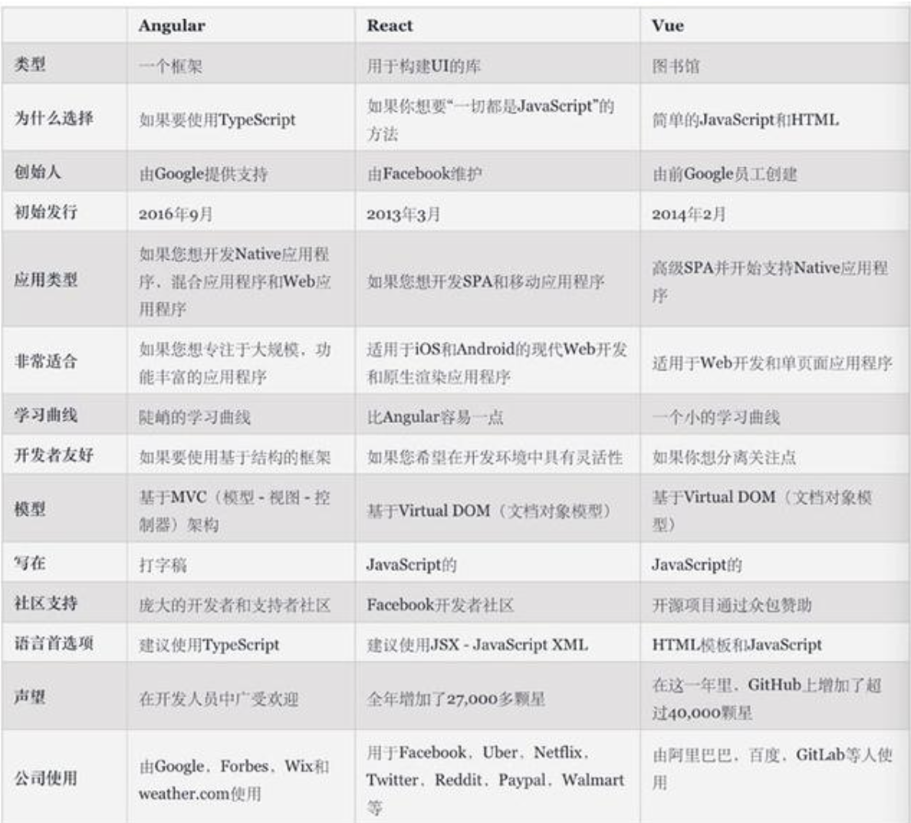

## 1.01 框架

一个公司赚钱是因为业务赚钱，而不会因为你用了 Vue 或者 Angular 这些技术框架而赚钱。

<https://baijiahao.baidu.com/s?id=1609374985643812253&wfr=spider&for=pc>   

##### 1. 背景

目前流行的js模块化开发标准规范有AMD、CMD、CommonJS以及ES6的模块系统。
       
**AMD(Asynchronous Module Definition) / CMD (Common Module Definition)**                 
相同点：浏览器端JS规范，并行异步加载文件                  
不同点：                 
AMD 是预加载，加载的同时解析，因此，加载会快速，但加载顺序不可控，用户体验好，实现的是RequireJs          
CMD 是懒加载，加载完等待执行时解析，因此，顺序可控，但是解析叠加时间会长，性能好，实现的是 SeaJs          

**CommonJs / ES6模块**              
相同点：针对服务端              
不同点：                
commonjs 输出的是值拷贝，模块是运行时加载，加载的是一个对象(module.exports)，脚本运行完时生成，实现是nodeJs               
ES6模块  输出的是值引用，模块是编译时通过export/import加载的，接口是一种静态定义，代码解析阶段就会生成      

##### 2. UI layui bootstrap
以下是UI框架，主要基于css

layui <https://www.layui.com/>            
官方：经典的模块化前端框架 (采用自身的模块规范)         
特点：作者贤心，国产不可多得的框架，始于2016年，出发点满足后端程序员          

bootstrap <https://getbootstrap.com/>           
官方：是一个用于快速开发 Web 应用程序和网站的前端框架          
特点：作者Twitter，响应式网站的典型，始于2012年，适合前端           

elementUI <https://element.eleme.cn/#/zh-CN>         
官方：一套为开发者、设计师、产品经理准备的基于Vue2.0的桌面端组件          
特点：

##### 3. JS Vue react angular          
以下是JS框架，主要基于JS           

Angular
<https://angular.cn/>          
官方：一个应用设计框架与开发平台，创建高效、复杂、精致的单页面应用          
特点：约束多，擅长复杂中后台场景和多人协作。

React               
<https://react.docschina.org/>           
官方：用于构建用户界面的JS库           
特点：组件化设计的好，可以实现比较好的组件生态进行复用          

Vue         
<https://cn.vuejs.org/>           
官方：一套用于构建用户界面的渐进式框架             
特点：灵活，适用于简单业务快速迭代（当然也有 Vue 做中后台的）            

