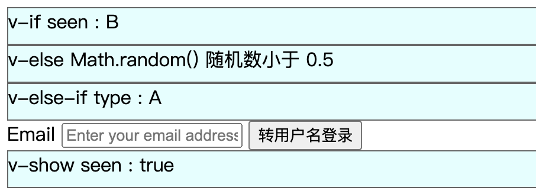

## 2.05 指令 条件/循环

##### 1. 条件判断
```
1、语法
v-if
v-if  v-else
v-if  v-if-else v-if-else  v-else
v-show 

2、template 包裹标签
v-if 标签必须紧挨着 v-else标签，否则将无法识别。那如果根据一个判断渲染多个标签呢？            
解决一：把多个标签上层套一层 div，在div 内执行 v-if (但会多了一层结构)
解决二：把多个标签上层套一层 template，在template 内执行 v-if (不会多一层结构)

3、key 管理可复用元素

有时在 input 中输入数据，当切换选框时，会发现只有placeholder变了，用户输入的没有变
(好像新版本vue已经改掉了这个问题)
此时只需要给每个 input 添加唯一属性值的 key 即可，一般这个值是后端获取数据的唯一id 或 index

4、 v-show 指令
v-if 是惰性的，初始化为假，当发现为真是，开始创建 dom 节点
v-if 是真正的渲染，当为假时，会在 dom 节点上删除占位，有频繁创建删除开销
v-show 不支持 template、v-else
v-show 不管初始条件是什么，都会被渲染，只是基于css display 的切换
```



```
<head>
    <meta charset="UTF-8">
    <meta name="viewport" content="width=device-width, initial-scale=1.0">
    <title>txt</title>
    <style>
        #app div {
            width: 700px;
            height: 30px;
            background-color: lightcyan;
            border: 1px solid #666;
        }
    </style>
</head>
<body>
    <script src="https://cdn.staticfile.org/vue/2.2.2/vue.min.js"></script>
    <div id="app">
        <div v-if="seen">v-if seen : {{ seen }} </div>
    
        <div v-if="Math.random() > 0.5">v-else Math.random() 随机数大于 0.5 </div>
        <div v-else>v-else Math.random() 随机数小于 0.5</div>

        <div v-if="type === 'A'">v-else-if  type : A</div>
        <div v-else-if="type === 'B'">v-else-if  type : B</div>
        <div v-else-if="type === 'C'">v-else-if  type : C</div>
        <div v-else>v-else-if  type : Not A/B/C</div>

        <template v-if="loginType === 'username'">
            Username
            <input placeholder="Enter your username" key="username-id">
        </template>
        <template v-else>
            <label>Email</label>
            <input placeholder="Enter your email address" key="email-id">
        </template>
        
        <button @click="loginType = loginType == 'username'? 'email':'username'">
            {{loginType=="username"?"转邮箱登录":"转用户名登录"}}
        </button>

        <div v-show="showval">v-show seen : {{ showval }} </div>

    </div>
    <script>
        let vm = new Vue({   
            el: '#app',        
            data: {            
                ok: true,
                type: 'A',
                seen: 'B',
                loginType: '',
                showval: 'true',
            }
        })
    </script>
</body>

```


##### 2. 循环语句

```
1、基础循环
循环数组：v-for="(site, index) in list"
循环对象：v-for="(value, key, index) in object"  // 顺序不能颠倒
循环数字：v-for="n in 5"

2、使用 of 代替 in

3、v-for 中的 key 属性
key 的作用主要是为了高效的更新虚拟 DOM
当在数组中新增一个值时，前边 index 不变没问题
当插入一条数据后，后边的数据都会重新渲染，index值都自增1
解决：<div v-for="(item, index) in list" :key="index" >{{item.name}}</div>
建议：key 一般后端都会传入唯一id，没有的话用index也凑合

4、不推荐同时使用 v-if 和 v-for
v-for 优先级比 v-if 高，同一标签使用时会出现 v-for 全部渲染一遍，v-if 在判断删除 dom 节点
解决：我们可以在上层进行 v-if 判断，在下层执行 v-for 循环

```

```
<body>
    <script src="https://cdn.staticfile.org/vue/2.2.2/vue.min.js"></script>
    <div id="app">
        <ol>
            <li v-for="site in lists">{{ site }}</li>
        </ol>
        <ul>
            <li v-for="(value, key, inde) in object">object[{{inde}}] {{ key }}={{ value }}</li>
        </ul>
        <ul>
            <li v-for="n in 5">{{ n }}</li>
        </ul>

    </div>
    <script>
        let vm = new Vue({   
            el: '#app',        
            data: {            
                lists: [
                    { name: '苹果' },
                    { name: '葡萄' },
                    { name: '榴莲' },
               ],
               object: {
                    name: 'jack',
                    age: 18,
               },
            }
        })
    </script>
</body>
```

