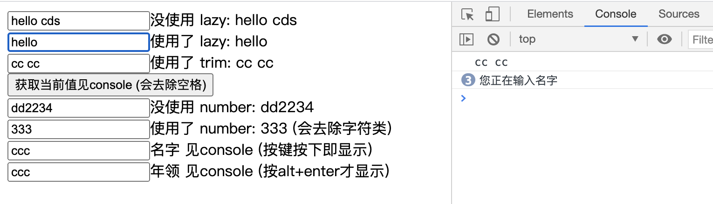

## 2.06 实例 事件/表单/按键

背景：              
在处理函数时，我们要经常处理诸如阻止默认事件event.preventDefault()，虽然实现并不复杂，但是最好的方式是方法只处理数据逻辑，而不是DOM细节          

为了解决这个问题，vue 为 v-on事件绑定提供了事件修饰符            
1、修饰符是以半角句号. 指明的特殊后缀                 
2、使用修饰符，顺序很重要                      


##### 1. 事件修饰符
```
1、阻止事件传播
<div @click.stop="handleClickWrap">grandson</div>

2、将事件绑定在捕获阶段 (默认是冒泡阶段)，捕获是先执行外部在执行内部
<div @click.capture="handleClickBox">parent</div>

3、阻止默认事件 
<a href="http://www.baidu.com" @click.prevent='child'>百度</a>

4、阻止传播与实践捕获组合使用
<div @click.capture.stop="parent">parent</div>

5、事件只触发一次
<div @click.once="handleChild">child</div>

6、事件发生在事件源身上的时候触发
<div @click.self="child">child</div>
```

##### 2. 表单修饰符
```
1、lazy 修饰符
input 变成 change 的时候触发，即表单失去焦点或者点击enter时触发

2、trim 修饰符
过滤掉前后的空格

3、number 修饰符
将用户的输入的数字当做 number (默认当做字符串)，输入不是数字时将被过滤掉

```


##### 3. 按键修饰符
按键修饰符就是键盘事件，也可以用键盘码代替，但是不推荐
```
.ctrl
.alt
.shift
.enter
.tab
.delete (捕获“删除”和“退格”键)
.esc
.space
.up
.down
.left
.right
```


##### 4. 示例


```
<body>
    <script src="https://cdn.staticfile.org/vue/2.2.2/vue.min.js"></script>

    <!-- <div id="app">
        <div 
         class="box1"
         @click="handleClickBox1">
            <div 
             class="box2"
             @click.stop="handleClickBox2"
            ></div>
        </div>
    </div> -->


    <div id="app2">
        <div><input type="text" v-model="msg">没使用 lazy: {{ msg }}</div>
        <div><input type="text" v-model.lazy="msg1">使用了 lazy: {{ msg1 }}</div>
        <div>
            <input type="text" v-model.trim="msg2">使用了 trim: {{ msg2 }}
            <button @click="type">获取当前值见console (会去除空格)</button>
        </div>
        
        <div><input type="text" v-model="num">没使用 number: {{ num }}</div>
        <div><input type="text" v-model.number="num1">使用了 number: {{ num1 }} (会去除字符类)</div>
        <div><input type="text" @keyup="logName">名字 见console (按键按下即显示)</div>
        <div><input type="text" @keyup.alt.enter="logAge">年领 见console (按alt+enter才显示)</div>
    </div>
    <script>
        // let vm = new Vue({   
        //     el: '#app',        
        //     data: {            
        //         msg: "hello",
        //     },
        //     methods: {
        //         handleClickBox1(){
        //             console.log("box1")
        //         },
        //         handleClickBox2(){
        //             console.log("box2")
        //         }
        //     }
        // })
        let vm2 = new Vue({   
            el: '#app2',        
            data: {            
                msg: "hello",
                msg1: "hello",
                msg2: "",
                num: '',
                num1: '',
                name: '',
                age: '',
            },
            methods: {
                type(){
                    console.log(this.msg2);
                },
                logName() {
                    console.log("您正在输入名字")
                    return this.name
                },
                logAge: function(){
                    console.log("您正在输入年领")
                }
            }
        })
    </script>
</body>
```